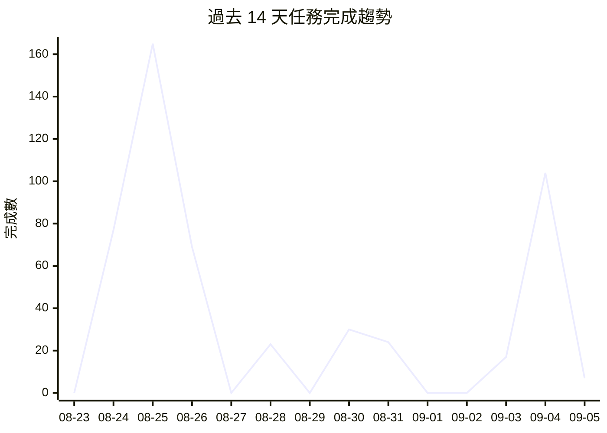

# 📁 Projects Dashboard

> 最後更新: 2026-09-05 10:03 · 自動生成

---

## 📊 總覽

| 指標 | 數量 |
|------|------|
| 專案數 | 63 |
| 任務總數 | 1639 |
| ✅ 已完成 | 1523 |
| ⬜ 待處理 | 53 |
| 🔄 進行中 | 0 |
| ⏭️ 跳過 | 63 |
| 總完成率 | 96% |

## 🔥 待處理高優先級任務

| 專案 | 任務 | 標題 |
|------|------|------|
| awesome-taiwan-mcp | [T001-project-bootstrap](https://github.com/gentoobreaking/ai-tasks/blob/main/awesome-taiwan-mcp/tasks/T001-project-bootstrap.md) | 專案初始化 — Go module, Dockerfile, README, CLI scaffold |
| awesome-taiwan-mcp | [T002-domain-models](https://github.com/gentoobreaking/ai-tasks/blob/main/awesome-taiwan-mcp/tasks/T002-domain-models.md) | 領域模型 — MCPServer, RawCandidate, RawRecord, TaiwanRelevance 等 |
| awesome-taiwan-mcp | [T003-json-schema](https://github.com/gentoobreaking/ai-tasks/blob/main/awesome-taiwan-mcp/tasks/T003-json-schema.md) | JSON Schema — mcp-server.json, registry.json schema 驗證 |
| awesome-taiwan-mcp | [T004-sqlite-storage](https://github.com/gentoobreaking/ai-tasks/blob/main/awesome-taiwan-mcp/tasks/T004-sqlite-storage.md) | SQLite 持久化 — migrations, storage 層實現 |
| awesome-taiwan-mcp | [T005-source-adapter-interface](https://github.com/gentoobreaking/ai-tasks/blob/main/awesome-taiwan-mcp/tasks/T005-source-adapter-interface.md) | Source Adapter 介面 — Discover + Fetch interface + mock adapter |
| awesome-taiwan-mcp | [T006-github-adapter](https://github.com/gentoobreaking/ai-tasks/blob/main/awesome-taiwan-mcp/tasks/T006-github-adapter.md) | GitHub Adapter — keyword matrix 搜尋 + candidate 提取 |
| awesome-taiwan-mcp | [T007-github-rate-limit](https://github.com/gentoobreaking/ai-tasks/blob/main/awesome-taiwan-mcp/tasks/T007-github-rate-limit.md) | GitHub Rate Limit — rate limiter, retry, 429 handling, timeout, context cancellation |
| awesome-taiwan-mcp | [T008-normalizer](https://github.com/gentoobreaking/ai-tasks/blob/main/awesome-taiwan-mcp/tasks/T008-normalizer.md) | Normalizer — RawRecord → MCPServer 統一轉換 |
| awesome-taiwan-mcp | [T009-manifest-detector](https://github.com/gentoobreaking/ai-tasks/blob/main/awesome-taiwan-mcp/tasks/T009-manifest-detector.md) | Manifest Detector — 偵測 package.json, pyproject.toml, go.mod, Cargo.toml, mcp.json 等 |
| awesome-taiwan-mcp | [T010-identity-engine](https://github.com/gentoobreaking/ai-tasks/blob/main/awesome-taiwan-mcp/tasks/T010-identity-engine.md) | Identity Engine — CanonicalIdentity + ServerID 生成 |
| awesome-taiwan-mcp | [T011-deduplication-engine](https://github.com/gentoobreaking/ai-tasks/blob/main/awesome-taiwan-mcp/tasks/T011-deduplication-engine.md) | Deduplication Engine — 合併來自多個 source 的相同 MCP |
| awesome-taiwan-mcp | [T012-taiwan-keyword-engine](https://github.com/gentoobreaking/ai-tasks/blob/main/awesome-taiwan-mcp/tasks/T012-taiwan-keyword-engine.md) | Taiwan Keyword Engine — config-driven keyword classification |
| awesome-taiwan-mcp | [T013-taiwan-domain-engine](https://github.com/gentoobreaking/ai-tasks/blob/main/awesome-taiwan-mcp/tasks/T013-taiwan-domain-engine.md) | Taiwan Domain Engine — official domains config + detection |
| awesome-taiwan-mcp | [T014-taiwan-scoring](https://github.com/gentoobreaking/ai-tasks/blob/main/awesome-taiwan-mcp/tasks/T014-taiwan-scoring.md) | Taiwan Scoring — deterministic relevance score + level mapping |
| awesome-taiwan-mcp | [T015-evidence-engine](https://github.com/gentoobreaking/ai-tasks/blob/main/awesome-taiwan-mcp/tasks/T015-evidence-engine.md) | Evidence Engine — scoring rule evidence provenance |
| awesome-taiwan-mcp | [T016-official-registry-adapter](https://github.com/gentoobreaking/ai-tasks/blob/main/awesome-taiwan-mcp/tasks/T016-official-registry-adapter.md) | Official MCP Registry Adapter — discovery + metadata fetch |
| awesome-taiwan-mcp | [T020-source-aggregation](https://github.com/gentoobreaking/ai-tasks/blob/main/awesome-taiwan-mcp/tasks/T020-source-aggregation.md) | Source Aggregation — 合併多個 source 的 metadata |
| awesome-taiwan-mcp | [T021-repository-verification](https://github.com/gentoobreaking/ai-tasks/blob/main/awesome-taiwan-mcp/tasks/T021-repository-verification.md) | Repository Verification — HTTP, Git, README, manifest, archive status |
| awesome-taiwan-mcp | [T022-mcp-protocol-verification](https://github.com/gentoobreaking/ai-tasks/blob/main/awesome-taiwan-mcp/tasks/T022-mcp-protocol-verification.md) | MCP Protocol Verification — initialize, tools/list, resources/list, prompts/list |
| awesome-taiwan-mcp | [T023-endpoint-health](https://github.com/gentoobreaking/ai-tasks/blob/main/awesome-taiwan-mcp/tasks/T023-endpoint-health.md) | Endpoint Health — DNS, TLS, HTTP, MCP initialize, latency |
| awesome-taiwan-mcp | [T024-tool-extraction](https://github.com/gentoobreaking/ai-tasks/blob/main/awesome-taiwan-mcp/tasks/T024-tool-extraction.md) | Tool Extraction — tools/list 結果保存 |
| awesome-taiwan-mcp | [T025-quality-engine](https://github.com/gentoobreaking/ai-tasks/blob/main/awesome-taiwan-mcp/tasks/T025-quality-engine.md) | Quality Engine — 10-component 100-point scoring |
| awesome-taiwan-mcp | [T026-security-scanner](https://github.com/gentoobreaking/ai-tasks/blob/main/awesome-taiwan-mcp/tasks/T026-security-scanner.md) | Security Scanner — static analysis of discovered MCP code |
| awesome-taiwan-mcp | [T027-registry-persistence](https://github.com/gentoobreaking/ai-tasks/blob/main/awesome-taiwan-mcp/tasks/T027-registry-persistence.md) | Registry Persistence — pipeline → SQLite idempotent write |
| awesome-taiwan-mcp | [T028-json-registry-export](https://github.com/gentoobreaking/ai-tasks/blob/main/awesome-taiwan-mcp/tasks/T028-json-registry-export.md) | JSON Registry Export — registry.json, registry.min.json, categories, sources, statistics, health |
| awesome-taiwan-mcp | [T029-crawl-coordinator](https://github.com/gentoobreaking/ai-tasks/blob/main/awesome-taiwan-mcp/tasks/T029-crawl-coordinator.md) | Crawl Coordinator — full pipeline orchestration |
| awesome-taiwan-mcp | [T030-crawl-run](https://github.com/gentoobreaking/ai-tasks/blob/main/awesome-taiwan-mcp/tasks/T030-crawl-run.md) | Crawl Run — metadata tracking per execution |
| awesome-taiwan-mcp | [T031-cli](https://github.com/gentoobreaking/ai-tasks/blob/main/awesome-taiwan-mcp/tasks/T031-cli.md) | CLI — crawl, verify, dedupe, score, export, stats, search commands |
| awesome-taiwan-mcp | [T032-incremental-crawl](https://github.com/gentoobreaking/ai-tasks/blob/main/awesome-taiwan-mcp/tasks/T032-incremental-crawl.md) | Incremental Crawl — ETag, pushed_at, last_seen tracking |
| awesome-taiwan-mcp | [T033-retry-backoff](https://github.com/gentoobreaking/ai-tasks/blob/main/awesome-taiwan-mcp/tasks/T033-retry-backoff.md) | Retry & Backoff — unified retry logic, context cancellation |
| awesome-taiwan-mcp | [T034-metrics-logging](https://github.com/gentoobreaking/ai-tasks/blob/main/awesome-taiwan-mcp/tasks/T034-metrics-logging.md) | Metrics & Logging — Prometheus metrics + structured JSON logging |
| awesome-taiwan-mcp | [T038-test-fixtures](https://github.com/gentoobreaking/ai-tasks/blob/main/awesome-taiwan-mcp/tasks/T038-test-fixtures.md) | Test Fixtures — taiwan, non-taiwan, duplicate, archived, dead endpoint, invalid, official, scraping |
| awesome-taiwan-mcp | [T039-unit-tests](https://github.com/gentoobreaking/ai-tasks/blob/main/awesome-taiwan-mcp/tasks/T039-unit-tests.md) | Unit Tests — >=80% coverage for critical modules |
| awesome-taiwan-mcp | [T040-integration-tests](https://github.com/gentoobreaking/ai-tasks/blob/main/awesome-taiwan-mcp/tasks/T040-integration-tests.md) | Integration Tests — adapter, SQLite, MCP handshake via mock servers |
| awesome-taiwan-mcp | [T041-e2e-test](https://github.com/gentoobreaking/ai-tasks/blob/main/awesome-taiwan-mcp/tasks/T041-e2e-test.md) | End-to-End Test — full pipeline with mock sources |
| awesome-taiwan-mcp | [T042-docker](https://github.com/gentoobreaking/ai-tasks/blob/main/awesome-taiwan-mcp/tasks/T042-docker.md) | Docker — Dockerfile + docker-compose with security best practices |
| awesome-taiwan-mcp | [T043-security-boundary](https://github.com/gentoobreaking/ai-tasks/blob/main/awesome-taiwan-mcp/tasks/T043-security-boundary.md) | Security Boundary — enforce never-execute-discovered-code policy |
| awesome-taiwan-mcp | [T044-documentation](https://github.com/gentoobreaking/ai-tasks/blob/main/awesome-taiwan-mcp/tasks/T044-documentation.md) | Documentation — README with all required sections |
| awesome-taiwan-mcp | [T045-final-verification](https://github.com/gentoobreaking/ai-tasks/blob/main/awesome-taiwan-mcp/tasks/T045-final-verification.md) | Final Verification — full build + test + crawl + export validation |
| awesome-taiwan-mcp | [T054-kpi-verification](https://github.com/gentoobreaking/ai-tasks/blob/main/awesome-taiwan-mcp/tasks/T054-kpi-verification.md) | KPI Verification — Recall, Precision, Duplicate rate, False positive |

---

## ⬜ 待處理

| 專案 | 任務 | 標題 | 狀態 |
|------|------|------|------|
| awesome-taiwan-mcp | [T001-project-bootstrap](https://github.com/gentoobreaking/ai-tasks/blob/main/awesome-taiwan-mcp/tasks/T001-project-bootstrap.md) | 專案初始化 — Go module, Dockerfile, README, CLI scaffold | ⬜ |
| awesome-taiwan-mcp | [T002-domain-models](https://github.com/gentoobreaking/ai-tasks/blob/main/awesome-taiwan-mcp/tasks/T002-domain-models.md) | 領域模型 — MCPServer, RawCandidate, RawRecord, TaiwanRelevance 等 | ⬜ |
| awesome-taiwan-mcp | [T003-json-schema](https://github.com/gentoobreaking/ai-tasks/blob/main/awesome-taiwan-mcp/tasks/T003-json-schema.md) | JSON Schema — mcp-server.json, registry.json schema 驗證 | ⬜ |
| awesome-taiwan-mcp | [T004-sqlite-storage](https://github.com/gentoobreaking/ai-tasks/blob/main/awesome-taiwan-mcp/tasks/T004-sqlite-storage.md) | SQLite 持久化 — migrations, storage 層實現 | ⬜ |
| awesome-taiwan-mcp | [T005-source-adapter-interface](https://github.com/gentoobreaking/ai-tasks/blob/main/awesome-taiwan-mcp/tasks/T005-source-adapter-interface.md) | Source Adapter 介面 — Discover + Fetch interface + mock adapter | ⬜ |
| awesome-taiwan-mcp | [T006-github-adapter](https://github.com/gentoobreaking/ai-tasks/blob/main/awesome-taiwan-mcp/tasks/T006-github-adapter.md) | GitHub Adapter — keyword matrix 搜尋 + candidate 提取 | ⬜ |
| awesome-taiwan-mcp | [T007-github-rate-limit](https://github.com/gentoobreaking/ai-tasks/blob/main/awesome-taiwan-mcp/tasks/T007-github-rate-limit.md) | GitHub Rate Limit — rate limiter, retry, 429 handling, timeout, context cancellation | ⬜ |
| awesome-taiwan-mcp | [T008-normalizer](https://github.com/gentoobreaking/ai-tasks/blob/main/awesome-taiwan-mcp/tasks/T008-normalizer.md) | Normalizer — RawRecord → MCPServer 統一轉換 | ⬜ |
| awesome-taiwan-mcp | [T009-manifest-detector](https://github.com/gentoobreaking/ai-tasks/blob/main/awesome-taiwan-mcp/tasks/T009-manifest-detector.md) | Manifest Detector — 偵測 package.json, pyproject.toml, go.mod, Cargo.toml, mcp.json 等 | ⬜ |
| awesome-taiwan-mcp | [T010-identity-engine](https://github.com/gentoobreaking/ai-tasks/blob/main/awesome-taiwan-mcp/tasks/T010-identity-engine.md) | Identity Engine — CanonicalIdentity + ServerID 生成 | ⬜ |
| awesome-taiwan-mcp | [T011-deduplication-engine](https://github.com/gentoobreaking/ai-tasks/blob/main/awesome-taiwan-mcp/tasks/T011-deduplication-engine.md) | Deduplication Engine — 合併來自多個 source 的相同 MCP | ⬜ |
| awesome-taiwan-mcp | [T012-taiwan-keyword-engine](https://github.com/gentoobreaking/ai-tasks/blob/main/awesome-taiwan-mcp/tasks/T012-taiwan-keyword-engine.md) | Taiwan Keyword Engine — config-driven keyword classification | ⬜ |
| awesome-taiwan-mcp | [T013-taiwan-domain-engine](https://github.com/gentoobreaking/ai-tasks/blob/main/awesome-taiwan-mcp/tasks/T013-taiwan-domain-engine.md) | Taiwan Domain Engine — official domains config + detection | ⬜ |
| awesome-taiwan-mcp | [T014-taiwan-scoring](https://github.com/gentoobreaking/ai-tasks/blob/main/awesome-taiwan-mcp/tasks/T014-taiwan-scoring.md) | Taiwan Scoring — deterministic relevance score + level mapping | ⬜ |
| awesome-taiwan-mcp | [T015-evidence-engine](https://github.com/gentoobreaking/ai-tasks/blob/main/awesome-taiwan-mcp/tasks/T015-evidence-engine.md) | Evidence Engine — scoring rule evidence provenance | ⬜ |
| awesome-taiwan-mcp | [T016-official-registry-adapter](https://github.com/gentoobreaking/ai-tasks/blob/main/awesome-taiwan-mcp/tasks/T016-official-registry-adapter.md) | Official MCP Registry Adapter — discovery + metadata fetch | ⬜ |
| awesome-taiwan-mcp | [T017-glama-adapter](https://github.com/gentoobreaking/ai-tasks/blob/main/awesome-taiwan-mcp/tasks/T017-glama-adapter.md) | > ⛔ Glama Adapter — discovery + metadata fetch (Phase 2, needs Glama API) | ⬜ |
| awesome-taiwan-mcp | [T018-pulsemcp-adapter](https://github.com/gentoobreaking/ai-tasks/blob/main/awesome-taiwan-mcp/tasks/T018-pulsemcp-adapter.md) | > ⛔ PulseMCP Adapter — discovery + metadata fetch (Phase 2, needs PulseMCP API) | ⬜ |
| awesome-taiwan-mcp | [T019-mcpso-adapter](https://github.com/gentoobreaking/ai-tasks/blob/main/awesome-taiwan-mcp/tasks/T019-mcpso-adapter.md) | > ⛔ MCP.so Adapter — discovery + metadata fetch (Phase 2, needs MCP.so API) | ⬜ |
| awesome-taiwan-mcp | [T020-source-aggregation](https://github.com/gentoobreaking/ai-tasks/blob/main/awesome-taiwan-mcp/tasks/T020-source-aggregation.md) | Source Aggregation — 合併多個 source 的 metadata | ⬜ |
| awesome-taiwan-mcp | [T021-repository-verification](https://github.com/gentoobreaking/ai-tasks/blob/main/awesome-taiwan-mcp/tasks/T021-repository-verification.md) | Repository Verification — HTTP, Git, README, manifest, archive status | ⬜ |
| awesome-taiwan-mcp | [T022-mcp-protocol-verification](https://github.com/gentoobreaking/ai-tasks/blob/main/awesome-taiwan-mcp/tasks/T022-mcp-protocol-verification.md) | MCP Protocol Verification — initialize, tools/list, resources/list, prompts/list | ⬜ |
| awesome-taiwan-mcp | [T023-endpoint-health](https://github.com/gentoobreaking/ai-tasks/blob/main/awesome-taiwan-mcp/tasks/T023-endpoint-health.md) | Endpoint Health — DNS, TLS, HTTP, MCP initialize, latency | ⬜ |
| awesome-taiwan-mcp | [T024-tool-extraction](https://github.com/gentoobreaking/ai-tasks/blob/main/awesome-taiwan-mcp/tasks/T024-tool-extraction.md) | Tool Extraction — tools/list 結果保存 | ⬜ |
| awesome-taiwan-mcp | [T025-quality-engine](https://github.com/gentoobreaking/ai-tasks/blob/main/awesome-taiwan-mcp/tasks/T025-quality-engine.md) | Quality Engine — 10-component 100-point scoring | ⬜ |
| awesome-taiwan-mcp | [T026-security-scanner](https://github.com/gentoobreaking/ai-tasks/blob/main/awesome-taiwan-mcp/tasks/T026-security-scanner.md) | Security Scanner — static analysis of discovered MCP code | ⬜ |
| awesome-taiwan-mcp | [T027-registry-persistence](https://github.com/gentoobreaking/ai-tasks/blob/main/awesome-taiwan-mcp/tasks/T027-registry-persistence.md) | Registry Persistence — pipeline → SQLite idempotent write | ⬜ |
| awesome-taiwan-mcp | [T028-json-registry-export](https://github.com/gentoobreaking/ai-tasks/blob/main/awesome-taiwan-mcp/tasks/T028-json-registry-export.md) | JSON Registry Export — registry.json, registry.min.json, categories, sources, statistics, health | ⬜ |
| awesome-taiwan-mcp | [T029-crawl-coordinator](https://github.com/gentoobreaking/ai-tasks/blob/main/awesome-taiwan-mcp/tasks/T029-crawl-coordinator.md) | Crawl Coordinator — full pipeline orchestration | ⬜ |
| awesome-taiwan-mcp | [T030-crawl-run](https://github.com/gentoobreaking/ai-tasks/blob/main/awesome-taiwan-mcp/tasks/T030-crawl-run.md) | Crawl Run — metadata tracking per execution | ⬜ |
| awesome-taiwan-mcp | [T031-cli](https://github.com/gentoobreaking/ai-tasks/blob/main/awesome-taiwan-mcp/tasks/T031-cli.md) | CLI — crawl, verify, dedupe, score, export, stats, search commands | ⬜ |
| awesome-taiwan-mcp | [T032-incremental-crawl](https://github.com/gentoobreaking/ai-tasks/blob/main/awesome-taiwan-mcp/tasks/T032-incremental-crawl.md) | Incremental Crawl — ETag, pushed_at, last_seen tracking | ⬜ |
| awesome-taiwan-mcp | [T033-retry-backoff](https://github.com/gentoobreaking/ai-tasks/blob/main/awesome-taiwan-mcp/tasks/T033-retry-backoff.md) | Retry & Backoff — unified retry logic, context cancellation | ⬜ |
| awesome-taiwan-mcp | [T034-metrics-logging](https://github.com/gentoobreaking/ai-tasks/blob/main/awesome-taiwan-mcp/tasks/T034-metrics-logging.md) | Metrics & Logging — Prometheus metrics + structured JSON logging | ⬜ |
| awesome-taiwan-mcp | [T036-search-api](https://github.com/gentoobreaking/ai-tasks/blob/main/awesome-taiwan-mcp/tasks/T036-search-api.md) | Search API — registry search by keyword, level, category, min-score | ⬜ |
| awesome-taiwan-mcp | [T037-capability-search](https://github.com/gentoobreaking/ai-tasks/blob/main/awesome-taiwan-mcp/tasks/T037-capability-search.md) | Capability Search — tool/resource/data-source capability matching | ⬜ |
| awesome-taiwan-mcp | [T038-test-fixtures](https://github.com/gentoobreaking/ai-tasks/blob/main/awesome-taiwan-mcp/tasks/T038-test-fixtures.md) | Test Fixtures — taiwan, non-taiwan, duplicate, archived, dead endpoint, invalid, official, scraping | ⬜ |
| awesome-taiwan-mcp | [T039-unit-tests](https://github.com/gentoobreaking/ai-tasks/blob/main/awesome-taiwan-mcp/tasks/T039-unit-tests.md) | Unit Tests — >=80% coverage for critical modules | ⬜ |
| awesome-taiwan-mcp | [T040-integration-tests](https://github.com/gentoobreaking/ai-tasks/blob/main/awesome-taiwan-mcp/tasks/T040-integration-tests.md) | Integration Tests — adapter, SQLite, MCP handshake via mock servers | ⬜ |
| awesome-taiwan-mcp | [T041-e2e-test](https://github.com/gentoobreaking/ai-tasks/blob/main/awesome-taiwan-mcp/tasks/T041-e2e-test.md) | End-to-End Test — full pipeline with mock sources | ⬜ |
| awesome-taiwan-mcp | [T042-docker](https://github.com/gentoobreaking/ai-tasks/blob/main/awesome-taiwan-mcp/tasks/T042-docker.md) | Docker — Dockerfile + docker-compose with security best practices | ⬜ |
| awesome-taiwan-mcp | [T043-security-boundary](https://github.com/gentoobreaking/ai-tasks/blob/main/awesome-taiwan-mcp/tasks/T043-security-boundary.md) | Security Boundary — enforce never-execute-discovered-code policy | ⬜ |
| awesome-taiwan-mcp | [T044-documentation](https://github.com/gentoobreaking/ai-tasks/blob/main/awesome-taiwan-mcp/tasks/T044-documentation.md) | Documentation — README with all required sections | ⬜ |
| awesome-taiwan-mcp | [T045-final-verification](https://github.com/gentoobreaking/ai-tasks/blob/main/awesome-taiwan-mcp/tasks/T045-final-verification.md) | Final Verification — full build + test + crawl + export validation | ⬜ |
| awesome-taiwan-mcp | [T046-regression-golden](https://github.com/gentoobreaking/ai-tasks/blob/main/awesome-taiwan-mcp/tasks/T046-regression-golden.md) | Regression Golden Dataset — TST-068 classification/identity/dedup accuracy | ⬜ |
| awesome-taiwan-mcp | [T047-historical-snapshots](https://github.com/gentoobreaking/ai-tasks/blob/main/awesome-taiwan-mcp/tasks/T047-historical-snapshots.md) | > ⛔ Historical Snapshots — crawl run history + time-series data (Phase 2) | ⬜ |
| awesome-taiwan-mcp | [T048-rest-api](https://github.com/gentoobreaking/ai-tasks/blob/main/awesome-taiwan-mcp/tasks/T048-rest-api.md) | > ⛔ REST API — HTTP API for registry search + metadata (Phase 4) | ⬜ |
| awesome-taiwan-mcp | [T049-web-ui](https://github.com/gentoobreaking/ai-tasks/blob/main/awesome-taiwan-mcp/tasks/T049-web-ui.md) | > ⛔ Web UI — registry browse + Taiwan MCP discovery dashboard (Phase 4) | ⬜ |
| awesome-taiwan-mcp | [T050-static-analysis-ci](https://github.com/gentoobreaking/ai-tasks/blob/main/awesome-taiwan-mcp/tasks/T050-static-analysis-ci.md) | Static Analysis CI — golangci-lint + gosec security linting | ⬜ |
| awesome-taiwan-mcp | [T051-performance-benchmark](https://github.com/gentoobreaking/ai-tasks/blob/main/awesome-taiwan-mcp/tasks/T051-performance-benchmark.md) | Performance Benchmark — 10k candidates, <10min, no OOM | ⬜ |
| awesome-taiwan-mcp | [T052-production-smoke](https://github.com/gentoobreaking/ai-tasks/blob/main/awesome-taiwan-mcp/tasks/T052-production-smoke.md) | Production Smoke Test — live GitHub + Registry crawl + export | ⬜ |
| awesome-taiwan-mcp | [T053-verification-manual-tests](https://github.com/gentoobreaking/ai-tasks/blob/main/awesome-taiwan-mcp/tasks/T053-verification-manual-tests.md) | Verification Manual Tests — mapping CRAWLER_VERIFICATION_MANUAL to automated tests | ⬜ |
| awesome-taiwan-mcp | [T054-kpi-verification](https://github.com/gentoobreaking/ai-tasks/blob/main/awesome-taiwan-mcp/tasks/T054-kpi-verification.md) | KPI Verification — Recall, Precision, Duplicate rate, False positive | ⬜ |

---

## 📈 效能分析

| 指標 | 數值 |
|------|------|
| 過去 7 天完成 | 182 |
| 過去 30 天完成 | 744 |
| 平均週期時間 | 2.7 天 |
| 週期時間中位數 | 0.0 天 |

📊 總計: 516 | 日均: 36.9 | 本週: 182 | 📉 下降中

## 📋 專案列表

| 狀態 | 專案 | 總數 | ✅ | ⬜ | 🔄 | ⏭️ | 進度 | 更新 |
|------|------|------|----|----|----|----|------|------|
| ✅ | [agent-config](https://github.com/gentoobreaking/ai-tasks/tree/main/agent-config) | 9 | 9 | 0 | 0 | 0 | ████████████████████ 100% | 2026-04-09 |
| ✅ | [ai-oncall](https://github.com/gentoobreaking/ai-tasks/tree/main/ai-oncall) | 22 | 22 | 0 | 0 | 0 | ████████████████████ 100% | 2026-08-26 |
| ✅ | [automation-tools](https://github.com/gentoobreaking/ai-tasks/tree/main/automation-tools) | 1 | 1 | 0 | 0 | 0 | ████████████████████ 100% | 2026-05-16 |
| ⬜ | [awesome-taiwan-mcp](https://github.com/gentoobreaking/ai-tasks/tree/main/awesome-taiwan-mcp) | 54 | 1 | 53 | 0 | 0 | ░░░░░░░░░░░░░░░░░░░░ 1% | 2026-09-05 |
| ✅ | [backup-system](https://github.com/gentoobreaking/ai-tasks/tree/main/backup-system) | 5 | 5 | 0 | 0 | 0 | ████████████████████ 100% | 2026-04-15 |
| ✅ | [claw-sessions-issue](https://github.com/gentoobreaking/ai-tasks/tree/main/claw-sessions-issue) | 1 | 1 | 0 | 0 | 0 | ████████████████████ 100% | 2026-04-16 |
| ✅ | [clawhub-oauth-investigation](https://github.com/gentoobreaking/ai-tasks/tree/main/clawhub-oauth-investigation) | 2 | 2 | 0 | 0 | 0 | ████████████████████ 100% | 2026-04-22 |
| ✅ | [cmd-log-parser](https://github.com/gentoobreaking/ai-tasks/tree/main/cmd-log-parser) | 3 | 3 | 0 | 0 | 0 | ████████████████████ 100% | 2026-04-16 |
| ✅ | [cnyes-stock](https://github.com/gentoobreaking/ai-tasks/tree/main/cnyes-stock) | 16 | 16 | 0 | 0 | 0 | ████████████████████ 100% | 2026-05-12 |
| ✅ | [dashboard-tool](https://github.com/gentoobreaking/ai-tasks/tree/main/dashboard-tool) | 5 | 5 | 0 | 0 | 0 | ████████████████████ 100% | 2026-04-09 |
| ✅ | [digital-twin](https://github.com/gentoobreaking/ai-tasks/tree/main/digital-twin) | 95 | 95 | 0 | 0 | 0 | ████████████████████ 100% | 2026-08-24 |
| ✅ | [elevenlabs-research](https://github.com/gentoobreaking/ai-tasks/tree/main/elevenlabs-research) | 1 | 1 | 0 | 0 | 0 | ████████████████████ 100% | 2026-04-21 |
| ✅ | [free-ai-router](https://github.com/gentoobreaking/ai-tasks/tree/main/free-ai-router) | 118 | 118 | 0 | 0 | 0 | ████████████████████ 100% | 2026-08-24 |
| ✅ | [git-maintenance](https://github.com/gentoobreaking/ai-tasks/tree/main/git-maintenance) | 1 | 1 | 0 | 0 | 0 | ████████████████████ 100% | 2026-05-16 |
| ✅ | [github-data-review](https://github.com/gentoobreaking/ai-tasks/tree/main/github-data-review) | 8 | 8 | 0 | 0 | 0 | ████████████████████ 100% | 2026-04-28 |
| ✅ | [global-policy-refactor](https://github.com/gentoobreaking/ai-tasks/tree/main/global-policy-refactor) | 3 | 3 | 0 | 0 | 0 | ████████████████████ 100% | 2026-05-07 |
| ✅ | [gold-analysis](https://github.com/gentoobreaking/ai-tasks/tree/main/gold-analysis) | 67 | 67 | 0 | 0 | 0 | ████████████████████ 100% | 2026-08-30 |
| ✅ | [gold-monitor-pro](https://github.com/gentoobreaking/ai-tasks/tree/main/gold-monitor-pro) | 21 | 21 | 0 | 0 | 0 | ████████████████████ 100% | 2026-08-30 |
| ✅ | [gpt-sovits-research](https://github.com/gentoobreaking/ai-tasks/tree/main/gpt-sovits-research) | 1 | 1 | 0 | 0 | 0 | ████████████████████ 100% | 2026-04-21 |
| ✅ | [gpt-sovits-voice-presets-research](https://github.com/gentoobreaking/ai-tasks/tree/main/gpt-sovits-voice-presets-research) | 1 | 1 | 0 | 0 | 0 | ████████████████████ 100% | 2026-04-21 |
| ✅ | [gpt-sovits-voices-research](https://github.com/gentoobreaking/ai-tasks/tree/main/gpt-sovits-voices-research) | 1 | 1 | 0 | 0 | 0 | ████████████████████ 100% | 2026-04-21 |
| ✅ | [ideas2tasks](https://github.com/gentoobreaking/ai-tasks/tree/main/ideas2tasks) | 11 | 11 | 0 | 0 | 0 | ████████████████████ 100% | 2026-04-23 |
| ✅ | [ideas2tasks-fix](https://github.com/gentoobreaking/ai-tasks/tree/main/ideas2tasks-fix) | 5 | 5 | 0 | 0 | 0 | ████████████████████ 100% | 2026-04-16 |
| ✅ | [ideas2tasks-improvements](https://github.com/gentoobreaking/ai-tasks/tree/main/ideas2tasks-improvements) | 7 | 7 | 0 | 0 | 0 | ████████████████████ 100% | 2026-05-12 |
| ✅ | [jarvis](https://github.com/gentoobreaking/ai-tasks/tree/main/jarvis) | 47 | 43 | 0 | 0 | 4 | ████████████████████ 100% | 2026-05-23 |
| ✅ | [kgi-monitor](https://github.com/gentoobreaking/ai-tasks/tree/main/kgi-monitor) | 6 | 6 | 0 | 0 | 0 | ████████████████████ 100% | 2026-04-22 |
| ✅ | [lifecycle-sync-fix](https://github.com/gentoobreaking/ai-tasks/tree/main/lifecycle-sync-fix) | 2 | 2 | 0 | 0 | 0 | ████████████████████ 100% | 2026-04-21 |
| ✅ | [llm-router](https://github.com/gentoobreaking/ai-tasks/tree/main/llm-router) | 1 | 1 | 0 | 0 | 0 | ████████████████████ 100% | 2026-04-16 |
| ✅ | [local-ai-controlpanel](https://github.com/gentoobreaking/ai-tasks/tree/main/local-ai-controlpanel) | 41 | 41 | 0 | 0 | 0 | ████████████████████ 100% | 2026-08-18 |
| ✅ | [mcp-go-core](https://github.com/gentoobreaking/ai-tasks/tree/main/mcp-go-core) | 98 | 98 | 0 | 0 | 0 | ████████████████████ 100% | 2026-09-05 |
| ✅ | [md-viewer-app](https://github.com/gentoobreaking/ai-tasks/tree/main/md-viewer-app) | 44 | 38 | 0 | 0 | 6 | ████████████████████ 100% | 2026-05-12 |
| ✅ | [member-backup](https://github.com/gentoobreaking/ai-tasks/tree/main/member-backup) | 1 | 1 | 0 | 0 | 0 | ████████████████████ 100% | 2026-04-16 |
| ✅ | [member-config-review](https://github.com/gentoobreaking/ai-tasks/tree/main/member-config-review) | 7 | 7 | 0 | 0 | 0 | ████████████████████ 100% | 2026-04-19 |
| ✅ | [member-tasks](https://github.com/gentoobreaking/ai-tasks/tree/main/member-tasks) | 5 | 5 | 0 | 0 | 0 | ████████████████████ 100% | 2026-04-04 |
| ✅ | [mindnav-codeagent](https://github.com/gentoobreaking/ai-tasks/tree/main/mindnav-codeagent) | 147 | 147 | 0 | 0 | 0 | ████████████████████ 100% | 2026-05-23 |
| ✅ | [openclaw](https://github.com/gentoobreaking/ai-tasks/tree/main/openclaw) | 6 | 6 | 0 | 0 | 0 | ████████████████████ 100% | 2026-05-07 |
| ✅ | [openclaw-scrum](https://github.com/gentoobreaking/ai-tasks/tree/main/openclaw-scrum) | 7 | 7 | 0 | 0 | 0 | ████████████████████ 100% | 2026-04-16 |
| ✅ | [read](https://github.com/gentoobreaking/ai-tasks/tree/main/read) | 2 | 2 | 0 | 0 | 0 | ████████████████████ 100% | 2026-05-07 |
| ✅ | [research](https://github.com/gentoobreaking/ai-tasks/tree/main/research) | 1 | 1 | 0 | 0 | 0 | ████████████████████ 100% | 2026-04-28 |
| ✅ | [revenue-zero-cost](https://github.com/gentoobreaking/ai-tasks/tree/main/revenue-zero-cost) | 15 | 14 | 0 | 0 | 1 | ████████████████████ 100% | 2026-04-20 |
| ✅ | [security-improvements](https://github.com/gentoobreaking/ai-tasks/tree/main/security-improvements) | 7 | 7 | 0 | 0 | 0 | ████████████████████ 100% | 2026-04-04 |
| ✅ | [security-tools](https://github.com/gentoobreaking/ai-tasks/tree/main/security-tools) | 5 | 5 | 0 | 0 | 0 | ████████████████████ 100% | 2026-04-09 |
| ✅ | [session-logger-plugin](https://github.com/gentoobreaking/ai-tasks/tree/main/session-logger-plugin) | 5 | 5 | 0 | 0 | 0 | ████████████████████ 100% | 2026-05-07 |
| ✅ | [sinotrade-scraper](https://github.com/gentoobreaking/ai-tasks/tree/main/sinotrade-scraper) | 9 | 8 | 0 | 0 | 1 | ████████████████████ 100% | 2026-04-28 |
| ✅ | [skill-enhancement](https://github.com/gentoobreaking/ai-tasks/tree/main/skill-enhancement) | 4 | 4 | 0 | 0 | 0 | ████████████████████ 100% | 2026-04-04 |
| ✅ | [skills-audit](https://github.com/gentoobreaking/ai-tasks/tree/main/skills-audit) | 5 | 5 | 0 | 0 | 0 | ████████████████████ 100% | 2026-05-19 |
| ✅ | [slo-sentinel](https://github.com/gentoobreaking/ai-tasks/tree/main/slo-sentinel) | 36 | 34 | 0 | 0 | 2 | ████████████████████ 100% | 2026-08-26 |
| ✅ | [taolive-ios](https://github.com/gentoobreaking/ai-tasks/tree/main/taolive-ios) | 67 | 19 | 0 | 0 | 48 | ████████████████████ 100% | 2026-05-14 |
| ✅ | [task-url-repair](https://github.com/gentoobreaking/ai-tasks/tree/main/task-url-repair) | 1 | 1 | 0 | 0 | 0 | ████████████████████ 100% | 2026-04-20 |
| ✅ | [tasks-executor](https://github.com/gentoobreaking/ai-tasks/tree/main/tasks-executor) | 8 | 8 | 0 | 0 | 0 | ████████████████████ 100% | 2026-05-12 |
| ✅ | [tw-prop-mcp](https://github.com/gentoobreaking/ai-tasks/tree/main/tw-prop-mcp) | 29 | 29 | 0 | 0 | 0 | ████████████████████ 100% | 2026-09-04 |
| ✅ | [tw-quant](https://github.com/gentoobreaking/ai-tasks/tree/main/tw-quant) | 14 | 14 | 0 | 0 | 0 | ████████████████████ 100% | 2026-08-25 |
| ✅ | [tw-quant-daybrain](https://github.com/gentoobreaking/ai-tasks/tree/main/tw-quant-daybrain) | 28 | 28 | 0 | 0 | 0 | ████████████████████ 100% | 2026-08-12 |
| ✅ | [tw-quant-db](https://github.com/gentoobreaking/ai-tasks/tree/main/tw-quant-db) | 38 | 37 | 0 | 0 | 1 | ████████████████████ 100% | 2026-09-02T05:45:00Z |
| ✅ | [tw-quant-mcp](https://github.com/gentoobreaking/ai-tasks/tree/main/tw-quant-mcp) | 243 | 243 | 0 | 0 | 0 | ████████████████████ 100% | 2026-08-26 |
| ✅ | [tw-quant-pickup](https://github.com/gentoobreaking/ai-tasks/tree/main/tw-quant-pickup) | 49 | 49 | 0 | 0 | 0 | ████████████████████ 100% | 2026-09-02T06:30:00Z |
| ✅ | [tw-quant-selector](https://github.com/gentoobreaking/ai-tasks/tree/main/tw-quant-selector) | 148 | 148 | 0 | 0 | 0 | ████████████████████ 100% | 2026-08-15 |
| ✅ | [tw-quant-signal](https://github.com/gentoobreaking/ai-tasks/tree/main/tw-quant-signal) | 32 | 32 | 0 | 0 | 0 | ████████████████████ 100% | 2026-08-19 |
| ✅ | [twse-monitor](https://github.com/gentoobreaking/ai-tasks/tree/main/twse-monitor) | 11 | 11 | 0 | 0 | 0 | ████████████████████ 100% | 2026-05-07 |
| ✅ | [twstock-bfp-research](https://github.com/gentoobreaking/ai-tasks/tree/main/twstock-bfp-research) | 1 | 1 | 0 | 0 | 0 | ████████████████████ 100% | 2026-05-06 |
| ✅ | [ux-improvement](https://github.com/gentoobreaking/ai-tasks/tree/main/ux-improvement) | 2 | 2 | 0 | 0 | 0 | ████████████████████ 100% | 2026-04-04 |
| ✅ | [working-issue](https://github.com/gentoobreaking/ai-tasks/tree/main/working-issue) | 4 | 4 | 0 | 0 | 0 | ████████████████████ 100% | 2026-05-07 |
| ✅ | [xiamen-travel](https://github.com/gentoobreaking/ai-tasks/tree/main/xiamen-travel) | 5 | 5 | 0 | 0 | 0 | ████████████████████ 100% | 2026-04-19 |

---

## 🔗 快速連結

- [任務看板](https://github.com/users/gentoobreaking/projects/1/views/1?groupedBy%5BcolumnId%5D=Status)
        - [每日儀表板 → DAILY.md](https://github.com/gentoobreaking/ai-tasks/blob/main/DAILY.md)
        - [Tasks 根目錄](https://github.com/gentoobreaking/ai-tasks/tree/main)
- 腳本: `scripts/update_projects.py` · `scripts/update_daily.py`

---
_自動生成，請勿手動編輯_
