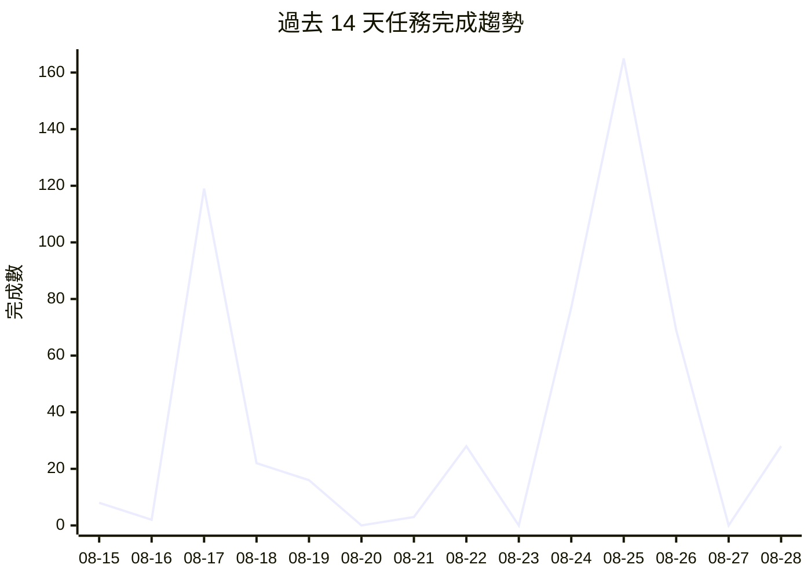

# 📁 Projects Dashboard

> 最後更新: 2026-08-28 12:50 · 自動生成

---

## 📊 總覽

| 指標 | 數量 |
|------|------|
| 專案數 | 59 |
| 任務總數 | 1416 |
| ✅ 已完成 | 1345 |
| ⬜ 待處理 | 9 |
| 🔄 進行中 | 0 |
| ⏭️ 跳過 | 62 |
| 總完成率 | 99% |

## ⬜ 待處理

| 專案 | 任務 | 標題 | 狀態 |
|------|------|------|------|
| gold-analysis | [T048-rest-exchange-client-verification](https://github.com/gentoobreaking/ai-tasks/blob/main/gold-analysis/tasks/T048-rest-exchange-client-verification.md) | RestExchangeClient 實盤冒煙測試 | ⬜ |
| gold-analysis | [T058-fix-f821-undefined](https://github.com/gentoobreaking/ai-tasks/blob/main/gold-analysis/tasks/T058-fix-f821-undefined.md) | 修復 F821 未定義名稱 (macd List 等) | ⬜ |
| gold-analysis | [T059-ruff-cleanup-precommit](https://github.com/gentoobreaking/ai-tasks/blob/main/gold-analysis/tasks/T059-ruff-cleanup-precommit.md) | ruff 清理 + pre-commit + CI lint 閘門 | ⬜ |
| gold-monitor-pro | [T009-bring-source-code-into-project](https://github.com/gentoobreaking/ai-tasks/blob/main/gold-monitor-pro/tasks/T009-bring-source-code-into-project.md) | 將實現程式碼移入專案目錄 | ⬜ |
| gold-monitor-pro | [T010-fix-readme-task-links](https://github.com/gentoobreaking/ai-tasks/blob/main/gold-monitor-pro/tasks/T010-fix-readme-task-links.md) | 更新 README task 表格的 GitHub 連結 | ⬜ |
| gold-monitor-pro | [T011-complete-t008-integration-tests](https://github.com/gentoobreaking/ai-tasks/blob/main/gold-monitor-pro/tasks/T011-complete-t008-integration-tests.md) | 完成 T008 剩餘整合測試案例 | ⬜ |
| gold-monitor-pro | [T012-price-history-chart-api](https://github.com/gentoobreaking/ai-tasks/blob/main/gold-monitor-pro/tasks/T012-price-history-chart-api.md) | 新增黃金/白銀/鉑金價格歷史圖表 API | ⬜ |
| gold-monitor-pro | [T013-health-check-endpoint](https://github.com/gentoobreaking/ai-tasks/blob/main/gold-monitor-pro/tasks/T013-health-check-endpoint.md) | 新增 Health check endpoint + 結構化 JSON 日誌 | ⬜ |
| gold-monitor-pro | [T014-multi-channel-notifications](https://github.com/gentoobreaking/ai-tasks/blob/main/gold-monitor-pro/tasks/T014-multi-channel-notifications.md) | 新增多管道通知支援 (Discord / Telegram / Email) | ⬜ |

---

## 📈 效能分析

| 指標 | 數值 |
|------|------|
| 過去 7 天完成 | 370 |
| 過去 30 天完成 | 703 |
| 平均週期時間 | 2.0 天 |
| 週期時間中位數 | 0.0 天 |

📊 總計: 537 | 日均: 38.4 | 本週: 367 | 📈 成長中

## 📋 專案列表

| 狀態 | 專案 | 總數 | ✅ | ⬜ | 🔄 | ⏭️ | 進度 | 更新 |
|------|------|------|----|----|----|----|------|------|
| ✅ | [agent-config](https://github.com/gentoobreaking/ai-tasks/tree/main/agent-config) | 9 | 9 | 0 | 0 | 0 | ████████████████████ 100% | 2026-04-09 |
| ✅ | [ai-oncall](https://github.com/gentoobreaking/ai-tasks/tree/main/ai-oncall) | 22 | 22 | 0 | 0 | 0 | ████████████████████ 100% | 2026-08-26 |
| ✅ | [automation-tools](https://github.com/gentoobreaking/ai-tasks/tree/main/automation-tools) | 1 | 1 | 0 | 0 | 0 | ████████████████████ 100% | 2026-05-16 |
| ✅ | [backup-system](https://github.com/gentoobreaking/ai-tasks/tree/main/backup-system) | 5 | 5 | 0 | 0 | 0 | ████████████████████ 100% | 2026-04-15 |
| ✅ | [claw-sessions-issue](https://github.com/gentoobreaking/ai-tasks/tree/main/claw-sessions-issue) | 1 | 1 | 0 | 0 | 0 | ████████████████████ 100% | 2026-04-16 |
| ✅ | [clawhub-oauth-investigation](https://github.com/gentoobreaking/ai-tasks/tree/main/clawhub-oauth-investigation) | 2 | 2 | 0 | 0 | 0 | ████████████████████ 100% | 2026-04-22 |
| ✅ | [cmd-log-parser](https://github.com/gentoobreaking/ai-tasks/tree/main/cmd-log-parser) | 3 | 3 | 0 | 0 | 0 | ████████████████████ 100% | 2026-04-16 |
| ✅ | [cnyes-stock](https://github.com/gentoobreaking/ai-tasks/tree/main/cnyes-stock) | 16 | 16 | 0 | 0 | 0 | ████████████████████ 100% | 2026-05-12 |
| ✅ | [dashboard-tool](https://github.com/gentoobreaking/ai-tasks/tree/main/dashboard-tool) | 5 | 5 | 0 | 0 | 0 | ████████████████████ 100% | 2026-04-09 |
| ✅ | [digital-twin](https://github.com/gentoobreaking/ai-tasks/tree/main/digital-twin) | 95 | 95 | 0 | 0 | 0 | ████████████████████ 100% | 2026-08-24 |
| ✅ | [elevenlabs-research](https://github.com/gentoobreaking/ai-tasks/tree/main/elevenlabs-research) | 1 | 1 | 0 | 0 | 0 | ████████████████████ 100% | 2026-04-21 |
| ✅ | [free-ai-router](https://github.com/gentoobreaking/ai-tasks/tree/main/free-ai-router) | 118 | 118 | 0 | 0 | 0 | ████████████████████ 100% | 2026-08-24 |
| ✅ | [git-maintenance](https://github.com/gentoobreaking/ai-tasks/tree/main/git-maintenance) | 1 | 1 | 0 | 0 | 0 | ████████████████████ 100% | 2026-05-16 |
| ✅ | [github-data-review](https://github.com/gentoobreaking/ai-tasks/tree/main/github-data-review) | 8 | 8 | 0 | 0 | 0 | ████████████████████ 100% | 2026-04-28 |
| ✅ | [global-policy-refactor](https://github.com/gentoobreaking/ai-tasks/tree/main/global-policy-refactor) | 3 | 3 | 0 | 0 | 0 | ████████████████████ 100% | 2026-05-07 |
| ⬜ | [gold-analysis](https://github.com/gentoobreaking/ai-tasks/tree/main/gold-analysis) | 67 | 64 | 3 | 0 | 0 | ███████████████████░ 95% | 2026-08-28 |
| ⬜ | [gold-monitor-pro](https://github.com/gentoobreaking/ai-tasks/tree/main/gold-monitor-pro) | 19 | 13 | 6 | 0 | 0 | █████████████░░░░░░░ 68% | 2026-08-28 |
| ✅ | [gpt-sovits-research](https://github.com/gentoobreaking/ai-tasks/tree/main/gpt-sovits-research) | 1 | 1 | 0 | 0 | 0 | ████████████████████ 100% | 2026-04-21 |
| ✅ | [gpt-sovits-voice-presets-research](https://github.com/gentoobreaking/ai-tasks/tree/main/gpt-sovits-voice-presets-research) | 1 | 1 | 0 | 0 | 0 | ████████████████████ 100% | 2026-04-21 |
| ✅ | [gpt-sovits-voices-research](https://github.com/gentoobreaking/ai-tasks/tree/main/gpt-sovits-voices-research) | 1 | 1 | 0 | 0 | 0 | ████████████████████ 100% | 2026-04-21 |
| ✅ | [ideas2tasks](https://github.com/gentoobreaking/ai-tasks/tree/main/ideas2tasks) | 11 | 11 | 0 | 0 | 0 | ████████████████████ 100% | 2026-04-23 |
| ✅ | [ideas2tasks-fix](https://github.com/gentoobreaking/ai-tasks/tree/main/ideas2tasks-fix) | 5 | 5 | 0 | 0 | 0 | ████████████████████ 100% | 2026-04-16 |
| ✅ | [ideas2tasks-improvements](https://github.com/gentoobreaking/ai-tasks/tree/main/ideas2tasks-improvements) | 7 | 7 | 0 | 0 | 0 | ████████████████████ 100% | 2026-05-12 |
| ✅ | [jarvis](https://github.com/gentoobreaking/ai-tasks/tree/main/jarvis) | 47 | 43 | 0 | 0 | 4 | ████████████████████ 100% | 2026-05-23 |
| ✅ | [kgi-monitor](https://github.com/gentoobreaking/ai-tasks/tree/main/kgi-monitor) | 6 | 6 | 0 | 0 | 0 | ████████████████████ 100% | 2026-04-22 |
| ✅ | [lifecycle-sync-fix](https://github.com/gentoobreaking/ai-tasks/tree/main/lifecycle-sync-fix) | 2 | 2 | 0 | 0 | 0 | ████████████████████ 100% | 2026-04-21 |
| ✅ | [llm-router](https://github.com/gentoobreaking/ai-tasks/tree/main/llm-router) | 1 | 1 | 0 | 0 | 0 | ████████████████████ 100% | 2026-04-16 |
| ✅ | [local-ai-controlpanel](https://github.com/gentoobreaking/ai-tasks/tree/main/local-ai-controlpanel) | 41 | 41 | 0 | 0 | 0 | ████████████████████ 100% | 2026-08-18 |
| ✅ | [md-viewer-app](https://github.com/gentoobreaking/ai-tasks/tree/main/md-viewer-app) | 44 | 38 | 0 | 0 | 6 | ████████████████████ 100% | 2026-05-12 |
| ✅ | [member-backup](https://github.com/gentoobreaking/ai-tasks/tree/main/member-backup) | 1 | 1 | 0 | 0 | 0 | ████████████████████ 100% | 2026-04-16 |
| ✅ | [member-config-review](https://github.com/gentoobreaking/ai-tasks/tree/main/member-config-review) | 7 | 7 | 0 | 0 | 0 | ████████████████████ 100% | 2026-04-19 |
| ✅ | [member-tasks](https://github.com/gentoobreaking/ai-tasks/tree/main/member-tasks) | 5 | 5 | 0 | 0 | 0 | ████████████████████ 100% | 2026-04-04 |
| ✅ | [mindnav-codeagent](https://github.com/gentoobreaking/ai-tasks/tree/main/mindnav-codeagent) | 147 | 147 | 0 | 0 | 0 | ████████████████████ 100% | 2026-05-23 |
| ✅ | [openclaw](https://github.com/gentoobreaking/ai-tasks/tree/main/openclaw) | 6 | 6 | 0 | 0 | 0 | ████████████████████ 100% | 2026-05-07 |
| ✅ | [openclaw-scrum](https://github.com/gentoobreaking/ai-tasks/tree/main/openclaw-scrum) | 7 | 7 | 0 | 0 | 0 | ████████████████████ 100% | 2026-04-16 |
| ✅ | [read](https://github.com/gentoobreaking/ai-tasks/tree/main/read) | 2 | 2 | 0 | 0 | 0 | ████████████████████ 100% | 2026-05-07 |
| ✅ | [research](https://github.com/gentoobreaking/ai-tasks/tree/main/research) | 1 | 1 | 0 | 0 | 0 | ████████████████████ 100% | 2026-04-28 |
| ✅ | [revenue-zero-cost](https://github.com/gentoobreaking/ai-tasks/tree/main/revenue-zero-cost) | 15 | 14 | 0 | 0 | 1 | ████████████████████ 100% | 2026-04-20 |
| ✅ | [security-improvements](https://github.com/gentoobreaking/ai-tasks/tree/main/security-improvements) | 7 | 7 | 0 | 0 | 0 | ████████████████████ 100% | 2026-04-04 |
| ✅ | [security-tools](https://github.com/gentoobreaking/ai-tasks/tree/main/security-tools) | 5 | 5 | 0 | 0 | 0 | ████████████████████ 100% | 2026-04-09 |
| ✅ | [session-logger-plugin](https://github.com/gentoobreaking/ai-tasks/tree/main/session-logger-plugin) | 5 | 5 | 0 | 0 | 0 | ████████████████████ 100% | 2026-05-07 |
| ✅ | [sinotrade-scraper](https://github.com/gentoobreaking/ai-tasks/tree/main/sinotrade-scraper) | 9 | 8 | 0 | 0 | 1 | ████████████████████ 100% | 2026-04-28 |
| ✅ | [skill-enhancement](https://github.com/gentoobreaking/ai-tasks/tree/main/skill-enhancement) | 4 | 4 | 0 | 0 | 0 | ████████████████████ 100% | 2026-04-04 |
| ✅ | [skills-audit](https://github.com/gentoobreaking/ai-tasks/tree/main/skills-audit) | 5 | 5 | 0 | 0 | 0 | ████████████████████ 100% | 2026-05-19 |
| ✅ | [slo-sentinel](https://github.com/gentoobreaking/ai-tasks/tree/main/slo-sentinel) | 36 | 34 | 0 | 0 | 2 | ████████████████████ 100% | 2026-08-26 |
| ✅ | [taolive-ios](https://github.com/gentoobreaking/ai-tasks/tree/main/taolive-ios) | 67 | 19 | 0 | 0 | 48 | ████████████████████ 100% | 2026-05-14 |
| ✅ | [task-url-repair](https://github.com/gentoobreaking/ai-tasks/tree/main/task-url-repair) | 1 | 1 | 0 | 0 | 0 | ████████████████████ 100% | 2026-04-20 |
| ✅ | [tasks-executor](https://github.com/gentoobreaking/ai-tasks/tree/main/tasks-executor) | 8 | 8 | 0 | 0 | 0 | ████████████████████ 100% | 2026-05-12 |
| ✅ | [tw-quant](https://github.com/gentoobreaking/ai-tasks/tree/main/tw-quant) | 14 | 14 | 0 | 0 | 0 | ████████████████████ 100% | 2026-08-25 |
| ✅ | [tw-quant-daybrain](https://github.com/gentoobreaking/ai-tasks/tree/main/tw-quant-daybrain) | 28 | 28 | 0 | 0 | 0 | ████████████████████ 100% | 2026-08-12 |
| ✅ | [tw-quant-mcp](https://github.com/gentoobreaking/ai-tasks/tree/main/tw-quant-mcp) | 243 | 243 | 0 | 0 | 0 | ████████████████████ 100% | 2026-08-26 |
| ✅ | [tw-quant-pickup](https://github.com/gentoobreaking/ai-tasks/tree/main/tw-quant-pickup) | 47 | 47 | 0 | 0 | 0 | ████████████████████ 100% | 2026-08-24 |
| ✅ | [tw-quant-selector](https://github.com/gentoobreaking/ai-tasks/tree/main/tw-quant-selector) | 148 | 148 | 0 | 0 | 0 | ████████████████████ 100% | 2026-08-15 |
| ✅ | [tw-quant-signal](https://github.com/gentoobreaking/ai-tasks/tree/main/tw-quant-signal) | 32 | 32 | 0 | 0 | 0 | ████████████████████ 100% | 2026-08-19 |
| ✅ | [twse-monitor](https://github.com/gentoobreaking/ai-tasks/tree/main/twse-monitor) | 11 | 11 | 0 | 0 | 0 | ████████████████████ 100% | 2026-05-07 |
| ✅ | [twstock-bfp-research](https://github.com/gentoobreaking/ai-tasks/tree/main/twstock-bfp-research) | 1 | 1 | 0 | 0 | 0 | ████████████████████ 100% | 2026-05-06 |
| ✅ | [ux-improvement](https://github.com/gentoobreaking/ai-tasks/tree/main/ux-improvement) | 2 | 2 | 0 | 0 | 0 | ████████████████████ 100% | 2026-04-04 |
| ✅ | [working-issue](https://github.com/gentoobreaking/ai-tasks/tree/main/working-issue) | 4 | 4 | 0 | 0 | 0 | ████████████████████ 100% | 2026-05-07 |
| ✅ | [xiamen-travel](https://github.com/gentoobreaking/ai-tasks/tree/main/xiamen-travel) | 5 | 5 | 0 | 0 | 0 | ████████████████████ 100% | 2026-04-19 |

---

## 🔗 快速連結

- [任務看板](https://github.com/users/gentoobreaking/projects/1/views/1?groupedBy%5BcolumnId%5D=Status)
        - [每日儀表板 → DAILY.md](https://github.com/gentoobreaking/ai-tasks/blob/main/DAILY.md)
        - [Tasks 根目錄](https://github.com/gentoobreaking/ai-tasks/tree/main)
- 腳本: `scripts/update_projects.py` · `scripts/update_daily.py`

---
_自動生成，請勿手動編輯_
