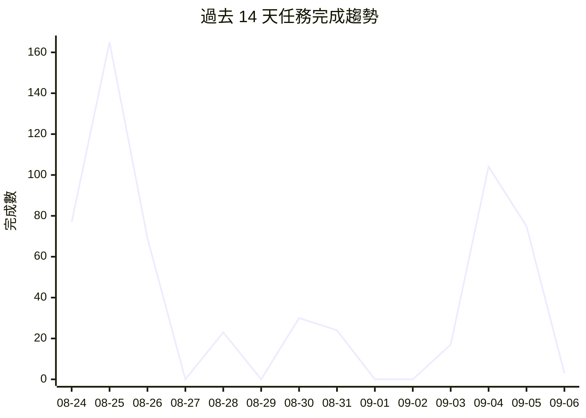

# 📁 Projects Dashboard

> 最後更新: 2026-09-06 00:53 · 自動生成

---

## 📊 總覽

| 指標 | 數量 |
|------|------|
| 專案數 | 63 |
| 任務總數 | 1681 |
| ✅ 已完成 | 1594 |
| ⬜ 待處理 | 24 |
| 🔄 進行中 | 0 |
| ⏭️ 跳過 | 63 |
| 總完成率 | 98% |

## 🔥 待處理高優先級任務

| 專案 | 任務 | 標題 |
|------|------|------|
| awesome-taiwan-ai-ecosystem | [T076-endpoint-type-classifier](https://github.com/gentoobreaking/ai-tasks/blob/main/awesome-taiwan-ai-ecosystem/tasks/T076-endpoint-type-classifier.md) | Endpoint Type Classifier — REPOSITORY_URL, DOCUMENTATION_URL, INSTALLER_URL, MCP_RUNTIME_ENDPOINT |
| awesome-taiwan-ai-ecosystem | [T077-url-evidence-tracking](https://github.com/gentoobreaking/ai-tasks/blob/main/awesome-taiwan-ai-ecosystem/tasks/T077-url-evidence-tracking.md) | URL Evidence Tracking — Record why each URL was classified |
| awesome-taiwan-ai-ecosystem | [T078-mcp-runtime-verifier](https://github.com/gentoobreaking/ai-tasks/blob/main/awesome-taiwan-ai-ecosystem/tasks/T078-mcp-runtime-verifier.md) | MCP Runtime Verifier — initialize + tools/list handshake |
| awesome-taiwan-ai-ecosystem | [T079-runtime-verification-status](https://github.com/gentoobreaking/ai-tasks/blob/main/awesome-taiwan-ai-ecosystem/tasks/T079-runtime-verification-status.md) | Runtime Verification Status — MCP_CANDIDATE, MCP_STATIC_VERIFIED, MCP_RUNTIME_VERIFIED, NOT_MCP |
| awesome-taiwan-ai-ecosystem | [T080-security-scanner-integration](https://github.com/gentoobreaking/ai-tasks/blob/main/awesome-taiwan-ai-ecosystem/tasks/T080-security-scanner-integration.md) | Security Scanner Integration — Detect obfuscation, credential extraction, remote binary download |
| awesome-taiwan-ai-ecosystem | [T081-security-status-enum](https://github.com/gentoobreaking/ai-tasks/blob/main/awesome-taiwan-ai-ecosystem/tasks/T081-security-status-enum.md) | Security Status Enum — CLEAN, SUSPICIOUS, QUARANTINED, BLOCKED |
| awesome-taiwan-ai-ecosystem | [T082-quality-engine-refactor](https://github.com/gentoobreaking/ai-tasks/blob/main/awesome-taiwan-ai-ecosystem/tasks/T082-quality-engine-refactor.md) | Quality Engine Refactor — Independent from classification, per spec weights |
| awesome-taiwan-ai-ecosystem | [T083-registry-view-generator](https://github.com/gentoobreaking/ai-tasks/blob/main/awesome-taiwan-ai-ecosystem/tasks/T083-registry-view-generator.md) | Registry View Generator — taiwan-ai-ecosystem.md, taiwan-mcp.md, taiwan-ai-agents.md, etc. |
| awesome-taiwan-ai-ecosystem | [T084-database-schema-migration](https://github.com/gentoobreaking/ai-tasks/blob/main/awesome-taiwan-ai-ecosystem/tasks/T084-database-schema-migration.md) | Database Schema Migration — SQLite schema for new entity model |
| awesome-taiwan-ai-ecosystem | [T085-migration-pipeline](https://github.com/gentoobreaking/ai-tasks/blob/main/awesome-taiwan-ai-ecosystem/tasks/T085-migration-pipeline.md) | Migration Pipeline — Load, normalize, classify, score, verify existing records |
| awesome-taiwan-ai-ecosystem | [T087-acceptance-test-suite](https://github.com/gentoobreaking/ai-tasks/blob/main/awesome-taiwan-ai-ecosystem/tasks/T087-acceptance-test-suite.md) | Acceptance Test Suite — 12 test cases from spec §56 |
| awesome-taiwan-ai-ecosystem | [T088-fp-rate-test](https://github.com/gentoobreaking/ai-tasks/blob/main/awesome-taiwan-ai-ecosystem/tasks/T088-fp-rate-test.md) | MCP False Positive Rate Test — Target <5% |
| awesome-taiwan-ai-ecosystem | [T089-discovery-pipeline-refactor](https://github.com/gentoobreaking/ai-tasks/blob/main/awesome-taiwan-ai-ecosystem/tasks/T089-discovery-pipeline-refactor.md) | Discovery Pipeline Refactor — Broad discovery (Taiwan + AI), no MCP keyword filter |
| awesome-taiwan-ai-ecosystem | [T090-source-adapter-updates](https://github.com/gentoobreaking/ai-tasks/blob/main/awesome-taiwan-ai-ecosystem/tasks/T090-source-adapter-updates.md) | Source Adapter Updates — Treat registries as discovery sources, not proof |
| awesome-taiwan-ai-ecosystem | [T091-cli-coordinator-updates](https://github.com/gentoobreaking/ai-tasks/blob/main/awesome-taiwan-ai-ecosystem/tasks/T091-cli-coordinator-updates.md) | CLI & Coordinator Updates — New pipeline stages |
| awesome-taiwan-ai-ecosystem | [T093-coordinator-refactor](https://github.com/gentoobreaking/ai-tasks/blob/main/awesome-taiwan-ai-ecosystem/tasks/T093-coordinator-refactor.md) | Crawler Coordinator 重構 - 適配新 Entity 模型與協調器邏輯修復 |
| awesome-taiwan-ai-ecosystem | [T094-incremental-refactor](https://github.com/gentoobreaking/ai-tasks/blob/main/awesome-taiwan-ai-ecosystem/tasks/T094-incremental-refactor.md) | Crawler Incremental 重構 - 適配新 Entity 模型與增量爬蟲邏輯修復 |
| awesome-taiwan-ai-ecosystem | [T095-storage-refactor](https://github.com/gentoobreaking/ai-tasks/blob/main/awesome-taiwan-ai-ecosystem/tasks/T095-storage-refactor.md) | Storage Store 重構 - 適配新 Entity 模型與存儲邏輯修復 |

---

## ⬜ 待處理

| 專案 | 任務 | 標題 | 狀態 |
|------|------|------|------|
| awesome-taiwan-ai-ecosystem | [T048-rest-api](https://github.com/gentoobreaking/ai-tasks/blob/main/awesome-taiwan-ai-ecosystem/tasks/T048-rest-api.md) | > ⛔ REST API — HTTP API for registry search + metadata (Phase 4) | ⬜ |
| awesome-taiwan-ai-ecosystem | [T049-web-ui](https://github.com/gentoobreaking/ai-tasks/blob/main/awesome-taiwan-ai-ecosystem/tasks/T049-web-ui.md) | > ⛔ Web UI — registry browse + Taiwan MCP discovery dashboard (Phase 4) | ⬜ |
| awesome-taiwan-ai-ecosystem | [T073-llm-classifier-fallback](https://github.com/gentoobreaking/ai-tasks/blob/main/awesome-taiwan-ai-ecosystem/tasks/T073-llm-classifier-fallback.md) | LLM Classifier Fallback — For ambiguous cases (score 20-55) | ⬜ |
| awesome-taiwan-ai-ecosystem | [T076-endpoint-type-classifier](https://github.com/gentoobreaking/ai-tasks/blob/main/awesome-taiwan-ai-ecosystem/tasks/T076-endpoint-type-classifier.md) | Endpoint Type Classifier — REPOSITORY_URL, DOCUMENTATION_URL, INSTALLER_URL, MCP_RUNTIME_ENDPOINT | ⬜ |
| awesome-taiwan-ai-ecosystem | [T077-url-evidence-tracking](https://github.com/gentoobreaking/ai-tasks/blob/main/awesome-taiwan-ai-ecosystem/tasks/T077-url-evidence-tracking.md) | URL Evidence Tracking — Record why each URL was classified | ⬜ |
| awesome-taiwan-ai-ecosystem | [T078-mcp-runtime-verifier](https://github.com/gentoobreaking/ai-tasks/blob/main/awesome-taiwan-ai-ecosystem/tasks/T078-mcp-runtime-verifier.md) | MCP Runtime Verifier — initialize + tools/list handshake | ⬜ |
| awesome-taiwan-ai-ecosystem | [T079-runtime-verification-status](https://github.com/gentoobreaking/ai-tasks/blob/main/awesome-taiwan-ai-ecosystem/tasks/T079-runtime-verification-status.md) | Runtime Verification Status — MCP_CANDIDATE, MCP_STATIC_VERIFIED, MCP_RUNTIME_VERIFIED, NOT_MCP | ⬜ |
| awesome-taiwan-ai-ecosystem | [T080-security-scanner-integration](https://github.com/gentoobreaking/ai-tasks/blob/main/awesome-taiwan-ai-ecosystem/tasks/T080-security-scanner-integration.md) | Security Scanner Integration — Detect obfuscation, credential extraction, remote binary download | ⬜ |
| awesome-taiwan-ai-ecosystem | [T081-security-status-enum](https://github.com/gentoobreaking/ai-tasks/blob/main/awesome-taiwan-ai-ecosystem/tasks/T081-security-status-enum.md) | Security Status Enum — CLEAN, SUSPICIOUS, QUARANTINED, BLOCKED | ⬜ |
| awesome-taiwan-ai-ecosystem | [T082-quality-engine-refactor](https://github.com/gentoobreaking/ai-tasks/blob/main/awesome-taiwan-ai-ecosystem/tasks/T082-quality-engine-refactor.md) | Quality Engine Refactor — Independent from classification, per spec weights | ⬜ |
| awesome-taiwan-ai-ecosystem | [T083-registry-view-generator](https://github.com/gentoobreaking/ai-tasks/blob/main/awesome-taiwan-ai-ecosystem/tasks/T083-registry-view-generator.md) | Registry View Generator — taiwan-ai-ecosystem.md, taiwan-mcp.md, taiwan-ai-agents.md, etc. | ⬜ |
| awesome-taiwan-ai-ecosystem | [T084-database-schema-migration](https://github.com/gentoobreaking/ai-tasks/blob/main/awesome-taiwan-ai-ecosystem/tasks/T084-database-schema-migration.md) | Database Schema Migration — SQLite schema for new entity model | ⬜ |
| awesome-taiwan-ai-ecosystem | [T085-migration-pipeline](https://github.com/gentoobreaking/ai-tasks/blob/main/awesome-taiwan-ai-ecosystem/tasks/T085-migration-pipeline.md) | Migration Pipeline — Load, normalize, classify, score, verify existing records | ⬜ |
| awesome-taiwan-ai-ecosystem | [T086-backward-compatibility](https://github.com/gentoobreaking/ai-tasks/blob/main/awesome-taiwan-ai-ecosystem/tasks/T086-backward-compatibility.md) | Backward Compatibility — Keep awesome-taiwan-mcp.md as generated view | ⬜ |
| awesome-taiwan-ai-ecosystem | [T087-acceptance-test-suite](https://github.com/gentoobreaking/ai-tasks/blob/main/awesome-taiwan-ai-ecosystem/tasks/T087-acceptance-test-suite.md) | Acceptance Test Suite — 12 test cases from spec §56 | ⬜ |
| awesome-taiwan-ai-ecosystem | [T088-fp-rate-test](https://github.com/gentoobreaking/ai-tasks/blob/main/awesome-taiwan-ai-ecosystem/tasks/T088-fp-rate-test.md) | MCP False Positive Rate Test — Target <5% | ⬜ |
| awesome-taiwan-ai-ecosystem | [T089-discovery-pipeline-refactor](https://github.com/gentoobreaking/ai-tasks/blob/main/awesome-taiwan-ai-ecosystem/tasks/T089-discovery-pipeline-refactor.md) | Discovery Pipeline Refactor — Broad discovery (Taiwan + AI), no MCP keyword filter | ⬜ |
| awesome-taiwan-ai-ecosystem | [T090-source-adapter-updates](https://github.com/gentoobreaking/ai-tasks/blob/main/awesome-taiwan-ai-ecosystem/tasks/T090-source-adapter-updates.md) | Source Adapter Updates — Treat registries as discovery sources, not proof | ⬜ |
| awesome-taiwan-ai-ecosystem | [T091-cli-coordinator-updates](https://github.com/gentoobreaking/ai-tasks/blob/main/awesome-taiwan-ai-ecosystem/tasks/T091-cli-coordinator-updates.md) | CLI & Coordinator Updates — New pipeline stages | ⬜ |
| awesome-taiwan-ai-ecosystem | [T092-documentation-update](https://github.com/gentoobreaking/ai-tasks/blob/main/awesome-taiwan-ai-ecosystem/tasks/T092-documentation-update.md) | Documentation Update — README, spec.md alignment | ⬜ |
| awesome-taiwan-ai-ecosystem | [T093-coordinator-refactor](https://github.com/gentoobreaking/ai-tasks/blob/main/awesome-taiwan-ai-ecosystem/tasks/T093-coordinator-refactor.md) | Crawler Coordinator 重構 - 適配新 Entity 模型與協調器邏輯修復 | ⬜ |
| awesome-taiwan-ai-ecosystem | [T094-incremental-refactor](https://github.com/gentoobreaking/ai-tasks/blob/main/awesome-taiwan-ai-ecosystem/tasks/T094-incremental-refactor.md) | Crawler Incremental 重構 - 適配新 Entity 模型與增量爬蟲邏輯修復 | ⬜ |
| awesome-taiwan-ai-ecosystem | [T095-storage-refactor](https://github.com/gentoobreaking/ai-tasks/blob/main/awesome-taiwan-ai-ecosystem/tasks/T095-storage-refactor.md) | Storage Store 重構 - 適配新 Entity 模型與存儲邏輯修復 | ⬜ |
| awesome-taiwan-ai-ecosystem | [T096-classify-refactor](https://github.com/gentoobreaking/ai-tasks/blob/main/awesome-taiwan-ai-ecosystem/tasks/T096-classify-refactor.md) | Classify/LLM 分類器與 Rules 完善 - 適配新模型 | ⬜ |

---

## 📈 效能分析

| 指標 | 數值 |
|------|------|
| 過去 7 天完成 | 253 |
| 過去 30 天完成 | 815 |
| 平均週期時間 | 2.6 天 |
| 週期時間中位數 | 0.0 天 |

📊 總計: 587 | 日均: 41.9 | 本週: 223 | 📉 下降中

## 📋 專案列表

| 狀態 | 專案 | 總數 | ✅ | ⬜ | 🔄 | ⏭️ | 進度 | 更新 |
|------|------|------|----|----|----|----|------|------|
| ✅ | [agent-config](https://github.com/gentoobreaking/ai-tasks/tree/main/agent-config) | 9 | 9 | 0 | 0 | 0 | ████████████████████ 100% | 2026-04-09 |
| ✅ | [ai-oncall](https://github.com/gentoobreaking/ai-tasks/tree/main/ai-oncall) | 22 | 22 | 0 | 0 | 0 | ████████████████████ 100% | 2026-08-26 |
| ✅ | [automation-tools](https://github.com/gentoobreaking/ai-tasks/tree/main/automation-tools) | 1 | 1 | 0 | 0 | 0 | ████████████████████ 100% | 2026-05-16 |
| ⬜ | [awesome-taiwan-ai-ecosystem](https://github.com/gentoobreaking/ai-tasks/tree/main/awesome-taiwan-ai-ecosystem) | 96 | 72 | 24 | 0 | 0 | ███████████████░░░░░ 75% | 2026-09-06 |
| ✅ | [backup-system](https://github.com/gentoobreaking/ai-tasks/tree/main/backup-system) | 5 | 5 | 0 | 0 | 0 | ████████████████████ 100% | 2026-04-15 |
| ✅ | [claw-sessions-issue](https://github.com/gentoobreaking/ai-tasks/tree/main/claw-sessions-issue) | 1 | 1 | 0 | 0 | 0 | ████████████████████ 100% | 2026-04-16 |
| ✅ | [clawhub-oauth-investigation](https://github.com/gentoobreaking/ai-tasks/tree/main/clawhub-oauth-investigation) | 2 | 2 | 0 | 0 | 0 | ████████████████████ 100% | 2026-04-22 |
| ✅ | [cmd-log-parser](https://github.com/gentoobreaking/ai-tasks/tree/main/cmd-log-parser) | 3 | 3 | 0 | 0 | 0 | ████████████████████ 100% | 2026-04-16 |
| ✅ | [cnyes-stock](https://github.com/gentoobreaking/ai-tasks/tree/main/cnyes-stock) | 16 | 16 | 0 | 0 | 0 | ████████████████████ 100% | 2026-05-12 |
| ✅ | [dashboard-tool](https://github.com/gentoobreaking/ai-tasks/tree/main/dashboard-tool) | 5 | 5 | 0 | 0 | 0 | ████████████████████ 100% | 2026-04-09 |
| ✅ | [digital-twin](https://github.com/gentoobreaking/ai-tasks/tree/main/digital-twin) | 95 | 95 | 0 | 0 | 0 | ████████████████████ 100% | 2026-08-24 |
| ✅ | [elevenlabs-research](https://github.com/gentoobreaking/ai-tasks/tree/main/elevenlabs-research) | 1 | 1 | 0 | 0 | 0 | ████████████████████ 100% | 2026-04-21 |
| ✅ | [free-ai-router](https://github.com/gentoobreaking/ai-tasks/tree/main/free-ai-router) | 118 | 118 | 0 | 0 | 0 | ████████████████████ 100% | 2026-08-24 |
| ✅ | [git-maintenance](https://github.com/gentoobreaking/ai-tasks/tree/main/git-maintenance) | 1 | 1 | 0 | 0 | 0 | ████████████████████ 100% | 2026-05-16 |
| ✅ | [github-data-review](https://github.com/gentoobreaking/ai-tasks/tree/main/github-data-review) | 8 | 8 | 0 | 0 | 0 | ████████████████████ 100% | 2026-04-28 |
| ✅ | [global-policy-refactor](https://github.com/gentoobreaking/ai-tasks/tree/main/global-policy-refactor) | 3 | 3 | 0 | 0 | 0 | ████████████████████ 100% | 2026-05-07 |
| ✅ | [gold-analysis](https://github.com/gentoobreaking/ai-tasks/tree/main/gold-analysis) | 67 | 67 | 0 | 0 | 0 | ████████████████████ 100% | 2026-08-30 |
| ✅ | [gold-monitor-pro](https://github.com/gentoobreaking/ai-tasks/tree/main/gold-monitor-pro) | 21 | 21 | 0 | 0 | 0 | ████████████████████ 100% | 2026-08-30 |
| ✅ | [gpt-sovits-research](https://github.com/gentoobreaking/ai-tasks/tree/main/gpt-sovits-research) | 1 | 1 | 0 | 0 | 0 | ████████████████████ 100% | 2026-04-21 |
| ✅ | [gpt-sovits-voice-presets-research](https://github.com/gentoobreaking/ai-tasks/tree/main/gpt-sovits-voice-presets-research) | 1 | 1 | 0 | 0 | 0 | ████████████████████ 100% | 2026-04-21 |
| ✅ | [gpt-sovits-voices-research](https://github.com/gentoobreaking/ai-tasks/tree/main/gpt-sovits-voices-research) | 1 | 1 | 0 | 0 | 0 | ████████████████████ 100% | 2026-04-21 |
| ✅ | [ideas2tasks](https://github.com/gentoobreaking/ai-tasks/tree/main/ideas2tasks) | 11 | 11 | 0 | 0 | 0 | ████████████████████ 100% | 2026-04-23 |
| ✅ | [ideas2tasks-fix](https://github.com/gentoobreaking/ai-tasks/tree/main/ideas2tasks-fix) | 5 | 5 | 0 | 0 | 0 | ████████████████████ 100% | 2026-04-16 |
| ✅ | [ideas2tasks-improvements](https://github.com/gentoobreaking/ai-tasks/tree/main/ideas2tasks-improvements) | 7 | 7 | 0 | 0 | 0 | ████████████████████ 100% | 2026-05-12 |
| ✅ | [jarvis](https://github.com/gentoobreaking/ai-tasks/tree/main/jarvis) | 47 | 43 | 0 | 0 | 4 | ████████████████████ 100% | 2026-05-23 |
| ✅ | [kgi-monitor](https://github.com/gentoobreaking/ai-tasks/tree/main/kgi-monitor) | 6 | 6 | 0 | 0 | 0 | ████████████████████ 100% | 2026-04-22 |
| ✅ | [lifecycle-sync-fix](https://github.com/gentoobreaking/ai-tasks/tree/main/lifecycle-sync-fix) | 2 | 2 | 0 | 0 | 0 | ████████████████████ 100% | 2026-04-21 |
| ✅ | [llm-router](https://github.com/gentoobreaking/ai-tasks/tree/main/llm-router) | 1 | 1 | 0 | 0 | 0 | ████████████████████ 100% | 2026-04-16 |
| ✅ | [local-ai-controlpanel](https://github.com/gentoobreaking/ai-tasks/tree/main/local-ai-controlpanel) | 41 | 41 | 0 | 0 | 0 | ████████████████████ 100% | 2026-08-18 |
| ✅ | [mcp-go-core](https://github.com/gentoobreaking/ai-tasks/tree/main/mcp-go-core) | 98 | 98 | 0 | 0 | 0 | ████████████████████ 100% | 2026-09-05 |
| ✅ | [md-viewer-app](https://github.com/gentoobreaking/ai-tasks/tree/main/md-viewer-app) | 44 | 38 | 0 | 0 | 6 | ████████████████████ 100% | 2026-05-12 |
| ✅ | [member-backup](https://github.com/gentoobreaking/ai-tasks/tree/main/member-backup) | 1 | 1 | 0 | 0 | 0 | ████████████████████ 100% | 2026-04-16 |
| ✅ | [member-config-review](https://github.com/gentoobreaking/ai-tasks/tree/main/member-config-review) | 7 | 7 | 0 | 0 | 0 | ████████████████████ 100% | 2026-04-19 |
| ✅ | [member-tasks](https://github.com/gentoobreaking/ai-tasks/tree/main/member-tasks) | 5 | 5 | 0 | 0 | 0 | ████████████████████ 100% | 2026-04-04 |
| ✅ | [mindnav-codeagent](https://github.com/gentoobreaking/ai-tasks/tree/main/mindnav-codeagent) | 147 | 147 | 0 | 0 | 0 | ████████████████████ 100% | 2026-05-23 |
| ✅ | [openclaw](https://github.com/gentoobreaking/ai-tasks/tree/main/openclaw) | 6 | 6 | 0 | 0 | 0 | ████████████████████ 100% | 2026-05-07 |
| ✅ | [openclaw-scrum](https://github.com/gentoobreaking/ai-tasks/tree/main/openclaw-scrum) | 7 | 7 | 0 | 0 | 0 | ████████████████████ 100% | 2026-04-16 |
| ✅ | [read](https://github.com/gentoobreaking/ai-tasks/tree/main/read) | 2 | 2 | 0 | 0 | 0 | ████████████████████ 100% | 2026-05-07 |
| ✅ | [research](https://github.com/gentoobreaking/ai-tasks/tree/main/research) | 1 | 1 | 0 | 0 | 0 | ████████████████████ 100% | 2026-04-28 |
| ✅ | [revenue-zero-cost](https://github.com/gentoobreaking/ai-tasks/tree/main/revenue-zero-cost) | 15 | 14 | 0 | 0 | 1 | ████████████████████ 100% | 2026-04-20 |
| ✅ | [security-improvements](https://github.com/gentoobreaking/ai-tasks/tree/main/security-improvements) | 7 | 7 | 0 | 0 | 0 | ████████████████████ 100% | 2026-04-04 |
| ✅ | [security-tools](https://github.com/gentoobreaking/ai-tasks/tree/main/security-tools) | 5 | 5 | 0 | 0 | 0 | ████████████████████ 100% | 2026-04-09 |
| ✅ | [session-logger-plugin](https://github.com/gentoobreaking/ai-tasks/tree/main/session-logger-plugin) | 5 | 5 | 0 | 0 | 0 | ████████████████████ 100% | 2026-05-07 |
| ✅ | [sinotrade-scraper](https://github.com/gentoobreaking/ai-tasks/tree/main/sinotrade-scraper) | 9 | 8 | 0 | 0 | 1 | ████████████████████ 100% | 2026-04-28 |
| ✅ | [skill-enhancement](https://github.com/gentoobreaking/ai-tasks/tree/main/skill-enhancement) | 4 | 4 | 0 | 0 | 0 | ████████████████████ 100% | 2026-04-04 |
| ✅ | [skills-audit](https://github.com/gentoobreaking/ai-tasks/tree/main/skills-audit) | 5 | 5 | 0 | 0 | 0 | ████████████████████ 100% | 2026-05-19 |
| ✅ | [slo-sentinel](https://github.com/gentoobreaking/ai-tasks/tree/main/slo-sentinel) | 36 | 34 | 0 | 0 | 2 | ████████████████████ 100% | 2026-08-26 |
| ✅ | [taolive-ios](https://github.com/gentoobreaking/ai-tasks/tree/main/taolive-ios) | 67 | 19 | 0 | 0 | 48 | ████████████████████ 100% | 2026-05-14 |
| ✅ | [task-url-repair](https://github.com/gentoobreaking/ai-tasks/tree/main/task-url-repair) | 1 | 1 | 0 | 0 | 0 | ████████████████████ 100% | 2026-04-20 |
| ✅ | [tasks-executor](https://github.com/gentoobreaking/ai-tasks/tree/main/tasks-executor) | 8 | 8 | 0 | 0 | 0 | ████████████████████ 100% | 2026-05-12 |
| ✅ | [tw-prop-mcp](https://github.com/gentoobreaking/ai-tasks/tree/main/tw-prop-mcp) | 29 | 29 | 0 | 0 | 0 | ████████████████████ 100% | 2026-09-04 |
| ✅ | [tw-quant](https://github.com/gentoobreaking/ai-tasks/tree/main/tw-quant) | 14 | 14 | 0 | 0 | 0 | ████████████████████ 100% | 2026-08-25 |
| ✅ | [tw-quant-daybrain](https://github.com/gentoobreaking/ai-tasks/tree/main/tw-quant-daybrain) | 28 | 28 | 0 | 0 | 0 | ████████████████████ 100% | 2026-08-12 |
| ✅ | [tw-quant-db](https://github.com/gentoobreaking/ai-tasks/tree/main/tw-quant-db) | 38 | 37 | 0 | 0 | 1 | ████████████████████ 100% | 2026-09-02T05:45:00Z |
| ✅ | [tw-quant-mcp](https://github.com/gentoobreaking/ai-tasks/tree/main/tw-quant-mcp) | 243 | 243 | 0 | 0 | 0 | ████████████████████ 100% | 2026-08-26 |
| ✅ | [tw-quant-pickup](https://github.com/gentoobreaking/ai-tasks/tree/main/tw-quant-pickup) | 49 | 49 | 0 | 0 | 0 | ████████████████████ 100% | 2026-09-02T06:30:00Z |
| ✅ | [tw-quant-selector](https://github.com/gentoobreaking/ai-tasks/tree/main/tw-quant-selector) | 148 | 148 | 0 | 0 | 0 | ████████████████████ 100% | 2026-08-15 |
| ✅ | [tw-quant-signal](https://github.com/gentoobreaking/ai-tasks/tree/main/tw-quant-signal) | 32 | 32 | 0 | 0 | 0 | ████████████████████ 100% | 2026-08-19 |
| ✅ | [twse-monitor](https://github.com/gentoobreaking/ai-tasks/tree/main/twse-monitor) | 11 | 11 | 0 | 0 | 0 | ████████████████████ 100% | 2026-05-07 |
| ✅ | [twstock-bfp-research](https://github.com/gentoobreaking/ai-tasks/tree/main/twstock-bfp-research) | 1 | 1 | 0 | 0 | 0 | ████████████████████ 100% | 2026-05-06 |
| ✅ | [ux-improvement](https://github.com/gentoobreaking/ai-tasks/tree/main/ux-improvement) | 2 | 2 | 0 | 0 | 0 | ████████████████████ 100% | 2026-04-04 |
| ✅ | [working-issue](https://github.com/gentoobreaking/ai-tasks/tree/main/working-issue) | 4 | 4 | 0 | 0 | 0 | ████████████████████ 100% | 2026-05-07 |
| ✅ | [xiamen-travel](https://github.com/gentoobreaking/ai-tasks/tree/main/xiamen-travel) | 5 | 5 | 0 | 0 | 0 | ████████████████████ 100% | 2026-04-19 |

---

## 🔗 快速連結

- [任務看板](https://github.com/users/gentoobreaking/projects/1/views/1?groupedBy%5BcolumnId%5D=Status)
        - [每日儀表板 → DAILY.md](https://github.com/gentoobreaking/ai-tasks/blob/main/DAILY.md)
        - [Tasks 根目錄](https://github.com/gentoobreaking/ai-tasks/tree/main)
- 腳本: `scripts/update_projects.py` · `scripts/update_daily.py`

---
_自動生成，請勿手動編輯_
