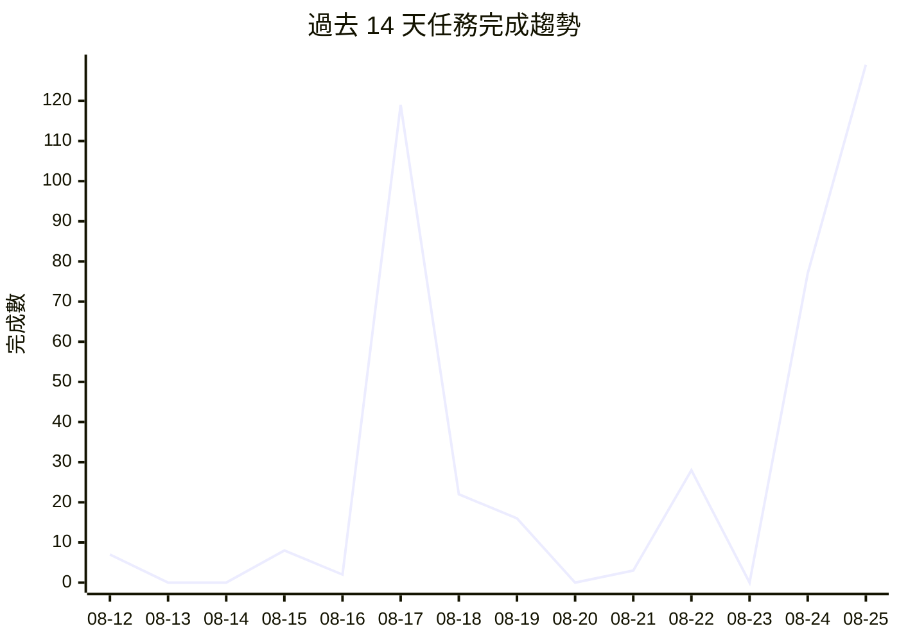

# 📁 Projects Dashboard

> 最後更新: 2026-08-25 16:06 · 自動生成

---

## 📊 總覽

| 指標 | 數量 |
|------|------|
| 專案數 | 65 |
| 任務總數 | 1348 |
| ✅ 已完成 | 1240 |
| ⬜ 待處理 | 41 |
| 🔄 進行中 | 4 |
| ⏭️ 跳過 | 63 |
| 總完成率 | 96% |

## 🔥 待處理高優先級任務

| 專案 | 任務 | 標題 |
|------|------|------|
| tw-quant | [T003-tw-quant-buypoint](https://github.com/gentoobreaking/ai-tasks/blob/main/tw-quant/tasks/T003-tw-quant-buypoint.md) | 台股篩選腳本-找買點 |

---

## ⬜ 待處理

| 專案 | 任務 | 標題 | 狀態 |
|------|------|------|------|
| gold-analysis-advanced | [T002](https://github.com/gentoobreaking/ai-tasks/blob/main/gold-analysis-advanced/tasks/T002.md) | ML 模型整合與優化 | ⬜ |
| gold-analysis-advanced | [T004](https://github.com/gentoobreaking/ai-tasks/blob/main/gold-analysis-advanced/tasks/T004.md) | 實盤交易對接 | ⬜ |
| slo-sentinel | [T019-ci-budget-gate](https://github.com/gentoobreaking/ai-tasks/blob/main/slo-sentinel/tasks/T019-ci-budget-gate.md) | 成本/預算 CI 整合——notify 模式（F6 Phase 1） | ⬜ |
| slo-sentinel | [T021-freeze-enforce](https://github.com/gentoobreaking/ai-tasks/blob/main/slo-sentinel/tasks/T021-freeze-enforce.md) | 成本/預算 CI 部署閘門——enforce 模式（F6 Phase 2） | ⬜ |
| slo-sentinel | [T030-billing-real-verify](https://github.com/gentoobreaking/ai-tasks/blob/main/slo-sentinel/tasks/T030-billing-real-verify.md) | 成本 adapter 真實雲端驗證（移除 NEEDS VERIFICATION） | ⬜ |
| tw-quant | [T003-tw-quant-buypoint](https://github.com/gentoobreaking/ai-tasks/blob/main/tw-quant/tasks/T003-tw-quant-buypoint.md) | 台股篩選腳本-找買點 | ⬜ |
| tw-quant-mcp | [T059-companies_with_anticompetitive_losses](https://github.com/gentoobreaking/ai-tasks/blob/main/tw-quant-mcp/tasks/T059-companies_with_anticompetitive_losses.md) | 新增工具 get_companies_with_anticompetitive_losses（ESG 揭露細項） | ⬜ |
| tw-quant-mcp | [T061-companies_with_csr_reports_103](https://github.com/gentoobreaking/ai-tasks/blob/main/tw-quant-mcp/tasks/T061-companies_with_csr_reports_103.md) | 新增工具 get_companies_with_csr_reports_103（ESG 揭露細項） | ⬜ |
| tw-quant-mcp | [T062-companies_with_inclusive_finance_data](https://github.com/gentoobreaking/ai-tasks/blob/main/tw-quant-mcp/tasks/T062-companies_with_inclusive_finance_data.md) | 新增工具 get_companies_with_inclusive_finance_data（ESG 揭露細項） | ⬜ |
| tw-quant-mcp | [T106-company_sec_regulatory_penalties](https://github.com/gentoobreaking/ai-tasks/blob/main/tw-quant-mcp/tasks/T106-company_sec_regulatory_penalties.md) | 新增工具 get_company_sec_regulatory_penalties（監理與重大訊息） | ⬜ |
| tw-quant-mcp | [T117-daily_futures_market_report](https://github.com/gentoobreaking/ai-tasks/blob/main/tw-quant-mcp/tasks/T117-daily_futures_market_report.md) | 新增工具 get_daily_futures_market_report（期貨與選擇權） | ⬜ |
| tw-quant-mcp | [T118-daily_options_market_report](https://github.com/gentoobreaking/ai-tasks/blob/main/tw-quant-mcp/tasks/T118-daily_options_market_report.md) | 新增工具 get_daily_options_market_report（期貨與選擇權） | ⬜ |
| tw-quant-mcp | [T120-etf_regular_investment_ranking](https://github.com/gentoobreaking/ai-tasks/blob/main/tw-quant-mcp/tasks/T120-etf_regular_investment_ranking.md) | 新增工具 get_etf_regular_investment_ranking（行情歷史與指數） | ⬜ |
| tw-quant-mcp | [T121-financial_program_abnormal_recommendations](https://github.com/gentoobreaking/ai-tasks/blob/main/tw-quant-mcp/tasks/T121-financial_program_abnormal_recommendations.md) | 新增工具 get_financial_program_abnormal_recommendations（監理與重大訊息） | ⬜ |
| tw-quant-mcp | [T123-foreign_companies_applying_for_listing](https://github.com/gentoobreaking/ai-tasks/blob/main/tw-quant-mcp/tasks/T123-foreign_companies_applying_for_listing.md) | 新增工具 get_foreign_companies_applying_for_listing（上市程序與名單） | ⬜ |
| tw-quant-mcp | [T125-futures_daily_history](https://github.com/gentoobreaking/ai-tasks/blob/main/tw-quant-mcp/tasks/T125-futures_daily_history.md) | 新增工具 get_futures_daily_history（期貨與選擇權） | ⬜ |
| tw-quant-mcp | [T126-futures_institutional](https://github.com/gentoobreaking/ai-tasks/blob/main/tw-quant-mcp/tasks/T126-futures_institutional.md) | 新增工具 get_futures_institutional（期貨與選擇權） | ⬜ |
| tw-quant-mcp | [T127-index_futures_margin](https://github.com/gentoobreaking/ai-tasks/blob/main/tw-quant-mcp/tasks/T127-index_futures_margin.md) | 新增工具 get_index_futures_margin（期貨與選擇權） | ⬜ |
| tw-quant-mcp | [T128-institutional_fut_opt_split_history](https://github.com/gentoobreaking/ai-tasks/blob/main/tw-quant-mcp/tasks/T128-institutional_fut_opt_split_history.md) | 新增工具 get_institutional_fut_opt_split_history（期貨與選擇權） | ⬜ |
| tw-quant-mcp | [T129-institutional_general](https://github.com/gentoobreaking/ai-tasks/blob/main/tw-quant-mcp/tasks/T129-institutional_general.md) | 新增工具 get_institutional_general（期貨與選擇權） | ⬜ |
| tw-quant-mcp | [T130-institutional_total_history](https://github.com/gentoobreaking/ai-tasks/blob/main/tw-quant-mcp/tasks/T130-institutional_total_history.md) | 新增工具 get_institutional_total_history（期貨與選擇權） | ⬜ |
| tw-quant-mcp | [T131-institutional_traders_by_futures](https://github.com/gentoobreaking/ai-tasks/blob/main/tw-quant-mcp/tasks/T131-institutional_traders_by_futures.md) | 新增工具 get_institutional_traders_by_futures（期貨與選擇權） | ⬜ |
| tw-quant-mcp | [T132-institutional_traders_by_futures_history](https://github.com/gentoobreaking/ai-tasks/blob/main/tw-quant-mcp/tasks/T132-institutional_traders_by_futures_history.md) | 新增工具 get_institutional_traders_by_futures_history（期貨與選擇權） | ⬜ |
| tw-quant-mcp | [T133-institutional_traders_by_options](https://github.com/gentoobreaking/ai-tasks/blob/main/tw-quant-mcp/tasks/T133-institutional_traders_by_options.md) | 新增工具 get_institutional_traders_by_options（期貨與選擇權） | ⬜ |
| tw-quant-mcp | [T134-institutional_traders_calls_puts](https://github.com/gentoobreaking/ai-tasks/blob/main/tw-quant-mcp/tasks/T134-institutional_traders_calls_puts.md) | 新增工具 get_institutional_traders_calls_puts（期貨與選擇權） | ⬜ |
| tw-quant-mcp | [T135-large_traders_futures_history](https://github.com/gentoobreaking/ai-tasks/blob/main/tw-quant-mcp/tasks/T135-large_traders_futures_history.md) | 新增工具 get_large_traders_futures_history（期貨與選擇權） | ⬜ |
| tw-quant-mcp | [T136-large_traders_futures_oi](https://github.com/gentoobreaking/ai-tasks/blob/main/tw-quant-mcp/tasks/T136-large_traders_futures_oi.md) | 新增工具 get_large_traders_futures_oi（期貨與選擇權） | ⬜ |
| tw-quant-mcp | [T137-large_traders_options_oi](https://github.com/gentoobreaking/ai-tasks/blob/main/tw-quant-mcp/tasks/T137-large_traders_options_oi.md) | 新增工具 get_large_traders_options_oi（期貨與選擇權） | ⬜ |
| tw-quant-mcp | [T138-local_companies_applying_for_listing](https://github.com/gentoobreaking/ai-tasks/blob/main/tw-quant-mcp/tasks/T138-local_companies_applying_for_listing.md) | 新增工具 get_local_companies_applying_for_listing（上市程序與名單） | ⬜ |
| tw-quant-mcp | [T150-options_daily_history](https://github.com/gentoobreaking/ai-tasks/blob/main/tw-quant-mcp/tasks/T150-options_daily_history.md) | 新增工具 get_options_daily_history（期貨與選擇權） | ⬜ |
| tw-quant-mcp | [T151-options_delta](https://github.com/gentoobreaking/ai-tasks/blob/main/tw-quant-mcp/tasks/T151-options_delta.md) | 新增工具 get_options_delta（期貨與選擇權） | ⬜ |
| tw-quant-mcp | [T152-options_institutional_by_contract_history](https://github.com/gentoobreaking/ai-tasks/blob/main/tw-quant-mcp/tasks/T152-options_institutional_by_contract_history.md) | 新增工具 get_options_institutional_by_contract_history（期貨與選擇權） | ⬜ |
| tw-quant-mcp | [T153-options_institutional_calls_puts_history](https://github.com/gentoobreaking/ai-tasks/blob/main/tw-quant-mcp/tasks/T153-options_institutional_calls_puts_history.md) | 新增工具 get_options_institutional_calls_puts_history（期貨與選擇權） | ⬜ |
| tw-quant-mcp | [T154-options_oi_change](https://github.com/gentoobreaking/ai-tasks/blob/main/tw-quant-mcp/tasks/T154-options_oi_change.md) | 新增工具 get_options_oi_change（期貨與選擇權） | ⬜ |
| tw-quant-mcp | [T155-otc_daily](https://github.com/gentoobreaking/ai-tasks/blob/main/tw-quant-mcp/tasks/T155-otc_daily.md) | 新增工具 get_otc_daily（上櫃市場） | ⬜ |
| tw-quant-mcp | [T156-otc_index](https://github.com/gentoobreaking/ai-tasks/blob/main/tw-quant-mcp/tasks/T156-otc_index.md) | 新增工具 get_otc_index（上櫃市場） | ⬜ |
| tw-quant-mcp | [T157-otc_odd_lot](https://github.com/gentoobreaking/ai-tasks/blob/main/tw-quant-mcp/tasks/T157-otc_odd_lot.md) | 新增工具 get_otc_odd_lot（上櫃市場） | ⬜ |
| tw-quant-mcp | [T158-public_company_balance_sheet](https://github.com/gentoobreaking/ai-tasks/blob/main/tw-quant-mcp/tasks/T158-public_company_balance_sheet.md) | 新增工具 get_public_company_balance_sheet（財務與基本面） | ⬜ |
| tw-quant-mcp | [T162-recently_listed_companies](https://github.com/gentoobreaking/ai-tasks/blob/main/tw-quant-mcp/tasks/T162-recently_listed_companies.md) | 新增工具 get_recently_listed_companies（上市程序與名單） | ⬜ |
| tw-quant-mcp | [T167-stock_futures_margin](https://github.com/gentoobreaking/ai-tasks/blob/main/tw-quant-mcp/tasks/T167-stock_futures_margin.md) | 新增工具 get_stock_futures_margin（期貨與選擇權） | ⬜ |
| tw-quant-mcp | [T178-suspended_listed_companies](https://github.com/gentoobreaking/ai-tasks/blob/main/tw-quant-mcp/tasks/T178-suspended_listed_companies.md) | 新增工具 get_suspended_listed_companies（上市程序與名單） | ⬜ |

## 🔄 進行中

| 專案 | 任務 | 標題 | 狀態 |
|------|------|------|------|
| gold-analysis-advanced | [T001](https://github.com/gentoobreaking/ai-tasks/blob/main/gold-analysis-advanced/tasks/T001.md) | 機器學習模型開發 | 🔄 |
| slo-sentinel | [T033-basic-capacity-sensor-templates](https://github.com/gentoobreaking/ai-tasks/blob/main/slo-sentinel/tasks/T033-basic-capacity-sensor-templates.md) | dev profile 基本容量感測範本集——memory/cpu/disk io/network/processes | 🔄 |
| slo-sentinel | [T034-slo-defs-common-templates](https://github.com/gentoobreaking/ai-tasks/blob/main/slo-sentinel/tasks/T034-slo-defs-common-templates.md) | slo_defs 常用範本——基礎設施存活率＋HTTP/gRPC 服務 SLO 範本庫 | 🔄 |
| slo-sentinel | [T035-template-library-k8s-cloud](https://github.com/gentoobreaking/ai-tasks/blob/main/slo-sentinel/tasks/T035-template-library-k8s-cloud.md) | 範本庫擴充——k8s／EC2／EBS／SLB 負載平衡器資源範本 | 🔄 |

## ⏭️ 跳過

| 專案 | 任務 | 標題 | 狀態 |
|------|------|------|------|
| gold-analysis-core | [T003-C](https://github.com/gentoobreaking/ai-tasks/blob/main/gold-analysis-core/tasks/T003-C.md) | 數據庫模組測試 | ⏭️ |
| gold-monitor-issue | [T005](https://github.com/gentoobreaking/ai-tasks/blob/main/gold-monitor-issue/tasks/T005.md) | 請檢查及修正 黃金存摺價格監控 的問題（見 T001） | ⏭️ |
| gold-monitor-issue | [T006](https://github.com/gentoobreaking/ai-tasks/blob/main/gold-monitor-issue/tasks/T006.md) | 更新為同時抓取及顯示 黃金存摺 賣出 買入 價格（見 T004） | ⏭️ |
| jarvis | [T021-jitsi-audio-capture](https://github.com/gentoobreaking/ai-tasks/blob/main/jarvis/tasks/T021-jitsi-audio-capture.md) | Jitsi 語音串接 — 音訊捕獲 | ⏭️ |
| jarvis | [T022-jitsi-audio-playback](https://github.com/gentoobreaking/ai-tasks/blob/main/jarvis/tasks/T022-jitsi-audio-playback.md) | Jitsi 語音串接 — 音訊播放回會議室 | ⏭️ |
| jarvis | [T043-KlingAI-LivePortrait](https://github.com/gentoobreaking/ai-tasks/blob/main/jarvis/tasks/T043-KlingAI-LivePortrait.md) | T043-KlingAI-LivePortrait | ⏭️ |
| jarvis | [T044-uniTalker-MNN](https://github.com/gentoobreaking/ai-tasks/blob/main/jarvis/tasks/T044-uniTalker-MNN.md) | T044-uniTalker-MNN | ⏭️ |
| md-viewer-app | [T004-實作-側邊欄-檔案列表](https://github.com/gentoobreaking/ai-tasks/blob/main/md-viewer-app/tasks/T004-實作-側邊欄-檔案列表.md) | 實作側邊欄檔案列表 | ⏭️ |
| md-viewer-app | [T015-Quick-Look-插件](https://github.com/gentoobreaking/ai-tasks/blob/main/md-viewer-app/tasks/T015-Quick-Look-插件.md) | [T015] Quick Look 插件 | ⏭️ |
| md-viewer-app | [T018-置頂小窗模式](https://github.com/gentoobreaking/ai-tasks/blob/main/md-viewer-app/tasks/T018-置頂小窗模式.md) | [T018] 置頂小窗模式 | ⏭️ |
| md-viewer-app | [T023-滾動位置保持](https://github.com/gentoobreaking/ai-tasks/blob/main/md-viewer-app/tasks/T023-滾動位置保持.md) | [T023] 滾動位置保持 | ⏭️ |
| md-viewer-app | [T026-專注模式](https://github.com/gentoobreaking/ai-tasks/blob/main/md-viewer-app/tasks/T026-專注模式.md) | [T026] 專注模式（Focus Mode） | ⏭️ |
| md-viewer-app | [T027-預覽連結懸停](https://github.com/gentoobreaking/ai-tasks/blob/main/md-viewer-app/tasks/T027-預覽連結懸停.md) | [T027] 連結懸停預覽 | ⏭️ |
| revenue-zero-cost | [T008](https://github.com/gentoobreaking/ai-tasks/blob/main/revenue-zero-cost/tasks/T008.md) | 技術社群曝光 | ⏭️ |
| sinotrade-scraper | [T008](https://github.com/gentoobreaking/ai-tasks/blob/main/sinotrade-scraper/tasks/T008.md) | 完整報告內容讀取（需登入，暫緩） | ⏭️ |
| taolive-ios | [T08-analyze-dependencies](https://github.com/gentoobreaking/ai-tasks/blob/main/taolive-ios/tasks/T08-analyze-dependencies.md) | T08-analyze-dependencies | ⏭️ |
| taolive-ios | [T09-prepare-dev-environment](https://github.com/gentoobreaking/ai-tasks/blob/main/taolive-ios/tasks/T09-prepare-dev-environment.md) | T09-prepare-dev-environment | ⏭️ |
| taolive-ios | [T12-setup-mnn-ios](https://github.com/gentoobreaking/ai-tasks/blob/main/taolive-ios/tasks/T12-setup-mnn-ios.md) | T12-setup-mnn-ios | ⏭️ |
| taolive-ios | [T16-ios-capture](https://github.com/gentoobreaking/ai-tasks/blob/main/taolive-ios/tasks/T16-ios-capture.md) | T16-ios-capture | ⏭️ |
| taolive-ios | [T17-avfoundation-video](https://github.com/gentoobreaking/ai-tasks/blob/main/taolive-ios/tasks/T17-avfoundation-video.md) | T17-avfoundation-video | ⏭️ |
| taolive-ios | [T18-coreml-audio](https://github.com/gentoobreaking/ai-tasks/blob/main/taolive-ios/tasks/T18-coreml-audio.md) | T18-coreml-audio | ⏭️ |
| taolive-ios | [T19-sherpa-integration](https://github.com/gentoobreaking/ai-tasks/blob/main/taolive-ios/tasks/T19-sherpa-integration.md) | T19-sherpa-integration | ⏭️ |
| taolive-ios | [T21-sherpa-mnn-ios](https://github.com/gentoobreaking/ai-tasks/blob/main/taolive-ios/tasks/T21-sherpa-mnn-ios.md) | T21-sherpa-mnn-ios | ⏭️ |
| taolive-ios | [T22-ios-pipeline](https://github.com/gentoobreaking/ai-tasks/blob/main/taolive-ios/tasks/T22-ios-pipeline.md) | T22-ios-pipeline | ⏭️ |
| taolive-ios | [T23-kokoro-tts-ios](https://github.com/gentoobreaking/ai-tasks/blob/main/taolive-ios/tasks/T23-kokoro-tts-ios.md) | T23-kokoro-tts-ios | ⏭️ |
| taolive-ios | [T24-gesture-control](https://github.com/gentoobreaking/ai-tasks/blob/main/taolive-ios/tasks/T24-gesture-control.md) | T24-gesture-control | ⏭️ |
| taolive-ios | [T25-face-tracking](https://github.com/gentoobreaking/ai-tasks/blob/main/taolive-ios/tasks/T25-face-tracking.md) | T25-face-tracking | ⏭️ |
| taolive-ios | [T26-body-tracking](https://github.com/gentoobreaking/ai-tasks/blob/main/taolive-ios/tasks/T26-body-tracking.md) | T26-body-tracking | ⏭️ |
| taolive-ios | [T27-emotion-recognition](https://github.com/gentoobreaking/ai-tasks/blob/main/taolive-ios/tasks/T27-emotion-recognition.md) | T27-emotion-recognition | ⏭️ |
| taolive-ios | [T28-lip-sync](https://github.com/gentoobreaking/ai-tasks/blob/main/taolive-ios/tasks/T28-lip-sync.md) | T28-lip-sync | ⏭️ |
| taolive-ios | [T29-eye-tracking](https://github.com/gentoobreaking/ai-tasks/blob/main/taolive-ios/tasks/T29-eye-tracking.md) | T29-eye-tracking | ⏭️ |
| taolive-ios | [T31-sceneKit-renderer](https://github.com/gentoobreaking/ai-tasks/blob/main/taolive-ios/tasks/T31-sceneKit-renderer.md) | T31-sceneKit-renderer | ⏭️ |
| taolive-ios | [T32-metal-shaders](https://github.com/gentoobreaking/ai-tasks/blob/main/taolive-ios/tasks/T32-metal-shaders.md) | T32-metal-shaders | ⏭️ |
| taolive-ios | [T33-pbr-materials](https://github.com/gentoobreaking/ai-tasks/blob/main/taolive-ios/tasks/T33-pbr-materials.md) | T33-pbr-materials | ⏭️ |
| taolive-ios | [T34-skin-rendering](https://github.com/gentoobreaking/ai-tasks/blob/main/taolive-ios/tasks/T34-skin-rendering.md) | T34-skin-rendering | ⏭️ |
| taolive-ios | [T35-hair-rendering](https://github.com/gentoobreaking/ai-tasks/blob/main/taolive-ios/tasks/T35-hair-rendering.md) | T35-hair-rendering | ⏭️ |
| taolive-ios | [T36-clothing-simulation](https://github.com/gentoobreaking/ai-tasks/blob/main/taolive-ios/tasks/T36-clothing-simulation.md) | T36-clothing-simulation | ⏭️ |
| taolive-ios | [T37-lighting-system](https://github.com/gentoobreaking/ai-tasks/blob/main/taolive-ios/tasks/T37-lighting-system.md) | T37-lighting-system | ⏭️ |
| taolive-ios | [T38-camera-controller](https://github.com/gentoobreaking/ai-tasks/blob/main/taolive-ios/tasks/T38-camera-controller.md) | T38-camera-controller | ⏭️ |
| taolive-ios | [T39-environment](https://github.com/gentoobreaking/ai-tasks/blob/main/taolive-ios/tasks/T39-environment.md) | T39-environment | ⏭️ |
| taolive-ios | [T45-model-compression](https://github.com/gentoobreaking/ai-tasks/blob/main/taolive-ios/tasks/T45-model-compression.md) | T45-model-compression | ⏭️ |
| taolive-ios | [T46-offline-cache](https://github.com/gentoobreaking/ai-tasks/blob/main/taolive-ios/tasks/T46-offline-cache.md) | T46-offline-cache | ⏭️ |
| taolive-ios | [T47-offline-mode](https://github.com/gentoobreaking/ai-tasks/blob/main/taolive-ios/tasks/T47-offline-mode.md) | T47-offline-mode | ⏭️ |
| taolive-ios | [T48-network-optimization](https://github.com/gentoobreaking/ai-tasks/blob/main/taolive-ios/tasks/T48-network-optimization.md) | T48-network-optimization | ⏭️ |
| taolive-ios | [T49-error-handling](https://github.com/gentoobreaking/ai-tasks/blob/main/taolive-ios/tasks/T49-error-handling.md) | T49-error-handling | ⏭️ |
| taolive-ios | [T50-internationalization](https://github.com/gentoobreaking/ai-tasks/blob/main/taolive-ios/tasks/T50-internationalization.md) | T50-internationalization | ⏭️ |
| taolive-ios | [T51-test-framework](https://github.com/gentoobreaking/ai-tasks/blob/main/taolive-ios/tasks/T51-test-framework.md) | T51-test-framework | ⏭️ |
| taolive-ios | [T52-ci-cd](https://github.com/gentoobreaking/ai-tasks/blob/main/taolive-ios/tasks/T52-ci-cd.md) | T52-ci-cd | ⏭️ |
| taolive-ios | [T53-internal-testing](https://github.com/gentoobreaking/ai-tasks/blob/main/taolive-ios/tasks/T53-internal-testing.md) | T53-internal-testing | ⏭️ |
| taolive-ios | [T54-release-candidate](https://github.com/gentoobreaking/ai-tasks/blob/main/taolive-ios/tasks/T54-release-candidate.md) | T54-release-candidate | ⏭️ |
| taolive-ios | [T55-beta-release](https://github.com/gentoobreaking/ai-tasks/blob/main/taolive-ios/tasks/T55-beta-release.md) | T55-beta-release | ⏭️ |
| taolive-ios | [T56-analytics](https://github.com/gentoobreaking/ai-tasks/blob/main/taolive-ios/tasks/T56-analytics.md) | T56-analytics | ⏭️ |
| taolive-ios | [T57-privacy-policy](https://github.com/gentoobreaking/ai-tasks/blob/main/taolive-ios/tasks/T57-privacy-policy.md) | T57-privacy-policy | ⏭️ |
| taolive-ios | [T58-in-app-purchase](https://github.com/gentoobreaking/ai-tasks/blob/main/taolive-ios/tasks/T58-in-app-purchase.md) | T58-in-app-purchase | ⏭️ |
| taolive-ios | [T59-user-profile](https://github.com/gentoobreaking/ai-tasks/blob/main/taolive-ios/tasks/T59-user-profile.md) | T59-user-profile | ⏭️ |
| taolive-ios | [T60-social-sharing](https://github.com/gentoobreaking/ai-tasks/blob/main/taolive-ios/tasks/T60-social-sharing.md) | T60-social-sharing | ⏭️ |
| taolive-ios | [T61-cloud-sync](https://github.com/gentoobreaking/ai-tasks/blob/main/taolive-ios/tasks/T61-cloud-sync.md) | T61-cloud-sync | ⏭️ |
| taolive-ios | [T62-documentation](https://github.com/gentoobreaking/ai-tasks/blob/main/taolive-ios/tasks/T62-documentation.md) | T62-documentation | ⏭️ |
| taolive-ios | [T63-appstore-submit](https://github.com/gentoobreaking/ai-tasks/blob/main/taolive-ios/tasks/T63-appstore-submit.md) | T63-appstore-submit | ⏭️ |
| taolive-ios | [T64-refactor-a2bs-api](https://github.com/gentoobreaking/ai-tasks/blob/main/taolive-ios/tasks/T64-refactor-a2bs-api.md) | 重構 A2BS 原始碼以適應新版 MNN API | ⏭️ |
| taolive-ios | [T65-add-miniaudio](https://github.com/gentoobreaking/ai-tasks/blob/main/taolive-ios/tasks/T65-add-miniaudio.md) | 下載並將遺失的 miniaudio 程式庫加入專案 | ⏭️ |
| taolive-ios | [T66-fix-headers-build-settings](https://github.com/gentoobreaking/ai-tasks/blob/main/taolive-ios/tasks/T66-fix-headers-build-settings.md) | 修正標頭檔路徑並清理重複編譯設定 | ⏭️ |
| taolive-ios | [T67-excluded-architectures](https://github.com/gentoobreaking/ai-tasks/blob/main/taolive-ios/tasks/T67-excluded-architectures.md) | 調整 Excluded Architectures 設定以相容模擬器 | ⏭️ |

---

## 📈 效能分析

| 指標 | 數值 |
|------|------|
| 過去 7 天完成 | 287 |
| 過去 30 天完成 | 582 |
| 平均週期時間 | 1.6 天 |
| 週期時間中位數 | 0.0 天 |

📊 總計: 411 | 日均: 29.4 | 本週: 253 | 📈 成長中

## 📋 專案列表

| 狀態 | 專案 | 總數 | ✅ | ⬜ | 🔄 | ⏭️ | 進度 | 更新 |
|------|------|------|----|----|----|----|------|------|
| ✅ | [agent-config](https://github.com/gentoobreaking/ai-tasks/tree/main/agent-config) | 9 | 9 | 0 | 0 | 0 | ████████████████████ 100% | 2026-04-09 |
| ✅ | [ai-oncall](https://github.com/gentoobreaking/ai-tasks/tree/main/ai-oncall) | 22 | 22 | 0 | 0 | 0 | ████████████████████ 100% | 2026-08-26 |
| ✅ | [automation-tools](https://github.com/gentoobreaking/ai-tasks/tree/main/automation-tools) | 1 | 1 | 0 | 0 | 0 | ████████████████████ 100% | 2026-05-16 |
| ✅ | [backup-system](https://github.com/gentoobreaking/ai-tasks/tree/main/backup-system) | 5 | 5 | 0 | 0 | 0 | ████████████████████ 100% | 2026-04-15 |
| ✅ | [claw-sessions-issue](https://github.com/gentoobreaking/ai-tasks/tree/main/claw-sessions-issue) | 1 | 1 | 0 | 0 | 0 | ████████████████████ 100% | 2026-04-16 |
| ✅ | [clawhub-oauth-investigation](https://github.com/gentoobreaking/ai-tasks/tree/main/clawhub-oauth-investigation) | 2 | 2 | 0 | 0 | 0 | ████████████████████ 100% | 2026-04-22 |
| ✅ | [cmd-log-parser](https://github.com/gentoobreaking/ai-tasks/tree/main/cmd-log-parser) | 3 | 3 | 0 | 0 | 0 | ████████████████████ 100% | 2026-04-16 |
| ✅ | [cnyes-stock](https://github.com/gentoobreaking/ai-tasks/tree/main/cnyes-stock) | 16 | 16 | 0 | 0 | 0 | ████████████████████ 100% | 2026-05-12 |
| ✅ | [dashboard-tool](https://github.com/gentoobreaking/ai-tasks/tree/main/dashboard-tool) | 5 | 5 | 0 | 0 | 0 | ████████████████████ 100% | 2026-04-09 |
| ✅ | [digital-twin](https://github.com/gentoobreaking/ai-tasks/tree/main/digital-twin) | 95 | 95 | 0 | 0 | 0 | ████████████████████ 100% | 2026-08-24 |
| ✅ | [elevenlabs-research](https://github.com/gentoobreaking/ai-tasks/tree/main/elevenlabs-research) | 1 | 1 | 0 | 0 | 0 | ████████████████████ 100% | 2026-04-21 |
| ✅ | [free-ai-router](https://github.com/gentoobreaking/ai-tasks/tree/main/free-ai-router) | 118 | 118 | 0 | 0 | 0 | ████████████████████ 100% | 2026-08-24 |
| ✅ | [git-maintenance](https://github.com/gentoobreaking/ai-tasks/tree/main/git-maintenance) | 1 | 1 | 0 | 0 | 0 | ████████████████████ 100% | 2026-05-16 |
| ✅ | [github-data-review](https://github.com/gentoobreaking/ai-tasks/tree/main/github-data-review) | 8 | 8 | 0 | 0 | 0 | ████████████████████ 100% | 2026-04-28 |
| ✅ | [global-policy-refactor](https://github.com/gentoobreaking/ai-tasks/tree/main/global-policy-refactor) | 3 | 3 | 0 | 0 | 0 | ████████████████████ 100% | 2026-05-07 |
| 🔄 | [gold-analysis-advanced](https://github.com/gentoobreaking/ai-tasks/tree/main/gold-analysis-advanced) | 4 | 1 | 2 | 1 | 0 | █████░░░░░░░░░░░░░░░ 25% | 2026-04-22 |
| ✅ | [gold-analysis-core](https://github.com/gentoobreaking/ai-tasks/tree/main/gold-analysis-core) | 29 | 28 | 0 | 0 | 1 | ████████████████████ 100% | 2026-04-16 |
| ✅ | [gold-analysis-extend](https://github.com/gentoobreaking/ai-tasks/tree/main/gold-analysis-extend) | 6 | 6 | 0 | 0 | 0 | ████████████████████ 100% | 2026-04-07 |
| ✅ | [gold-analysis-improve](https://github.com/gentoobreaking/ai-tasks/tree/main/gold-analysis-improve) | 12 | 12 | 0 | 0 | 0 | ████████████████████ 100% | 2026-05-07 |
| ✅ | [gold-analysis-merge](https://github.com/gentoobreaking/ai-tasks/tree/main/gold-analysis-merge) | 1 | 1 | 0 | 0 | 0 | ████████████████████ 100% | 2026-04-18 |
| ✅ | [gold-analysis-platform](https://github.com/gentoobreaking/ai-tasks/tree/main/gold-analysis-platform) | 3 | 3 | 0 | 0 | 0 | ████████████████████ 100% | 2026-04-07 |
| ✅ | [gold-monitor-issue](https://github.com/gentoobreaking/ai-tasks/tree/main/gold-monitor-issue) | 8 | 6 | 0 | 0 | 2 | ████████████████████ 100% | 2026-05-07 |
| ✅ | [gold-monitor-pro-v4](https://github.com/gentoobreaking/ai-tasks/tree/main/gold-monitor-pro-v4) | 8 | 8 | 0 | 0 | 0 | ████████████████████ 100% | 2026-05-01 |
| ✅ | [gpt-sovits-research](https://github.com/gentoobreaking/ai-tasks/tree/main/gpt-sovits-research) | 1 | 1 | 0 | 0 | 0 | ████████████████████ 100% | 2026-04-21 |
| ✅ | [gpt-sovits-voice-presets-research](https://github.com/gentoobreaking/ai-tasks/tree/main/gpt-sovits-voice-presets-research) | 1 | 1 | 0 | 0 | 0 | ████████████████████ 100% | 2026-04-21 |
| ✅ | [gpt-sovits-voices-research](https://github.com/gentoobreaking/ai-tasks/tree/main/gpt-sovits-voices-research) | 1 | 1 | 0 | 0 | 0 | ████████████████████ 100% | 2026-04-21 |
| ✅ | [ideas2tasks](https://github.com/gentoobreaking/ai-tasks/tree/main/ideas2tasks) | 11 | 11 | 0 | 0 | 0 | ████████████████████ 100% | 2026-04-23 |
| ✅ | [ideas2tasks-fix](https://github.com/gentoobreaking/ai-tasks/tree/main/ideas2tasks-fix) | 5 | 5 | 0 | 0 | 0 | ████████████████████ 100% | 2026-04-16 |
| ✅ | [ideas2tasks-improvements](https://github.com/gentoobreaking/ai-tasks/tree/main/ideas2tasks-improvements) | 7 | 7 | 0 | 0 | 0 | ████████████████████ 100% | 2026-05-12 |
| ✅ | [jarvis](https://github.com/gentoobreaking/ai-tasks/tree/main/jarvis) | 47 | 43 | 0 | 0 | 4 | ████████████████████ 100% | 2026-05-23 |
| ✅ | [kgi-monitor](https://github.com/gentoobreaking/ai-tasks/tree/main/kgi-monitor) | 6 | 6 | 0 | 0 | 0 | ████████████████████ 100% | 2026-04-22 |
| ✅ | [lifecycle-sync-fix](https://github.com/gentoobreaking/ai-tasks/tree/main/lifecycle-sync-fix) | 2 | 2 | 0 | 0 | 0 | ████████████████████ 100% | 2026-04-21 |
| ✅ | [llm-router](https://github.com/gentoobreaking/ai-tasks/tree/main/llm-router) | 1 | 1 | 0 | 0 | 0 | ████████████████████ 100% | 2026-04-16 |
| ✅ | [local-ai-controlpanel](https://github.com/gentoobreaking/ai-tasks/tree/main/local-ai-controlpanel) | 41 | 41 | 0 | 0 | 0 | ████████████████████ 100% | 2026-08-18 |
| ✅ | [md-viewer-app](https://github.com/gentoobreaking/ai-tasks/tree/main/md-viewer-app) | 44 | 38 | 0 | 0 | 6 | ████████████████████ 100% | 2026-05-12 |
| ✅ | [member-backup](https://github.com/gentoobreaking/ai-tasks/tree/main/member-backup) | 1 | 1 | 0 | 0 | 0 | ████████████████████ 100% | 2026-04-16 |
| ✅ | [member-config-review](https://github.com/gentoobreaking/ai-tasks/tree/main/member-config-review) | 7 | 7 | 0 | 0 | 0 | ████████████████████ 100% | 2026-04-19 |
| ✅ | [member-tasks](https://github.com/gentoobreaking/ai-tasks/tree/main/member-tasks) | 5 | 5 | 0 | 0 | 0 | ████████████████████ 100% | 2026-04-04 |
| ✅ | [mindnav-codeagent](https://github.com/gentoobreaking/ai-tasks/tree/main/mindnav-codeagent) | 147 | 147 | 0 | 0 | 0 | ████████████████████ 100% | 2026-05-23 |
| ✅ | [openclaw](https://github.com/gentoobreaking/ai-tasks/tree/main/openclaw) | 6 | 6 | 0 | 0 | 0 | ████████████████████ 100% | 2026-05-07 |
| ✅ | [openclaw-scrum](https://github.com/gentoobreaking/ai-tasks/tree/main/openclaw-scrum) | 7 | 7 | 0 | 0 | 0 | ████████████████████ 100% | 2026-04-16 |
| ✅ | [read](https://github.com/gentoobreaking/ai-tasks/tree/main/read) | 2 | 2 | 0 | 0 | 0 | ████████████████████ 100% | 2026-05-07 |
| ✅ | [research](https://github.com/gentoobreaking/ai-tasks/tree/main/research) | 1 | 1 | 0 | 0 | 0 | ████████████████████ 100% | 2026-04-28 |
| ✅ | [revenue-zero-cost](https://github.com/gentoobreaking/ai-tasks/tree/main/revenue-zero-cost) | 15 | 14 | 0 | 0 | 1 | ████████████████████ 100% | 2026-04-20 |
| ✅ | [security-improvements](https://github.com/gentoobreaking/ai-tasks/tree/main/security-improvements) | 7 | 7 | 0 | 0 | 0 | ████████████████████ 100% | 2026-04-04 |
| ✅ | [security-tools](https://github.com/gentoobreaking/ai-tasks/tree/main/security-tools) | 5 | 5 | 0 | 0 | 0 | ████████████████████ 100% | 2026-04-09 |
| ✅ | [session-logger-plugin](https://github.com/gentoobreaking/ai-tasks/tree/main/session-logger-plugin) | 5 | 5 | 0 | 0 | 0 | ████████████████████ 100% | 2026-05-07 |
| ✅ | [sinotrade-scraper](https://github.com/gentoobreaking/ai-tasks/tree/main/sinotrade-scraper) | 9 | 8 | 0 | 0 | 1 | ████████████████████ 100% | 2026-04-28 |
| ✅ | [skill-enhancement](https://github.com/gentoobreaking/ai-tasks/tree/main/skill-enhancement) | 4 | 4 | 0 | 0 | 0 | ████████████████████ 100% | 2026-04-04 |
| ✅ | [skills-audit](https://github.com/gentoobreaking/ai-tasks/tree/main/skills-audit) | 5 | 5 | 0 | 0 | 0 | ████████████████████ 100% | 2026-05-19 |
| 🔄 | [slo-sentinel](https://github.com/gentoobreaking/ai-tasks/tree/main/slo-sentinel) | 36 | 30 | 3 | 3 | 0 | ████████████████░░░░ 83% | 2026-08-26 |
| ✅ | [taolive-ios](https://github.com/gentoobreaking/ai-tasks/tree/main/taolive-ios) | 67 | 19 | 0 | 0 | 48 | ████████████████████ 100% | 2026-05-14 |
| ✅ | [task-url-repair](https://github.com/gentoobreaking/ai-tasks/tree/main/task-url-repair) | 1 | 1 | 0 | 0 | 0 | ████████████████████ 100% | 2026-04-20 |
| ✅ | [tasks-executor](https://github.com/gentoobreaking/ai-tasks/tree/main/tasks-executor) | 8 | 8 | 0 | 0 | 0 | ████████████████████ 100% | 2026-05-12 |
| ⬜ | [tw-quant](https://github.com/gentoobreaking/ai-tasks/tree/main/tw-quant) | 14 | 13 | 1 | 0 | 0 | ██████████████████░░ 92% | 2026-08-25 |
  **[T003-tw-quant-buypoint](https://github.com/gentoobreaking/ai-tasks/blob/main/tw-quant/tasks/T003-tw-quant-buypoint.md)**: 台股篩選腳本-找買點
| ✅ | [tw-quant-daybrain](https://github.com/gentoobreaking/ai-tasks/tree/main/tw-quant-daybrain) | 28 | 28 | 0 | 0 | 0 | ████████████████████ 100% | 2026-08-12 |
| ⬜ | [tw-quant-mcp](https://github.com/gentoobreaking/ai-tasks/tree/main/tw-quant-mcp) | 190 | 155 | 35 | 0 | 0 | ████████████████░░░░ 81% | 2026-08-25 |
| ✅ | [tw-quant-pickup](https://github.com/gentoobreaking/ai-tasks/tree/main/tw-quant-pickup) | 47 | 47 | 0 | 0 | 0 | ████████████████████ 100% | 2026-08-24 |
| ✅ | [tw-quant-selector](https://github.com/gentoobreaking/ai-tasks/tree/main/tw-quant-selector) | 148 | 148 | 0 | 0 | 0 | ████████████████████ 100% | 2026-08-15 |
| ✅ | [tw-quant-signal](https://github.com/gentoobreaking/ai-tasks/tree/main/tw-quant-signal) | 32 | 32 | 0 | 0 | 0 | ████████████████████ 100% | 2026-08-19 |
| ✅ | [twse-monitor](https://github.com/gentoobreaking/ai-tasks/tree/main/twse-monitor) | 11 | 11 | 0 | 0 | 0 | ████████████████████ 100% | 2026-05-07 |
| ✅ | [twstock-bfp-research](https://github.com/gentoobreaking/ai-tasks/tree/main/twstock-bfp-research) | 1 | 1 | 0 | 0 | 0 | ████████████████████ 100% | 2026-05-06 |
| ✅ | [ux-improvement](https://github.com/gentoobreaking/ai-tasks/tree/main/ux-improvement) | 2 | 2 | 0 | 0 | 0 | ████████████████████ 100% | 2026-04-04 |
| ✅ | [working-issue](https://github.com/gentoobreaking/ai-tasks/tree/main/working-issue) | 4 | 4 | 0 | 0 | 0 | ████████████████████ 100% | 2026-05-07 |
| ✅ | [xiamen-travel](https://github.com/gentoobreaking/ai-tasks/tree/main/xiamen-travel) | 5 | 5 | 0 | 0 | 0 | ████████████████████ 100% | 2026-04-19 |

---

## 🔗 快速連結

- [任務看板](https://github.com/users/gentoobreaking/projects/1/views/1?groupedBy%5BcolumnId%5D=Status)
- [每日儀表板 → DAILY.md](https://github.com/gentoobreaking/ai-tasks/blob/main/DAILY.md)
- [Tasks 根目錄](https://github.com/gentoobreaking/ai-tasks/tree/main)
- 腳本: `scripts/update_projects.py` · `scripts/update_daily.py`

---
_自動生成，請勿手動編輯_
