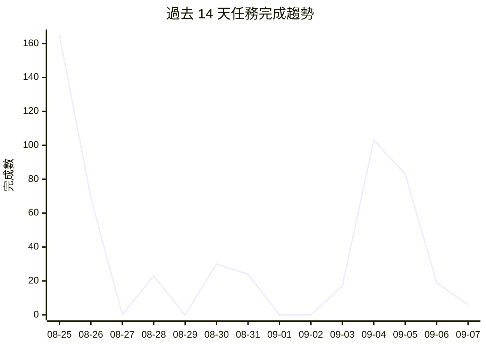

# 📁 Projects Dashboard

> 最後更新: 2026-09-07 20:08 · 自動生成

---

## 📊 總覽

| 指標 | 數量 |
|------|------|
| 專案數 | 63 |
| 任務總數 | 1701 |
| ✅ 已完成 | 1623 |
| ⬜ 待處理 | 15 |
| 🔄 進行中 | 0 |
| ⏭️ 跳過 | 63 |
| 總完成率 | 99% |

## 🔥 待處理高優先級任務

| 專案 | 任務 | 標題 |
|------|------|------|
| awesome-taiwan-ai-ecosystem | [T097-gap-analysis](https://github.com/gentoobreaking/ai-tasks/blob/main/awesome-taiwan-ai-ecosystem/tasks/T097-gap-analysis.md) | Crawler↔Spec 差距分析與補完清單（§64 DoD 阻塞項） |
| awesome-taiwan-ai-ecosystem | [T098-persist-entities](https://github.com/gentoobreaking/ai-tasks/blob/main/awesome-taiwan-ai-ecosystem/tasks/T098-persist-entities.md) | Coordinator 主流程持久化 Entity 到 DB（P0-1 阻塞項） |
| awesome-taiwan-ai-ecosystem | [T099-export-entitystore](https://github.com/gentoobreaking/ai-tasks/blob/main/awesome-taiwan-ai-ecosystem/tasks/T099-export-entitystore.md) | cmd/crawler runExport 改讀 EntityStore（P0-2 阻塞項） |
| awesome-taiwan-ai-ecosystem | [T100-runtime-verifier-http](https://github.com/gentoobreaking/ai-tasks/blob/main/awesome-taiwan-ai-ecosystem/tasks/T100-runtime-verifier-http.md) | Runtime Verifier 補 SSE / streamable_http 傳輸握手（P1-1 阻塞項） |
| awesome-taiwan-ai-ecosystem | [T101-discovery-keyword-split](https://github.com/gentoobreaking/ai-tasks/blob/main/awesome-taiwan-ai-ecosystem/tasks/T101-discovery-keyword-split.md) | GitHub KeywordMatrix 拆成兩階段 discovery，去除 MCP 字串依賴（DoD |
| awesome-taiwan-ai-ecosystem | [T102-mcp-verified-state](https://github.com/gentoobreaking/ai-tasks/blob/main/awesome-taiwan-ai-ecosystem/tasks/T102-mcp-verified-state.md) | 加 MCPIdentityStatusVerified 第 5 個 enum（DoD |
| awesome-taiwan-ai-ecosystem | [T107-fp-rate-validation](https://github.com/gentoobreaking/ai-tasks/blob/main/awesome-taiwan-ai-ecosystem/tasks/T107-fp-rate-validation.md) | 用 migrator reclassify 561 legacy records 驗證 FP rate < 5%（§58 KPI） |
| awesome-taiwan-ai-ecosystem | [T108-llm-fallback-wiring](https://github.com/gentoobreaking/ai-tasks/blob/main/awesome-taiwan-ai-ecosystem/tasks/T108-llm-fallback-wiring.md) | Classifier 接入 LLM fallback 主流程 |

---

## ⬜ 待處理

| 專案 | 任務 | 標題 | 狀態 |
|------|------|------|------|
| awesome-taiwan-ai-ecosystem | [T097-gap-analysis](https://github.com/gentoobreaking/ai-tasks/blob/main/awesome-taiwan-ai-ecosystem/tasks/T097-gap-analysis.md) | Crawler↔Spec 差距分析與補完清單（§64 DoD 阻塞項） | ⬜ |
| awesome-taiwan-ai-ecosystem | [T098-persist-entities](https://github.com/gentoobreaking/ai-tasks/blob/main/awesome-taiwan-ai-ecosystem/tasks/T098-persist-entities.md) | Coordinator 主流程持久化 Entity 到 DB（P0-1 阻塞項） | ⬜ |
| awesome-taiwan-ai-ecosystem | [T099-export-entitystore](https://github.com/gentoobreaking/ai-tasks/blob/main/awesome-taiwan-ai-ecosystem/tasks/T099-export-entitystore.md) | cmd/crawler runExport 改讀 EntityStore（P0-2 阻塞項） | ⬜ |
| awesome-taiwan-ai-ecosystem | [T100-runtime-verifier-http](https://github.com/gentoobreaking/ai-tasks/blob/main/awesome-taiwan-ai-ecosystem/tasks/T100-runtime-verifier-http.md) | Runtime Verifier 補 SSE / streamable_http 傳輸握手（P1-1 阻塞項） | ⬜ |
| awesome-taiwan-ai-ecosystem | [T101-discovery-keyword-split](https://github.com/gentoobreaking/ai-tasks/blob/main/awesome-taiwan-ai-ecosystem/tasks/T101-discovery-keyword-split.md) | GitHub KeywordMatrix 拆成兩階段 discovery，去除 MCP 字串依賴（DoD | ⬜ |
| awesome-taiwan-ai-ecosystem | [T102-mcp-verified-state](https://github.com/gentoobreaking/ai-tasks/blob/main/awesome-taiwan-ai-ecosystem/tasks/T102-mcp-verified-state.md) | 加 MCPIdentityStatusVerified 第 5 個 enum（DoD | ⬜ |
| awesome-taiwan-ai-ecosystem | [T103-registry-adapter-url](https://github.com/gentoobreaking/ai-tasks/blob/main/awesome-taiwan-ai-ecosystem/tasks/T103-registry-adapter-url.md) | 官方 MCP registry adapter URL 與可用性修補（P0-3） | ⬜ |
| awesome-taiwan-ai-ecosystem | [T104-entity-schema-align](https://github.com/gentoobreaking/ai-tasks/blob/main/awesome-taiwan-ai-ecosystem/tasks/T104-entity-schema-align.md) | Entity schema 補 SourceReference.Primary 與 MCPIdentity.Related（§37 對齊） | ⬜ |
| awesome-taiwan-ai-ecosystem | [T105-mcpmarket-default-disabled](https://github.com/gentoobreaking/ai-tasks/blob/main/awesome-taiwan-ai-ecosystem/tasks/T105-mcpmarket-default-disabled.md) | mcpmarket adapter 預設 disabled（Vercel WAF 永久失敗污染 log） | ⬜ |
| awesome-taiwan-ai-ecosystem | [T106-schema-v2](https://github.com/gentoobreaking/ai-tasks/blob/main/awesome-taiwan-ai-ecosystem/tasks/T106-schema-v2.md) | schema/registry.json 升級到 v2.0（Entity wrapper） | ⬜ |
| awesome-taiwan-ai-ecosystem | [T107-fp-rate-validation](https://github.com/gentoobreaking/ai-tasks/blob/main/awesome-taiwan-ai-ecosystem/tasks/T107-fp-rate-validation.md) | 用 migrator reclassify 561 legacy records 驗證 FP rate < 5%（§58 KPI） | ⬜ |
| awesome-taiwan-ai-ecosystem | [T108-llm-fallback-wiring](https://github.com/gentoobreaking/ai-tasks/blob/main/awesome-taiwan-ai-ecosystem/tasks/T108-llm-fallback-wiring.md) | Classifier 接入 LLM fallback 主流程 | ⬜ |
| awesome-taiwan-ai-ecosystem | [T109-evidence-based-classification](https://github.com/gentoobreaking/ai-tasks/blob/main/awesome-taiwan-ai-ecosystem/tasks/T109-evidence-based-classification.md) | Evidence-based classification 落實 spec §4.4 | ⬜ |
| awesome-taiwan-ai-ecosystem | [T110-mcp-identity-evidence-weighting](https://github.com/gentoobreaking/ai-tasks/blob/main/awesome-taiwan-ai-ecosystem/tasks/T110-mcp-identity-evidence-weighting.md) | MCP Identity 實作 spec §27 evidence weighting | ⬜ |
| awesome-taiwan-ai-ecosystem | [T111-data-library-guard](https://github.com/gentoobreaking/ai-tasks/blob/main/awesome-taiwan-ai-ecosystem/tasks/T111-data-library-guard.md) | Data Library / SDK / Infrastructure 防誤判（spec §22、§23、§48） | ⬜ |

---

## 📈 效能分析

| 指標 | 數值 |
|------|------|
| 過去 7 天完成 | 252 |
| 過去 30 天完成 | 844 |
| 平均週期時間 | 2.6 天 |
| 週期時間中位數 | 0.0 天 |

📊 總計: 539 | 日均: 38.5 | 本週: 228 | 📉 下降中

## 📋 專案列表

| 狀態 | 專案 | 總數 | ✅ | ⬜ | 🔄 | ⏭️ | 進度 | 更新 |
|------|------|------|----|----|----|----|------|------|
| ✅ | [agent-config](https://github.com/gentoobreaking/ai-tasks/tree/main/agent-config) | 9 | 9 | 0 | 0 | 0 | ████████████████████ 100% | 2026-04-09 |
| ✅ | [ai-oncall](https://github.com/gentoobreaking/ai-tasks/tree/main/ai-oncall) | 22 | 22 | 0 | 0 | 0 | ████████████████████ 100% | 2026-08-26 |
| ✅ | [automation-tools](https://github.com/gentoobreaking/ai-tasks/tree/main/automation-tools) | 1 | 1 | 0 | 0 | 0 | ████████████████████ 100% | 2026-05-16 |
| ⬜ | [awesome-taiwan-ai-ecosystem](https://github.com/gentoobreaking/ai-tasks/tree/main/awesome-taiwan-ai-ecosystem) | 111 | 96 | 15 | 0 | 0 | █████████████████░░░ 86% | 2026-09-07 |
| ✅ | [backup-system](https://github.com/gentoobreaking/ai-tasks/tree/main/backup-system) | 5 | 5 | 0 | 0 | 0 | ████████████████████ 100% | 2026-04-15 |
| ✅ | [claw-sessions-issue](https://github.com/gentoobreaking/ai-tasks/tree/main/claw-sessions-issue) | 1 | 1 | 0 | 0 | 0 | ████████████████████ 100% | 2026-04-16 |
| ✅ | [clawhub-oauth-investigation](https://github.com/gentoobreaking/ai-tasks/tree/main/clawhub-oauth-investigation) | 2 | 2 | 0 | 0 | 0 | ████████████████████ 100% | 2026-04-22 |
| ✅ | [cmd-log-parser](https://github.com/gentoobreaking/ai-tasks/tree/main/cmd-log-parser) | 3 | 3 | 0 | 0 | 0 | ████████████████████ 100% | 2026-04-16 |
| ✅ | [cnyes-stock](https://github.com/gentoobreaking/ai-tasks/tree/main/cnyes-stock) | 16 | 16 | 0 | 0 | 0 | ████████████████████ 100% | 2026-05-12 |
| ✅ | [dashboard-tool](https://github.com/gentoobreaking/ai-tasks/tree/main/dashboard-tool) | 5 | 5 | 0 | 0 | 0 | ████████████████████ 100% | 2026-04-09 |
| ✅ | [digital-twin](https://github.com/gentoobreaking/ai-tasks/tree/main/digital-twin) | 95 | 95 | 0 | 0 | 0 | ████████████████████ 100% | 2026-08-24 |
| ✅ | [elevenlabs-research](https://github.com/gentoobreaking/ai-tasks/tree/main/elevenlabs-research) | 1 | 1 | 0 | 0 | 0 | ████████████████████ 100% | 2026-04-21 |
| ✅ | [free-ai-router](https://github.com/gentoobreaking/ai-tasks/tree/main/free-ai-router) | 118 | 118 | 0 | 0 | 0 | ████████████████████ 100% | 2026-08-24 |
| ✅ | [git-maintenance](https://github.com/gentoobreaking/ai-tasks/tree/main/git-maintenance) | 1 | 1 | 0 | 0 | 0 | ████████████████████ 100% | 2026-05-16 |
| ✅ | [github-data-review](https://github.com/gentoobreaking/ai-tasks/tree/main/github-data-review) | 8 | 8 | 0 | 0 | 0 | ████████████████████ 100% | 2026-04-28 |
| ✅ | [global-policy-refactor](https://github.com/gentoobreaking/ai-tasks/tree/main/global-policy-refactor) | 3 | 3 | 0 | 0 | 0 | ████████████████████ 100% | 2026-05-07 |
| ✅ | [gold-analysis](https://github.com/gentoobreaking/ai-tasks/tree/main/gold-analysis) | 67 | 67 | 0 | 0 | 0 | ████████████████████ 100% | 2026-08-30 |
| ✅ | [gold-monitor-pro](https://github.com/gentoobreaking/ai-tasks/tree/main/gold-monitor-pro) | 21 | 21 | 0 | 0 | 0 | ████████████████████ 100% | 2026-08-30 |
| ✅ | [gpt-sovits-research](https://github.com/gentoobreaking/ai-tasks/tree/main/gpt-sovits-research) | 1 | 1 | 0 | 0 | 0 | ████████████████████ 100% | 2026-04-21 |
| ✅ | [gpt-sovits-voice-presets-research](https://github.com/gentoobreaking/ai-tasks/tree/main/gpt-sovits-voice-presets-research) | 1 | 1 | 0 | 0 | 0 | ████████████████████ 100% | 2026-04-21 |
| ✅ | [gpt-sovits-voices-research](https://github.com/gentoobreaking/ai-tasks/tree/main/gpt-sovits-voices-research) | 1 | 1 | 0 | 0 | 0 | ████████████████████ 100% | 2026-04-21 |
| ✅ | [ideas2tasks](https://github.com/gentoobreaking/ai-tasks/tree/main/ideas2tasks) | 11 | 11 | 0 | 0 | 0 | ████████████████████ 100% | 2026-04-23 |
| ✅ | [ideas2tasks-fix](https://github.com/gentoobreaking/ai-tasks/tree/main/ideas2tasks-fix) | 5 | 5 | 0 | 0 | 0 | ████████████████████ 100% | 2026-04-16 |
| ✅ | [ideas2tasks-improvements](https://github.com/gentoobreaking/ai-tasks/tree/main/ideas2tasks-improvements) | 7 | 7 | 0 | 0 | 0 | ████████████████████ 100% | 2026-05-12 |
| ✅ | [jarvis](https://github.com/gentoobreaking/ai-tasks/tree/main/jarvis) | 47 | 43 | 0 | 0 | 4 | ████████████████████ 100% | 2026-05-23 |
| ✅ | [kgi-monitor](https://github.com/gentoobreaking/ai-tasks/tree/main/kgi-monitor) | 6 | 6 | 0 | 0 | 0 | ████████████████████ 100% | 2026-04-22 |
| ✅ | [lifecycle-sync-fix](https://github.com/gentoobreaking/ai-tasks/tree/main/lifecycle-sync-fix) | 2 | 2 | 0 | 0 | 0 | ████████████████████ 100% | 2026-04-21 |
| ✅ | [llm-router](https://github.com/gentoobreaking/ai-tasks/tree/main/llm-router) | 1 | 1 | 0 | 0 | 0 | ████████████████████ 100% | 2026-04-16 |
| ✅ | [local-ai-controlpanel](https://github.com/gentoobreaking/ai-tasks/tree/main/local-ai-controlpanel) | 41 | 41 | 0 | 0 | 0 | ████████████████████ 100% | 2026-08-18 |
| ✅ | [mcp-go-core](https://github.com/gentoobreaking/ai-tasks/tree/main/mcp-go-core) | 98 | 98 | 0 | 0 | 0 | ████████████████████ 100% | 2026-09-05 |
| ✅ | [md-viewer-app](https://github.com/gentoobreaking/ai-tasks/tree/main/md-viewer-app) | 44 | 38 | 0 | 0 | 6 | ████████████████████ 100% | 2026-05-12 |
| ✅ | [member-backup](https://github.com/gentoobreaking/ai-tasks/tree/main/member-backup) | 1 | 1 | 0 | 0 | 0 | ████████████████████ 100% | 2026-04-16 |
| ✅ | [member-config-review](https://github.com/gentoobreaking/ai-tasks/tree/main/member-config-review) | 7 | 7 | 0 | 0 | 0 | ████████████████████ 100% | 2026-04-19 |
| ✅ | [member-tasks](https://github.com/gentoobreaking/ai-tasks/tree/main/member-tasks) | 5 | 5 | 0 | 0 | 0 | ████████████████████ 100% | 2026-04-04 |
| ✅ | [mindnav-codeagent](https://github.com/gentoobreaking/ai-tasks/tree/main/mindnav-codeagent) | 147 | 147 | 0 | 0 | 0 | ████████████████████ 100% | 2026-05-23 |
| ✅ | [openclaw](https://github.com/gentoobreaking/ai-tasks/tree/main/openclaw) | 6 | 6 | 0 | 0 | 0 | ████████████████████ 100% | 2026-05-07 |
| ✅ | [openclaw-scrum](https://github.com/gentoobreaking/ai-tasks/tree/main/openclaw-scrum) | 7 | 7 | 0 | 0 | 0 | ████████████████████ 100% | 2026-04-16 |
| ✅ | [read](https://github.com/gentoobreaking/ai-tasks/tree/main/read) | 2 | 2 | 0 | 0 | 0 | ████████████████████ 100% | 2026-05-07 |
| ✅ | [research](https://github.com/gentoobreaking/ai-tasks/tree/main/research) | 1 | 1 | 0 | 0 | 0 | ████████████████████ 100% | 2026-04-28 |
| ✅ | [revenue-zero-cost](https://github.com/gentoobreaking/ai-tasks/tree/main/revenue-zero-cost) | 15 | 14 | 0 | 0 | 1 | ████████████████████ 100% | 2026-04-20 |
| ✅ | [security-improvements](https://github.com/gentoobreaking/ai-tasks/tree/main/security-improvements) | 7 | 7 | 0 | 0 | 0 | ████████████████████ 100% | 2026-04-04 |
| ✅ | [security-tools](https://github.com/gentoobreaking/ai-tasks/tree/main/security-tools) | 5 | 5 | 0 | 0 | 0 | ████████████████████ 100% | 2026-04-09 |
| ✅ | [session-logger-plugin](https://github.com/gentoobreaking/ai-tasks/tree/main/session-logger-plugin) | 5 | 5 | 0 | 0 | 0 | ████████████████████ 100% | 2026-05-07 |
| ✅ | [sinotrade-scraper](https://github.com/gentoobreaking/ai-tasks/tree/main/sinotrade-scraper) | 9 | 8 | 0 | 0 | 1 | ████████████████████ 100% | 2026-04-28 |
| ✅ | [skill-enhancement](https://github.com/gentoobreaking/ai-tasks/tree/main/skill-enhancement) | 4 | 4 | 0 | 0 | 0 | ████████████████████ 100% | 2026-04-04 |
| ✅ | [skills-audit](https://github.com/gentoobreaking/ai-tasks/tree/main/skills-audit) | 5 | 5 | 0 | 0 | 0 | ████████████████████ 100% | 2026-05-19 |
| ✅ | [slo-sentinel](https://github.com/gentoobreaking/ai-tasks/tree/main/slo-sentinel) | 36 | 34 | 0 | 0 | 2 | ████████████████████ 100% | 2026-08-26 |
| ✅ | [taolive-ios](https://github.com/gentoobreaking/ai-tasks/tree/main/taolive-ios) | 67 | 19 | 0 | 0 | 48 | ████████████████████ 100% | 2026-05-14 |
| ✅ | [task-url-repair](https://github.com/gentoobreaking/ai-tasks/tree/main/task-url-repair) | 1 | 1 | 0 | 0 | 0 | ████████████████████ 100% | 2026-04-20 |
| ✅ | [tasks-executor](https://github.com/gentoobreaking/ai-tasks/tree/main/tasks-executor) | 8 | 8 | 0 | 0 | 0 | ████████████████████ 100% | 2026-05-12 |
| ✅ | [tw-prop-mcp](https://github.com/gentoobreaking/ai-tasks/tree/main/tw-prop-mcp) | 34 | 34 | 0 | 0 | 0 | ████████████████████ 100% | 2026-09-07 |
| ✅ | [tw-quant](https://github.com/gentoobreaking/ai-tasks/tree/main/tw-quant) | 14 | 14 | 0 | 0 | 0 | ████████████████████ 100% | 2026-08-25 |
| ✅ | [tw-quant-daybrain](https://github.com/gentoobreaking/ai-tasks/tree/main/tw-quant-daybrain) | 28 | 28 | 0 | 0 | 0 | ████████████████████ 100% | 2026-08-12 |
| ✅ | [tw-quant-db](https://github.com/gentoobreaking/ai-tasks/tree/main/tw-quant-db) | 38 | 37 | 0 | 0 | 1 | ████████████████████ 100% | 2026-09-02T05:45:00Z |
| ✅ | [tw-quant-mcp](https://github.com/gentoobreaking/ai-tasks/tree/main/tw-quant-mcp) | 243 | 243 | 0 | 0 | 0 | ████████████████████ 100% | 2026-08-26 |
| ✅ | [tw-quant-pickup](https://github.com/gentoobreaking/ai-tasks/tree/main/tw-quant-pickup) | 49 | 49 | 0 | 0 | 0 | ████████████████████ 100% | 2026-09-02T06:30:00Z |
| ✅ | [tw-quant-selector](https://github.com/gentoobreaking/ai-tasks/tree/main/tw-quant-selector) | 148 | 148 | 0 | 0 | 0 | ████████████████████ 100% | 2026-08-15 |
| ✅ | [tw-quant-signal](https://github.com/gentoobreaking/ai-tasks/tree/main/tw-quant-signal) | 32 | 32 | 0 | 0 | 0 | ████████████████████ 100% | 2026-08-19 |
| ✅ | [twse-monitor](https://github.com/gentoobreaking/ai-tasks/tree/main/twse-monitor) | 11 | 11 | 0 | 0 | 0 | ████████████████████ 100% | 2026-05-07 |
| ✅ | [twstock-bfp-research](https://github.com/gentoobreaking/ai-tasks/tree/main/twstock-bfp-research) | 1 | 1 | 0 | 0 | 0 | ████████████████████ 100% | 2026-05-06 |
| ✅ | [ux-improvement](https://github.com/gentoobreaking/ai-tasks/tree/main/ux-improvement) | 2 | 2 | 0 | 0 | 0 | ████████████████████ 100% | 2026-04-04 |
| ✅ | [working-issue](https://github.com/gentoobreaking/ai-tasks/tree/main/working-issue) | 4 | 4 | 0 | 0 | 0 | ████████████████████ 100% | 2026-05-07 |
| ✅ | [xiamen-travel](https://github.com/gentoobreaking/ai-tasks/tree/main/xiamen-travel) | 5 | 5 | 0 | 0 | 0 | ████████████████████ 100% | 2026-04-19 |

---

## 🔗 快速連結

- [任務看板](https://github.com/users/gentoobreaking/projects/1/views/1?groupedBy%5BcolumnId%5D=Status)
        - [每日儀表板 → DAILY.md](https://github.com/gentoobreaking/ai-tasks/blob/main/DAILY.md)
        - [Tasks 根目錄](https://github.com/gentoobreaking/ai-tasks/tree/main)
- 腳本: `scripts/update_projects.py` · `scripts/update_daily.py`

---
_自動生成，請勿手動編輯_
