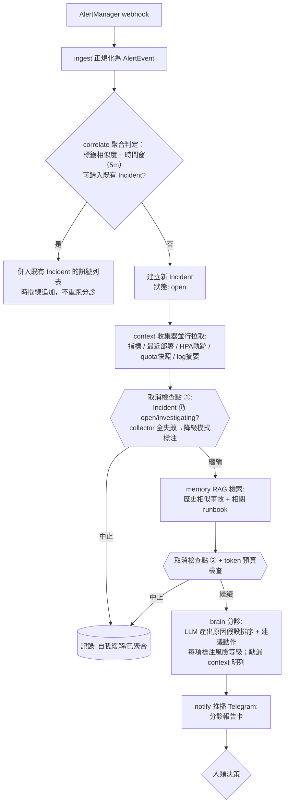

# 分診管線——主流程邏輯規格

> **本檔為管線編排的唯一實作依據。** 任務拆解鐵律：凡實作 `brain/triage.py`、
> `incident/correlate.go(py)`、`interact/` 的任務書，驗收標準必須逐條引用本檔小節。
>
> 對應功能：F4 診斷建議、F10 警報風暴聚合、F11 成本護欄、F15 Shadow Mode
> 對應模組：`core/src/oncall_core/{incident,brain,interact}`

## A.1 主流程（含取消檢查點）

## A.2 聚合演算法（v1 最簡版）

- 新警報與**過去 5 分鐘內的未結 Incident** 比較 `cluster`/`service`/`severity`
  標籤交集 ≥2 即併入；無命中才新建 Incident
- 併入時時間線追加事件、不重跑分診；若 Incident 已進入 mitigated 則只記錄不重開
- v2 再考慮文字嵌入相似度

## A.3 取消檢查點

| 檢查點 | 位置 | 條件 | 動作 |
|---|---|---|---|
| ① | context 收集完成後 | Incident 狀態 ∉ {open, investigating} | 中止，時間線記「自我緩解」 |
| ② | RAG 完成後、LLM 呼叫前 | 同上 ＋ token 預算剩餘 >0 | 同上 |

- 每次 LLM 呼叫包在可取消 context 中；取消時已耗 token 仍計入成本統計

## A.4 成本護欄（F11）

- 每 Incident 的 LLM 呼叫次數上限（預設 6 次）與 token 上限（YAML 可調）
- 超限降級：不再呼叫 LLM，改推純 context 摘要＋歷史相似事故連結
- 所有消耗入 `/metrics`

## A.5 降級模式

- Prometheus/Loki collector 全失敗 → 分診照常執行，
  但報告必須明列「本次缺少哪些 context」，禁止 LLM 幻覺補完缺失資訊
- 部分失敗 → 缺漏區塊標注 `unavailable`，其餘正常

## A.6 Shadow Mode（F15）

- 全域旗標 `SHADOW_MODE=1`：管線完整執行至分診報告產出
- 「推播」改寫入 `shadow_reports/{incident_id}.md`；executor 一律跳過
- 目的：上線前累積 ≥30 份影子報告供人工評分（見 algs/eval-shadow.md）
