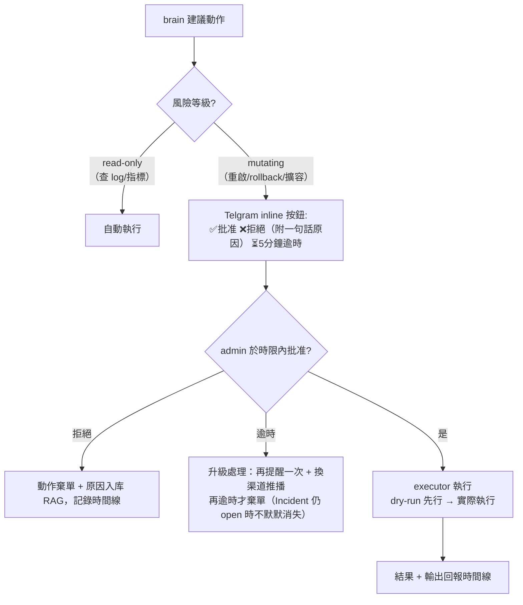
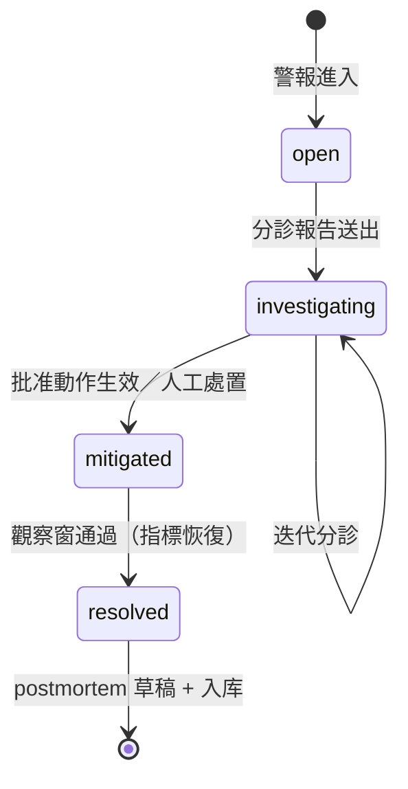

# ai-oncall — AI On-call 分身 開發規格書

> 版本：v0.1（草案）｜建立：2026-08-24
> 定位：獨立專案，與 digital-twin 無程式碼耦合（僅借鏡設計模式）
> **部署目標：上線長駐（production-grade daemon），gate/core/ui 三服務架構自第一天確立**

---

## 1. 開發目的

### 1.1 解決的問題

On-call 工程師半夜被警報叫醒後，最耗時的不是修復本身，而是**進入狀況前的 context 收集**：

1. **分診靠腦補**：警報只說「latency 高了」，要自己翻 dashboard、查最近部署、看 log 才能猜原因
2. **歷史經驗沒有被複用**：三個月前處理過的類似事故，這次還是從零開始查
3. **runbook 存在但沒人執行得那麼快**：緊張之下漏步驟、下錯指令
4. **事後文件永遠欠著**：postmortem 拖兩週才寫，細節已遺忘

### 1.2 專案目標

做一個 **AI on-call 副駕駛**：

- 接收 AlertManager 等來源的警報 webhook
- 自動收集現場 context（近期部署、相關 metrics、log 摘要）
- 用 RAG 對照**歷史事故與 runbook**：「上次類似狀況是什麼原因、怎麼解的」
- LLM 產出**診斷假設 + 建議動作清單**，推播 Telegram
- **破壞性動作必須人類批准**（批准閘門）→ 執行 runbook → 回報結果
- 容量型前驅預警（服務量暴漲、資源逼近天花板）由姊妹工具 **slo-sentinel** 的容量感測提供，經 AlertManager 以標準警報進入本系統——本專案不重造預測引擎，專注分診與處置
- 事故結束後自動產出 incident timeline + postmortem 草稿

核心原則：**AI 只建議與執行被批准的動作；判斷責任在人。**

### 1.3 非目標（Non-goals）

- 不做全自動修復（auto-remediation）——第一版所有改變系統狀態的動作都要人類批准
- 不取代 monitoring/告警系統本身
- 不做多租戶 SaaS；自用 / 單團隊優先

---

## 2. 功能與模組

### 2.1 功能清單

| # | 功能 | 說明 |
|---|------|------|
| F1 | 警報接收 | 接收 AlertManager webhook（JSON payload），正規化為統一 Incident 事件 |
| F2 | Context 自動收集 | 依警報標籤拉取：近 2 小時相關指標、最近 deployments、**HPA/擴縮容活動軌跡**（量暴漲的關鍵關鍵訊號）、雲端 **quota 使用率快照**（很多「暴漲事故」的真實根因是撞配額，不是程式）、錯誤 log 摘要 |
| F3 | 歷史比對（RAG） | 以警報特徵檢索歷史事故紀錄與 runbook，附相似度排名 |
| F4 | 診斷建議 | LLM 綜合 F2+F3 產出：可能原因排序、信心度、建議動作清單（每項標注風險等級） |
| F5 | Telegram 互動 | 推播分診報告；inline 按鈕批准/拒絕動作；`/incidents` `/status` 查詢指令 |
| F6 | Runbook 執行器 | YAML 定義的冪等動作（重啟 pod、rollback、擴容），批准後逐步執行並即時回報輸出 |
| F7 | 事故生命週期管理 | open → investigating → mitigated → resolved 狀態機；全程事件寫入時間線 |
| F8 | Postmortem 自動草稿 | resolved 後彙整時間線/動作/結果 → Markdown 草稿推播供人工修訂（檔案 commit 至 incidents repo） |
| F9 | 知識沉澱 | 已結案的事故（含人工修訂後結論）入库 RAG；**人類否決 AI 建議時強制捕獲「實際做法/原因」一句話即時入庫**——這是飛輪最貴的養分 |
| F10 | 警報風暴聚合 | 同根因的多條警報按標籤相似度+時間窗聚類為單一 Incident，context 只收集一次、分診只跑一次（見 §3.1） |
| F11 | 成本護欄 | 每一 Incident 的 LLM 呼叫次數/token 上限（沿數位分身 TokenLedger 模式），超限降級為純 context 推播 |
| F12 | 自我可觀測 | 分診延遲、LLM 失敗率、聚合比、成本等自身指標暴露 `/metrics`——值班工具自己啞火最丟臉 |
| F13 | Web Dashboard（獨立服務） | 唯讀網頁：事故清單/時間線/postmortem 渲染/runbook 統計；與 core 分進程，經唯讀 API 取數 |

### 2.2 系統切分：三服務架構（上線長駐為前提）

語言邊界自第一天確立——**Go 負責管線，Python 負責智能**，兩者以 gRPC 通訊：

```
┌─────────────────────────────────────────────────────────────┐
│  oncall-gate (Go) —— 管線層 sidecar，無 AI、無狀態依賴          │
│                                                              │
│  AlertManager webhook ──▶ ingest 正規化                       │
│  context 收集器（goroutine fan-out）:
  │    ├─ prometheus.go   ├─ deploys.go   └─ logs.go        │
│  Telegram Bot API 傳輸（送訊息/收按鈕 callback 的傳輸層）        │
└──────────────┬───────────────────────────────────▲───────────┘
               │ gRPC: ReportIncident(context)      │ gRPC: DeliverMessage / ActionApproval
               ▼                                    │
┌─────────────────────────────────────────────────────────────┐
│  oncall-core (Python) —— 智能層，長駐 daemon                  │
│                                                              │
│  incident 狀態機 + SQLite store                               │
│  memory RAG（歷史事故/runbook 入库與檢索）                      │
│  brain 分診引擎（LLM 多 provider 備援）                        │
│  runbook 引擎（解析/批准閘門/執行器——唯一碰生產環境的模組）       │
│  postmortem 生成                                              │
│  互動決策層（inline 按鈕的「語意」：批准/拒絕該做什麼）            │
└─────────────────────────────────────────────────────────────┘
               ▲
               │ 唯讀查詢 API（僅綁 localhost）
┌──────────────┴───────────────────────────────────────────────┐
│  oncall-ui (Python) —— 獨立 UI 服務，純唯讀                    │
│                                                              │
│  事故清單 / 時間線 / postmortem 渲染 / runbook 統計              │
│  對外一律經反向代理認證；無寫入端點                              │
└─────────────────────────────────────────────────────────────┘
```

#### oncall-gate（Go）模組

```
gate/
├── cmd/gate/main.go           # 進入點：HTTP server + gRPC client
├── internal/
│   ├── ingest/
│   │   └── alertmanager.go    # webhook 正規化 → IncidentEvent proto
│   ├── collect/               # [goroutine fan-out] context 收集
│   │   ├── prometheus.go      #   相關指標時間序列
│   │   ├── deploys.go         #   近期部署（API/檔案）
│   │   ├── scaling.go         #   ★ HPA/autoscaler 活動軌跡：事故前副本數變化（4→12 這種訊號對分診極關鍵）
│   │   └── logs.go            #   log 摘要（Loki API / 檔案 tail）
│   └── tgtransport/           # Telegram 傳輸傳輸層（純收發，不含決策）
│       └── transport.go       #   送訊息；callback 事件轉發給 core
├── proto/oncall.proto         # 雙向契約（單一事實來源）
└── deploy/                    # systemd unit / container
```

#### oncall-core（Python）模組

```
core/
├── pyproject.toml
└── src/oncall_core/
    ├── incident/              # [A] 事故領域模型 + SQLite store
    ├── memory/                # [D] RAG：indexer / search
    ├── brain/                 # [E] 分診引擎：prompt 組裝 + provider 備援
    ├── runbook/               # [F] parse / executor / approval（批准閘門）
    ├── interact/              # [G] Telegram 決策層：callback → 批准/拒絕語意
    ├── postmortem/            # [H] 草稿生成
    ├── grpc_servicer.py       # gate→core 的 gRPC 介面實作
    └── readapi/               # ★ UI 專用唯讀查詢（僅綁 127.0.0.1）
        └── http.go            #   /api/incidents /api/incidents/{id} /api/runbooks
```

#### oncall-ui（Python，獨立 process）模組

```
ui/
├── pyproject.toml
├── src/oncall_ui/
│   ├── app.py                # FastAPI + Jinja2 + htmx；唯讀路由
│   ├── views/
│   │   ├── incidents.py      #   清單（狀態篩選/搜尋）與詳情（時間線+分診報告+批准紀錄）
│   │   ├── postmortem.py     #   Markdown 渲染
│   │   └── runbooks.py       #   清單與執行統計
│   └── client.py             #   呼叫 core readapi 的客戶端（不碰 SQLite 檔案）
└── templates/ + static/      # htmx + 極簡 CSS
```

#### gRPC 契約（proto/oncall.proto，關鍵訊息）

| RPC | 方向 | 用途 |
|---|---|---|
| `ReportIncident(IncidentEvent) returns (Ack)` | gate → core | 警報進入，觸發分診 |
| `DeliverNotification(Notification) returns (Ack)` | gate → core | core 請求 gate 代發 Telegram 訊息 |
| `ActionCallback(CallbackEvent) returns (Ack)` | gate → core | 使用者按下批准/拒絕按鈕 |
| `CollectContext(Labels) returns (ContextBundle)` | core → gate | core 請求 gate 併發收集現場 |

> 邊界鐵律：gate 不 import 任何 AI/RAG 套件；core 不直接發 HTTP 到 Prometheus/Loki。
> 兩服務可各自獨立重啟/升級；gate 掛了警報暫存重試，core 掛了 gate 退避重試。

### 2.3 模組依賴方向（單向無循環，三服務各自成立）

```
【gate / Go】
cmd/gate → ingest → collect → tgtransport
                ↘ proto（唯一共用契約）

【core / Python】
grpc_servicer → incident ← memory ← brain ← runbook.approval
                     ↑                    ↓
               postmortem（唯讀時間線）   executor（唯一碰生產環境）
interact → runbook.approval / incident
```

- `brain` 只吃文字輸入、吐結構化 JSON——LLM 不得直接觸發動作
- `runbook.executor` 是 core 中唯一被允許碰生產環境的模組，必須經 `approval` 閘門
- gate 內**禁止**出現任何 AI/RAG 套件；core 內**禁止**直接呼叫 Prometheus/Loki HTTP（一律走 gate）
- 跨服務只允許透過 proto 契約通訊，兩側各自的內部重構互不可見
- `oncall-ui` 是第三個獨立 process：**純唯讀**（無 POST/表單）、僅綁 127.0.0.1、對外一律經反向代理認證；取數走 core 的 readapi，不碰 SQLite 檔案、不碰 executor——被打穿的最壞後果是事故資料唯讀洩漏，執行面完全隔絕
- **gate↔core 跨網段傳輸安全（決策）**：走 WireGuard/Tailscale 組內網後再聽 gRPC（零憑證管理，首選）；若環境不允許則 gRPC + mTLS。**禁止明文 gRPC 直接暴露公網**
- **分診管線取消檢查點**：context 收集/RAG/每次 LLM 呼叫之前，先確認 Incident 仍處 open/investigating——警報自我緩解或已聚合進他者時立即中止，不浪費 token 產出過期報告
- **context 降級模式**：Prometheus/Loki 本身也在故障中（相關性故障常見）時，分診照常執行但報告必須明列「本次缺少哪些 context」，禁止 LLM 幻覺補完

---

## 3. 邏輯流程圖

### 3.1 主流程：警報 → 聚合 → 分診 → 建議

```mermaid
flowchart TD
    A[AlertManager webhook] --> B[ingest 正規化為 AlertEvent]
    B --> C{correlate 聚合判定：
標籤相似度 + 時間窗（5m）
可歸入既有 Incident?}
    C -- 是 --> D[併入既有 Incident 的訊號列表
時間線追加，不重跑分診]
    C -- 否 --> E[建立新 Incident
狀態: open]
    E --> F[context 收集器並行拉取:
指標 / 最近部署 / log 摘要]
    F --> G{{取消檢查點 ①:
Incident 仍 open/investigating?
collector 全失敗→降級模式標注}}
    G -- 中止 --> X[(記錄: 自我緩解/已聚合)]
    G -- 繼續 --> H[memory RAG 檢索:
歷史相似事故 + 相關 runbook]
    H --> I{{取消檢查點 ② + token 預算檢查}}
    I -- 中止 --> X
    I -- 繼續 --> J[brain 分診:
LLM 產出原因假設排序 + 建議動作
每項標注風險等級；缺漏 context 明列]
    J --> K[notify 推播 Telegram:
分診報告卡]
    K --> L{人類決策}
    L -- 批准動作 --> M[runbook.executor 逐步執行
每步即時回報輸出]
    L -- 拒絕 --> N[★ 強制捕獲一句話:
「實際做法/原因」→ 即時入库 RAG]
    L -- 自行處理 --> O[記錄於時間線]
    M --> P{問題緩解?}
    N --> P
    O --> P
    P -- 是 --> Q[狀態 → mitigated/resolved]
    P -- 否 --> F（回到收集，迭代分診）
    Q --> R[postmortem 草稿生成
→ 推播供人工修訂]
    R --> S[(修訂後結論入库 RAG
知識飛輪)]
```

> **聚合演算法（v1 最簡版）**：新警報與過去 5 分鐘內的未結 Incident 比較
> `cluster` / `service` / `severity` 標籤交集 ≥2 即併入；無命中才新建。
> v2 再考慮文字嵌入相似度。

### 3.2 批准閘門（安全核心）



> 安全鐵律：mutating 動作一律 dry-run → 批准 → 執行三段式；無人批准 = 不執行，沒有例外。

### 3.3 事故狀態機



### 3.4 上線部署架構

```mermaid
flowchart LR
    subgraph prod["生產環境（目標叢集/主機）"]
        AM[AlertManager]
        PM[Prometheus]
        LO[Loki]
        G[oncall-gate
(Go daemon)]
    end
    subgraph home["你的機器/NAS"]
        C[oncall-core
(Python daemon)]
        DB[(SQLite)]
        VDB[(RAG 向量庫)]
    end
    U[你的手機 📱]
    AM -->|webhook| G
    G <-->|gRPC| C
    G --> PM
    G --> LO
    C --- DB
    C --- VDB
    G <-->|Telegram API| U
    UI -->|localhost 唯讀 API| C
    B -->|反向代理認證| UI
```

- gate 部署在「看得到生產環境」的網段（才能拉指標/log）
- core 可跑在家裡/NAS——它只需要跟 gate 通、跟 LLM API 通
- 兩服務斷線時各自緩衝重試（gate 存警報、core 存待送訊息）

---

## 4. 開發語言評估

| 評估面 | Go | Python |
|---|---|---|
| Webhook server / 併發收集 | ✅ goroutine 天然適合「同時拉指標+log+部署」，fan-out 很自然 | ✅ asyncio 也夠用 |
| LLM 生態 | ⚠️ 官方 SDK 有但要自己組裝；structured output 工具較少 | ✅✅ 最快最齊（含本地模型整合） |
| **RAG / embedding** | ❌❌ 致命傷：embedding 模型是 PyTorch 系，需 ONNX 或外部 service | ✅ sentence-transformers 直接用 |
| Kubernetes 操作（rollback 等） | ✅ client-go 一等公民 | ✅ kubernetes-py 可用 |
| 部署形態 | ✅ 單一 binary | ⚠️ venv/容器 |
| 開發速度 | ⚠️ 中等 | ✅ 快 |
| 對你的附加價值 | ✅ SRE+Go 的組合拳 | ➖ digital-twin 已覆蓋 |

### 結論：三服務定案——Gate 用 Go、Core 與 UI 用 Python

既然以上線長駐為前提，「要不要混語言」不再是選項而是答案：

| 服務 | 語言 | 理由 |
|---|---|---|
| **oncall-gate** | **Go** | 長駐管線 daemon：常駐資源小、單 binary 部署進生產網段零依賴、goroutine fan-out 收集器天然契合、Prometheus/Loki client 一等公民 |
| **oncall-core** | **Python** | RAG/embedding 生態不可替代；LLM structured output 迭代最快；這層變動頻率高（prompt/prompt/prompt），要的是開發速度 |
| **oncall-ui** | **Python（FastAPI+Jinja2+htmx）** | 純唯讀渲染服務；與 core 同語言共享型別定義；規模小到不需要獨立前端工程 |

分工的額外紅利：
- **故障隔離**：AI 層掛掉不影響警報接收；管線層掛掉不影響已開事故的處理
- **測試策略清晰**：gate 用表驅動單元測試＋契約測試（proto 為準）；core 用 mock LLM 測分診邏輯
- **開發節奏解耦**：gate 一次寫完就穩定；core 持續迭代 prompt 不用重新部署管線

### 風險與對沖

| 風險 | 對沖 |
|---|---|
| gRPC 契約前期設計錯誤 | proto 先行、契約測試進 CI；欄位寧多勿少 |
| 雙語言維運成本 | gate 刻意做到極簡（預計 <1500 行），寫完就不動 |
| 本機 core 對外網 LLM 依賴 | provider 備援鏈 + 離線降級（只通知不分診） |
| UI 被打穿 | 三層隔離：①UI 綁 127.0.0.1，對外必經反向代理認證 ②UI 無寫入端點，最壞後果是事故資料唯讀洩漏 ③UI 不碰 SQLite 檔案、不碰 runbook executor，只走 core 的唯讀 API |

---

## 5. 上線驗收標準（草案）

1. **端到端演練**：人造一次「deployment 後 latency 飆升」事故，gate 30 秒內收到警報並完成 context 收集，core 產出含歷史比對的分診報告到手機
2. **批准閘門實測**：mutating 動作未批准前零副作用；拒絕與逾時路徑皆有時間線紀錄
3. **知識飛輪實測**：同一類事故第二次發生時，分診報告必須引用第一次的結論
4. **韌性實測**：殺掉 core 期間警報不遺失（gate 重試）；恢復後自動補分診
5. **資源水位**：gate 常駐 <50MB；core <500MB（含模型載入）；ui <100MB
6. **UI 安全驗證**：未經反向代理直接掃 ui port 應無法從外部觸及；所有路由為 GET，滲透測試確認無寫入端點
7. **風暴演練**：同一根因同時引爆 10 條警報 → 聚合為 1 個 Incident、只跑 1 次分診；LLM 成本 ≤ 單一 Incident 上限
8. **取消檢查點驗證**：分診進行中警報自我緩解 → 管線中止且不產出報告，token 消耗為零
9. **傳輸安全**：gate↔core 通訊經 WireGuard/mTLS；公網側掃描不得發現明文 gRPC port
10. **容量暴漲情境**：slo-sentinel 發出「quota 觸頂預警」→ 本系統接手分診，報告中必須呈現 HPA 擴張軌跡與 quota 快照，並建議提額或降載動作
