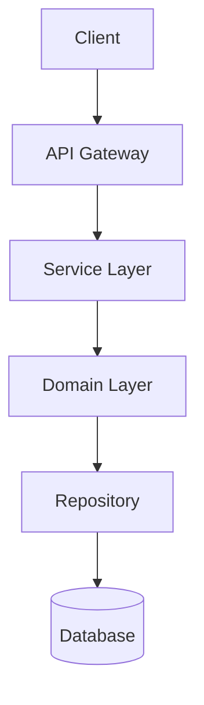
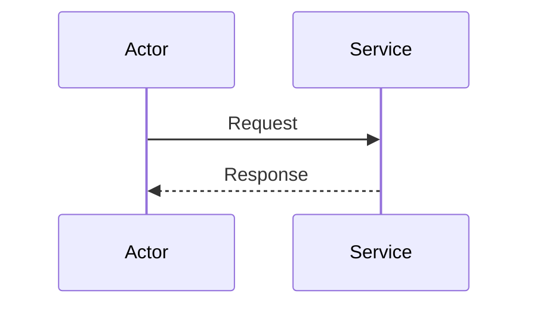

# {專案} 規格書 v{版本}

## 1. 版本資訊與變更摘要

### 1.1 版本元資料
- **專案**：{專案}
- **版本**：v{版本}
- **發布日期**：YYYY-MM-DD
- **狀態**：released / draft / deprecated
- **諮詢模型**：Claude, Gemini, Grok, DeepSeek V4 Flash
- **合併決策**：`ai-consultations/v{版本}/merge-decision.md`

### 1.2 變更摘要（Changelog）
| 類別 | 項目 | 說明 | 相關檔案 |
|------|------|------|----------|
| 新增 | {功能/介面} | {描述} | {路徑} |
| 變更 | {現有功能} | {變更內容} | {路徑} |
| 修復 | {Bug/問題} | {修復方式} | {路徑} |
| 移除 | {廢棄項目} | {替代方案} | {路徑} |

---

## 2. 架構設計

### 2.1 整體架構圖


### 2.2 模組劃分
| 模組 | 職責 | 介面 | 依賴 |
|------|------|------|------|
| {模組名} | {職責} | {介面定義} | {依賴模組} |

### 2.3 架構決策記錄（ADR 索引）
- ADR-{編號}：{決策標題} → `~/notes/adr/ADR-{編號}.md`

---

## 3. API 契約

### 3.1 介面定義
```go
// 範例：Go interface
type {ServiceName} interface {
    {MethodName}(ctx context.Context, req *{Request}) (*{Response}, error)
}
```

### 3.2 請求/回應格式
```json
{
  "field": "type",
  "description": "說明"
}
```

### 3.3 錯誤碼定義
| 代碼 | HTTP Status | 訊息 | 處理建議 |
|------|-------------|------|----------|
| ERR_XXX | 4xx/5xx | {訊息} | {建議} |

---

## 4. 資料模型

### 4.1 核心實體
```go
type {EntityName} struct {
    Field1 Type `json:"field1" validate:"required"`
    Field2 Type `json:"field2,omitempty"`
}
```

### 4.2 資料庫 Schema
```sql
CREATE TABLE {table} (
    id BIGSERIAL PRIMARY KEY,
    ...
);
```

### 4.3 遷移策略（如適用）
- 版本：v{版本} → v{下一版本}
- 步驟：1) ... 2) ... 3) ...

---

## 5. 核心流程與邏輯

### 5.1 {流程名稱}


### 5.2 業務規則
- 規則 1：{描述}
- 規則 2：{描述}

### 5.3 邊界條件與例外處理
| 場景 | 處理方式 | 回應 |
|------|----------|------|

---

## 6. 部署與運維

### 6.1 環境需求
- Go/Python/Node 版本：
- 依賴服務：{Redis, PostgreSQL, Kafka...}
- 資源建議：CPU、記憶體、磁碟

### 6.2 設定參數
```yaml
# config.yaml 範例
service:
  port: 8080
  timeout: 30s
```

### 6.3 觀測性
- 指標：{Prometheus metrics}
- 日誌：{結構化日誌格式}
- 追蹤：{OpenTelemetry}

### 6.4 Docker 部署
參考：`~/Projects/tw-quant-selector/Dockerfile`

---

## 7. 風險與待辦

### 7.1 已知風險
| 風險 | 影響度 | 機率 | 緩解措施 |
|------|--------|------|----------|

### 7.2 待決事項
- [ ] {事項} → 負責人 / 期限

### 7.3 未來擴展方向
- {方向 1}
- {方向 2}

---

## 附錄：AI 諮詢記錄索引

| 模型 | 角色 | 輸出檔案 | 諮詢日期 |
|------|------|----------|----------|
| Claude (Sonnet/Opus) | 架構設計師 | `ai-consultations/v{版本}/01-claude.md` | YYYY-MM-DD |
| Gemini (Pro/Ultra) | 細節工程師 | `ai-consultations/v{版本}/02-gemini.md` | YYYY-MM-DD |
| Grok | 批判性思考者 | `ai-consultations/v{版本}/03-grok.md` | YYYY-MM-DD |
| DeepSeek V4 Flash | 實作導向 | `ai-consultations/v{版本}/04-deepseek-v4-flash.md` | YYYY-MM-DD |

| 審查文件 | 路徑 |
|----------|------|
| 合併審查對照表 | `ai-consultations/v{版本}/05-merge-review.md` |
| 合併決策記錄 | `ai-consultations/v{版本}/merge-decision.md` |

---

> **說明**：本規格書為 v{版本} 權威版本。所有 AI 諮詢原始輸出永久保留於 `ai-consultations/v{版本}/`，供未來追溯決策脈絡。