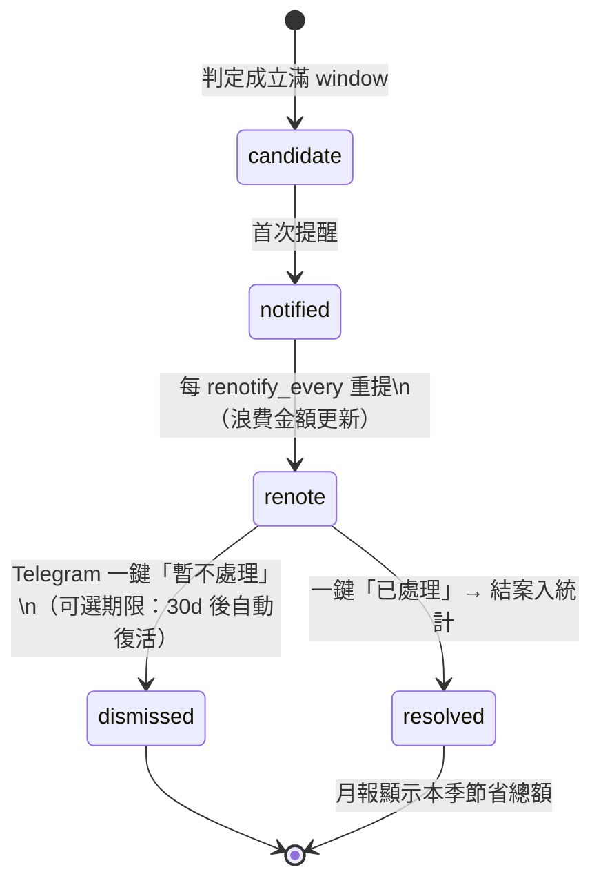

# 瘦身與閒置偵測——演算法規格

> **本檔為演算法規格，是對應模組的唯一實作依據。**
> **任務拆解鐵律**：凡實作下列功能/模組的任務書（T00X），其「驗收標準」必須
> 逐條引用本檔對應小節（例：「公式與觸發條件依 `algs/waste-detection.md` §X」），
> 未引用視為任務書不完整。
>
> 對應功能：F14 瘦身與閒置偵測（雲端/K8s/OpenShift/Standalone）
> 對應模組：`internal/waste/`
>


### E.1 兩類判定的公式

**A. 殭屍資源（零流量）**

```
idle(d) ⟺  max{ metric_d(t) : t ∈ window }  ≤  ε        # 視窗內最大值都趨近零
waste$   = unit_price_per_day × idle_days                # 累積浪費，隨時間增長
首次提醒：idle 成立滿 window（預設 14d）
重複提醒：之後每 renotify_every（預設 7d），金額持續累加——「拖越久越貴」具象化
```

> ε 的意義：ELB/ALB 健康檢查與偶發探測會產生個位數請求，ε=10 過濾雜訊，
> 只抓「真的沒人用」。

**B. 供給過剩（Right-sizing）**

```
util_ratio(t) = 使用量指標 / 供給容量
P95 = percentile(util_ratio, 95) over window              # 用 P95 不用均值：
                                                          # 尖峰時刻撐得住就不該縮
low_util(d) ⟺ P95 < threshold（預設 15%）

建議規格：target = 能讓降規後的 P50 ≈ target_p50(預設 40%) 的最小檔位
月省估算：saving/mo = (price_current − price_suggested) × 730h
          （價格查 billing adapter；無法確定檔位價差時標注「估算」）
```

### E.2 候選清單生命週期（避免嘮叨，也避免遺忘）



- `dismissed` 必須選擇性附一句原因（可空白但 UI 引導），供 §6.8 目錄調整參考
- 所有結案的節省金額加總 → 月報「本工具幫你省了多少」，價值自我證明

### E.3 掃描頻率與成本

- waste 類掃描每日一次即可（低頻、離線批次，不佔輪詢迴圈）
- 指標查詢走同一個 Prometheus；帳務單價走 billing adapter 快取
- 資源清單發現：K8s 用 client-go、AWS 用 Resource Groups Tagging API / ELB API、阿里雲用對應 SDK——以 provider interface 隔離

### E.4 為什麼必須自研引擎（v1 就做）——可視性的結構性問題

AWS Compute Optimizer、Trusted Advisor、阿里雲成本顧問的判定演算法確實成熟，
但它們有一個**無法用設定解決的缺陷：報告只出現在管理帳號的 console 裡**。

| 實務困境 | 後果 |
|---|---|
| 建議給管理人員看，資源是維護人員管的 | 看得到的人不動手，動手的人看不到 |
| 部分環境（代管/外包/多層轉售）連管理人員都不登入 console | 建議等於不存在 |
| 跨雲＋地端各自一套 console | 沒有單一清單，沒人能回答「全部加起來浪費多少」 |

因此本專案的價值主張正是**把判定結果送到維護人員手上**（Telegram 推播＋
統一目錄），自研判定引擎 **v1 即納入**，不做「先讀 findings 再轉發」的過渡方案。

與原生服務的分工仍存在：原生工具的**判定門檻數值**可作為我們目錄條目的
初始參考值（例如 Compute Optimizer 對 EC2 的降規檔位邏輯），但執行路徑完全獨立。

### E.5 涵蓋範圍：雲端＋地端三類環境（v1）

| 環境 | 發現機制 | 感測重點 |
|---|---|---|
| ☁️ AWS / AlibabaCloud | Tagging API / 各服務 List API + billing adapter | 閒置 ELB/EIP/磁碟、低使用率 EC2/ECS、RDS 連線閒置 |
| ☸️ K8s / OpenShift | client-go（OpenShift 為 K8s 發行版，同 API 相容） | 見 §8.6 四類感測 |
| 🖥️ Standalone server | node_exporter + process/port 探測 | 見 §8.6 |

#### E.6 K8s / OpenShift 四類感測

| # | 名稱 | 判定公式 | 浪費換算 |
|---|---|---|---|
| K1 | **過度請求的容器**（over-requested） | `P14d(container_usage) / requests < 0.3` 的容器——request 佔了排程資源但實際用不到，是叢集浪費的大宗 | `Σ(requests − 建議值) × 叢集單位成本` |
| K2 | **實質零使用的 Pod** | `P95(cpu) < ε 且 P95(mem) < ε` 連續 14d（排除 DaemonSet/Kube-system） | 對應 workload 份額成本 |
| K3 | **無人掛載的 PVC/PV** | PVC 存在但無任何 Pod 引用（`kube_persistentvolumeclaim_resource_requests_storage_bytes` 有值而引用數=0）連續 14d | 儲存單價 × 容量 × 天數 |
| K4 | **低效率節點**（可合併） | 節點 `allocatable` 使用率長期 < 20%（所有 Pod 的 requests 加總比）→ 提示「可驅逐合併後縮減節點」 | 節點單價 × 可省台數 |

> K8s 的浪費大宗是 K1：開發習慣性把 requests 開很大，整個叢集為幽靈資源付錢。
> 判定一律用 **P95 實際使用 vs requests**（而非 limit），且排除系統命名空間。

#### E.7 Standalone server 感測

| # | 判定 | 資料源 |
|---|---|---|
| S1 | 機器級殭屍：P95(CPU)<10% 且 P95(mem)<30% 連續 14d，且無對外活躍連線 | node_exporter |
| S2 | 幽靈服務：systemd service 在跑、監聽埠 14 天內零外部連線（conntrack/訪問 log 判定） | node_exporter + conntrack |
| S3 | 磁碟孤兒：掛載點無成長且無程序寫入超過 30d | node_exporter + audit |


### E.8 waste 類感測的目錄條目範例（Prometheus rules 格式）

與容量感測同一格式、同一目錄（`rules.d/`），sentinel 以 `sentinel_waste_*` 前綴
label/annotation 辨識歸屬：

```yaml
groups:
- name: waste.cloud.elb
  rules:
  - record: sentinel_waste_elb_idle_days
    expr: |
      max_over_time(aws_elb_request_count_sum[14d]) <= 10
    labels: {sentinel_kind: waste, scope: cloud, team: platform}
  - alert: WasteElbZeroTraffic
    expr: sentinel_waste_elb_idle_days == 1        # 首次成立當天報
    labels: {severity: info, notify_every: 7d}     # ← sentinel 擴充：重提週期
    annotations:
      summary: "{{ $labels.name }} 已 14 天零流量，累積浪費 {{ $value }} 天費用"
      runbook_url: "https://runbooks.example.com/waste-elb"

- name: waste.k8s.over-requested                   # §8.6-K1：K8s/OpenShift 浪費大宗
  rules:
  - record: sentinel_k8s_request_ratio_p95
    expr: |
      p95_over_time(
        container_usage / kube_pod_container_resource_requests[14d])
    labels: {sentinel_kind: waste, scope: k8s}
  - alert: WasteK8sOverRequested
    expr: sentinel_k8s_request_ratio_p95 < 0.30
    for: 14d
    labels: {severity: info, scope: k8s, openshift_compatible: "true"}
    annotations:
      summary: "{{ $labels.namespace }}/{{ $labels.pod }} requests 僅用掉 P95=30%↓"
      sentinel_exclude_namespaces: "kube-system,openshift-*"

- name: waste.onprem.server                        # §8.7-S1：standalone server
  rules:
  - alert: WasteServerZombie
    expr: |
      p95_over_time(cpu_usage[14d]) < 10
        and p95_over_time(mem_usage[14d]) < 30
        and external_connections_14d == 0
    labels: {severity: info, scope: onprem, standalone: "true"}
    annotations:
      summary: "{{ $labels.instance }} 疑似殭屍主機（CPU/記憶體/連線皆閒置 14 天）"
```

> `p95_over_time` 為示意（原生 PromQL 無此函式）——實作上由 sentinel 的
> catalog/loader 將此語法糖展開為 `quantile_over_time` 子查詢，或直接由
> waste 掃描器在 Go 端計算；規則檔保持人類可讀。
