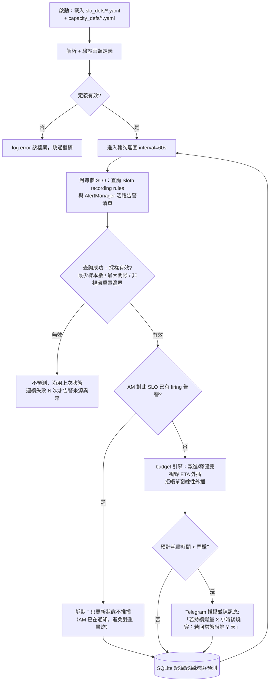
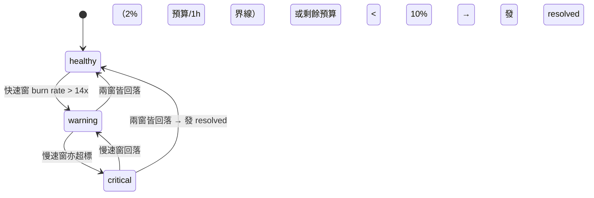

# slo-sentinel — SLO / Error Budget 值班機器人 開發規格書

> 版本：v0.1（草案）｜建立：2026-08-24
> 定位：獨立專案，與 digital-twin 無程式碼耦合
> **核心依賴：[Sloth](https://github.com/slok/sloth)（MIT）——多窗 burn rate 判定外包給它，不重造輪子**
> **定位：前瞻預測層**——不只看 SLO 預算，還涵蓋任何「有天花板的消耗型指標」（容量/配額/佇列深度…），
> 回答 AlertManager 靜態閾值答不了的問題：**「照目前的速度，幾小時/幾天後觸頂？」**

---

## 1. 開發目的

### 1.1 解決的問題

SRE 對「服務可靠性」的承諾靠 SLO 與 Error Budget 管理，但實務上常見痛點：

1. **SLO 定義了卻沒人看**：指標散落在 Prometheus/Grafana，burn rate 要自己心算
2. **預算燒完才發現**：錯誤預算耗盡時部署已經造成不可逆傷害，缺少「快燒完」的前瞻警告
3. **政策不落地**：「預算見底要凍結部署」寫在文件裡，但沒有機制強制或提醒

### 1.2 專案目標

做一個**小而準的主動式值班機器人**：

- 以 OpenSLO / YAML 宣告式定義 SLO（單一事實來源）
- 週期性查詢指標來源（Prometheus API），計算 multi-window burn rate
- 在 error budget 消耗速度異常時**主動推播** Telegram，附上「還剩多久燒完」與建議動作
- 可選：對接 CI/CD，預算見底時自動留言/擋部署（後期功能）

### 1.3 非目標（Non-goals）

- 不做 metrics 儲存與視覺化（那是 Prometheus/Grafana 的事）
- 不做通用監控平臺——只專注 SLO/burn rate 這一個切面
- 第一版不做多租戶；單人／單團隊自用即可

---

## 2. 功能與模組

### 2.1 功能清單

| # | 功能 | 說明 |
|---|------|------|
| F1 | SLO 宣告式定義 | YAML 定義 SLI 指標查詢、目標（99.9%）、時間窗（28d 等），相容 OpenSLO 子集 |
| F2 | 多視野 ETA 預測 | 多窗判定外包給 Sloth recording rules；本專案核心：**同時算激進版（1h 速率）與穩健版（6h/3d 速率）兩條 ETA**，推播並陳——「若持續爆量 X 小時後燒穿；若回常態尚餘 Y 天」。線性單窗外插會被脈衝式消耗（一次壞部署燒 5%）誤導，禁止 |
| F2b | AlertManager 協調靜默 | 推播前查 AlertManager API：該 SLO 的靜態告警若已 firing → sentinel 自動靜默（避免同一事件雙重通知）；sentinel 只負責「靜態閾值未觸發、但 ETA 預測將觸發」的前瞻窗口 |
| F3 | 主動通知 | 達到閾值 → Telegram 推播：剩餘剩餘預算、預計耗盡時間、建議動作文字 |
| F4 | 恢復通知 | 進入警示後回到安全範圍 → 發送 resolved 訊息（避免提醒疲勞需有去重/靜默設計） |
| F5 | CLI 查詢 | `slo-sentinel status` 一鍵列出所有 SLO 的現況表（預算%、burn rate、狀態） |
| F6 | CI 整合——**任務書 T019（notify）/ T021（enforce）**，兩模式可運行時熱切換 | budget 見底時對 PR/部署管線留言或以 exit code 擋部署；模式由 freeze_policy.yaml 定義，支援臨時覆寫（帶到期自動還原）與永久切換（git 審查） |
| F7 | Web Dashboard（獨立服務） | 唯讀網頁：全 SLO 總表、單一 SLO 歷史曲線、歷次觸警紀錄；與 daemon 分進程部署 |
| F8 | 容量感測目錄（Prometheus rules 格式） | 以**標準 Prometheus rules 檔案**為基底（不自造格式）：recording rules 正規化 + alert 規則含告警對象（labels 路由）與告警訊息（annotations 模板）；patch 自 awesome-prometheus-alerts 最新版 + sentinel 註解慣例；熱載入、上游同步、promtool 驗證——詳見 §6.8 |
| F9 | 容量觸頂預警 | 同一顆 ETA 引擎重用：軟頂之上開始預測「幾小時/幾天後觸及硬頂」，激進/穩健雙視野並陳。**演算法詳見 [`algs/capacity-eta.md`](algs/capacity-eta.md)**（Theil–Sen 斜率 + 雙視野外插 + 觸發條件表）。**雲端 autoscale 場景尤其關鍵**：擴容會掩蓋飽和徵兆（SLO 綠燈假象），真正的炸點是 quota 上限 / node max / 機型缺貨 / IP 耗盡等撞牆式失敗——靜態閾值與 SLO 都看不見，只有外插預測看得見 |
| F10 | 分診閉環——**任務書 T020**（受外部條件約束：ai-oncall gate 上線＋標籤慣例對齊） | 容量預警同時以標準格式發進 AlertManager，供 ai-oncall 等分診系統接手處理（維持工具間鬆耦合） |
| F11 | 營運成本感測（雙模式） | **estimate（主路徑，免 billing IAM）**：AWS 公開 Price List + 阿里雲 QuerySkuPriceList × Prometheus 用量 → 推估成本；**actual（選配）**：AWS CE / 阿里雲 BSS API 取實際值供校準。演算法詳見 `algs/cost-forecast.md` |
| F12 | 成本預算天花板與 ETA | 每服務/每帳號/每 tag 定義月度預算（=硬頂），累積花費=消耗曲線——**同一顆狀態機與 ETA 引擎**：「照目前速度，本月預算 12 日燒穿」 |
| F13 | 成本推估報表 | 日/月/年三個粒度的**實際值＋推估值**：月底推估（MTD + 近期速率外插）、年推估（各月推估加總）、單位成本連動容量預測（副本數預估 × 單價） |
| F14 | 瘦身與閒置偵測（Right-sizing / Zombies） | 反向偵測：①供給過剩——`P95(使用率比) < 門檻` 連續 N 天 → 建議降規＋估算月省；②殭屍資源——零流量（ELB RequestCount≈0、未掛目標的 TG、空閒 EIP/磁碟）滿 N 天 → 提醒＋累積浪費金額。**提醒週期可調**（預設首報後每 7 天重複），Telegram 一鍵「已處理／暫不處理」即止默 |

### 2.2 模組劃分

> **與 Sloth 的分工**：模組骨架不受 Sloth 整合影響（7 個模組全部保留）；
> 改變的是兩個模組的內部實作——`spec/query/budget` 從「自算視窗數學」
> 改為「讀取 Sloth 生成的 recording rules」，把最容易寫錯的多窗 PromQL
> 外包給社群驗證過的工具。本專案聚焦 Sloth 缺少的：ETA 預測、人話推播、狀態總覽。
>
> ```
> 【編譯期】Sloth 全包：SLO YAML ─▶ alerting rules ─▶ AlertManager（既有通知）
>                                  ├─▶ recording rules ──▶ ★ 本工具的資料源
>                                  └─▶ Grafana dashboard JSON（匯入即用）
> 【執行期】本工具：查 recording rules ─▶ ETA 外插 ─▶ Telegram / status UI
> ```

```
slo-sentinel/
├── slo_defs/                  # 使用者的 SLO 定義檔（YAML）
├── capacity_defs/             # ★ 容量感測定義檔（YAML）：metric + soft/hard ceiling + horizons
│   └── example.yaml
├── rules.d/                   # ★ 感測目錄：Prometheus rules 格式（含 waste 類感測，範例見 §6.8.1/§8）
├── internal/
│   ├── spec/                  # [模組A] SLO 定義解析
│   │   ├── parse.go           #   YAML → SLO struct、欄位驗證、OpenSLO 相容子集
│   │   └── validate.go
│   ├── query/                 # [模組B] 指標來源介接
│   │   ├── prometheus.go      #   Prometheus HTTP API 查詢（可擴充其他來源）
│   │   └── source.go          #   Source interface（測試用 fake 實作）
│   ├── catalog/               # [模組C1] ★ 感測目錄層（見 §6.8）：Prometheus rules 格式
│   │   ├── loader.go          #   rules.d/*.yaml 熱載入（fsnotify）+ promtool 驗證，免重啟
│   │   ├── amcoord.go 所需的活躍告警對照也源於同一批檔案（單一事實來源）
│   │   ├── upstream.go        #   community/ 上游同步（awesome-prometheus-alerts，記錄 commit hash）
│   │   └── validate.go        #   失敗整檔隔離並 log.warning，不拖垮 daemon
│   ├── capacity/              # [模組C2] ★ 容量感測引擎（重用 budget 的 eta.go；演算法見 §6）
│   │   └── forecast.go        #   讀 capacity_defs → 查指標 → 多視野「觸頂時間」預測
│   ├── billing/               # [模組B2] ★ 帳務來源介接（adapter 模式，同 query/ 的 Source interface）
│   │   ├── source.go          #   BillingSource interface：DailySpend(service, tags, range)
│   │   ├── aws_ce.go          #   AWS Cost Explorer / CUR Data Export
│   │   └── alicloud_bss.go    #   AlibabaCloud BSS（QueryInstanceBill 等）
│   ├── cost/                  # [模組C3] ★ 成本預測引擎（重用 eta.go + 狀態機；公式見 §7）
│   │   ├── project.go         #   月底/年底推估
│   │   └── report.go          #   日/月/年報表輸出（Telegram 摘要 + UI 頁面）
│   ├── waste/                 # [模組C4] ★ 瘦身與閒置掃描器（公式見 §8；涵蓋雲端＋K8s/OpenShift＋standalone）
│   │   ├── scanner.go         #   週期掃描 waste 類感測（低頻，每日一次即可）
│   │   ├── rightsizing.go     #   供給過剩判定：P95 使用率比 + 建議規格 + 月省估算
│   │   ├── zombies.go         #   零流量/孤兒資源判定（ELB/TG/EIP/磁碟…）
│   │   ├── tracker.go         #   候選清單生命週期：首次提醒→週期重提→一鍵忽略→結案
│   │   └── providers/         #   §8.5 三環境發現器：cloud(Tagging API) / k8s(client-go，
│   │                          #     OpenShift 同 API 相容) / standalone(node_exporter+conntrack)
│   ├── budget/                # [模組C] SLO 預算預測引擎（純函式，重點測試區）
│   │   ├── read.go            #   讀取 Sloth 生成的 recording rules（不自算視窗數學）
│   │   ├── validity.go        #   採樣有效性校驗：最少樣本數、最大資料間隙、視窗邊界（28d 重置瞬間 ETA 跳變特判）
│   │   ├── eta.go             #   ★ 獨特價值：多視野外插（激進/穩健並陳），拒絕單窗線性外插
│   │   └── state.go           #   狀態機：healthy → warning → critical → healthy
│   ├── alert/                 # [模組D] 通知層
│   │   ├── telegram.go        #   Telegram Bot API 推播
│   │   ├── amcoord.go         #   ★ 查 AlertManager 活躍告警 → 已 firing 者靜默（F2b）
│   │   ├── digest.go          #   多 SLO 匯總：每日一封摘要，避免 N 個 SLO 各推一條
│   │   └── dedupe.go          #   同一狀態不重複轟炸；resolved 才再發
│   └── store/                 # [模組E] 最小狀態持久化
│       └── sqlite.go          #   狀態/通知時間 + ★ 預測紀錄表（每次 ETA 預測 vs 實際走向，供命中率自評）
├── cmd/
│   ├── sentinel/
│   │   ├── main.go            # 進入點：daemon 模式（週期輪詢）與 CLI 子命令
│   │   └── status.go          #   `status` 子命令：現況總表輸出
│   └── sentinel-ui/           # ★ 獨立 UI 服務（與 daemon 分離的 process）
│       ├── main.go            #   HTTP server；唯讀，不寫任何狀態
│       └── internal/
│           ├── server.go      #   路由：/ （總表）、/slo/{name}（詳情+預測vs實際）、/accuracy（預測命中統計）
│           ├── source.go      #   資料來源：sentinel 的 /status.json + Prometheus 查詢
│           └── render.go      #   html/template + uPlot 圖表
└── docs/
    └── slo-format.md          # SLO YAML 格式文件
```

### 2.3 模組依賴方向（單向無循環）

```
cmd/sentinel → alert → budget ← query ← spec
                     ↘ store
```

- `budget` 是純計算核心，不得 import 任何 I/O 套件（可測性優先）
- `query` 透過 interface 注入，單元測試不打真實 Prometheus

### 2.4 關鍵設計決策（待確認）

| 決策點 | 選項 | 備註 |
|---|---|---|
| 技術棧 | **Go（建議）** / Python | 靜態二進位適合丟在跳板機/容器長駐；本專案規模小，是練 Go 的好題材 |
| 指標來源 v1 | Prometheus HTTP API | 未來以 Source interface 擴充 Datadog 等 |
| 通知渠道 v1 | Telegram Bot | 沿用既有 bot token 慣例，但 config 獨立於 digital-twin |
| 部署形態 | 兩個 binary：`sentinel`（daemon）+ `sentinel-ui`（唯讀 web） | 無外部依賴（SQLite 內嵌）；UI 可單獨不上線 |
| UI 存取控制 | 反向代理層認證（Tailscale serve / Caddy + forward_auth） | UI 本體不做帳號系統，信任邊界在代理層 |

---

### 2.5 獨立 UI 服務：設計與安全邊界

**為什麼 UI 是獨立 process，而非綁進 daemon：**

| 面向 | 同 process 內建 | 獨立 `sentinel-ui` |
|---|---|---|
| 攻擊面 | HTTP 解析與引擎共享命運；web 漏洞 = 動到輪詢器本身 | web 被打穿最壞是唯讀資料洩漏，引擎不受影響 |
| 可用性 | dashboard 慢查詢拖累輪詢迴圈 | 各自重啟互不影響 |
| 部署彈性 | UI 必須跟 daemon 同機 | UI 可放任何能連到資料源的地方，甚至不部署 |

**安全鐵律：**

1. UI 是**純唯讀**——不提供任何 POST/表單端點；寫入只有 daemon 做
2. 資料來源走兩條路：daemon 的 `/status.json`（現況）+ Prometheus 直查（歷史曲線）——UI **不碰 SQLite 檔案**，避免讀鎖與路徑耦合
3. 本體不做帳號系統；對外暴露一律經反向代理認證（Tailscale / Caddy forward_auth / SSO）
4. 預設 bind `127.0.0.1`，要對外由使用者明確改設定並自負代理層責任

```
瀏覽器 ──▶ 反向代理（認證）──▶ sentinel-ui ──▶ sentinel /status.json
                                            └─▶ Prometheus（歷史曲線）
sentinel daemon ──寫──▶ SQLite（UI 不碰）
```

---

## 3. 邏輯流程圖

### 3.1 主迴圈（daemon 模式）



> **ETA 方法論**：脈衝式消耗下單窗線性外插必然誤導。激進視野取 1h 速率回答
> 「最壞多快」；穩健視野取 6h/3d 速率回答「常態下還有多久」。兩者並陳讓收件人
> 自行判斷嚴重度；每次預測入庫，`/accuracy` 頁面回頭比對實際走向——外插參數
> 用資料調，不用感覺調。

### 3.2 狀態機



> 判定閾值採 Google SRE Book 多窗口慣例（14x/6x 配對），寫進 `budget` 模組常數並可由 YAML 覆寫。

### 3.3 CLI status 子命令

```mermaid
flowchart LR
    A[sentinel status] --> B[載入 SQLite 上次狀態]
    B --> C[即時查詢一次指標]
    C --> D[表格輸出：
SLO 名稱 | 目標 | 預算剩餘% | burn rate | 狀態]
```

---

## 4. 開發語言評估

| 評估面 | Go | Python |
|---|---|---|
| 部署形態 | ✅ 單一靜態 binary（<20MB），丟上任何機器就跑 | ❌ 需 venv 或容器；長駐 daemon 多一層管理 |
| 常駐資源占用 | ✅ 數十 MB、無 GC 壓力問題 | ⚠️ 直譯器常駐 ~50–100MB 起 |
| 本專案計算複雜度 | ✅ burn rate 是簡單浮點運算＋狀態機，Go 完勝綽綽有餘 | ✅ 也足夠 |
| 生態系 | ⚠️ Prometheus client 官方支援良好；Telegram 套件可用但選型要花時間 | ✅ prometheus-api-client、aiogram 都現成 |
| 開發速度 | ⚠️ 較慢（編譯型＋樣板較多） | ✅ 快 |
| 對你的附加價值 | ✅✅ **SRE 履歷上的 Go 工具**（Prometheus 生態原生語言，面試加分） | ➖ 已有 digital-twin 證明能力，邊際效益低 |

### Sloth 依賴對語言選擇的影響

無——Sloth 的整合面是「查它的 recording rules」（PromQL 查詢）與
「跑它的 CLI 生成規則檔」（一次性或 CI 步驟），兩者皆語言中立。
Go 結論維持不變。

### 結論：**建議 Go**

理由：
1. 本專案的技術核心（多窗 burn rate + 狀態機）夠小，Go 的開發速度劣勢被壓到最低
2. 「單一 binary 長駐輪詢器」正是 Go 的主場——這是它和 Python 差距最大的使用場景
3. Prometheus 是 Go 寫的，client library 一等公民；SRE 領域用 Go 寫工具 = 講同一種母語
4. 對職涯而言，digital-twin 已證明 Python/AI 能力，`slo-sentinel` 用 Go 恰好補上第二隻腳

Python 只在以下情況反超：你想在三週內上線、且確定之後會擴充需要大量 ML/資料處理的功能（本專案不會）。

---

## 5. 成功標準（驗收願景）

1. 用一份真實服務的 SLO YAML 跑起 daemon，能穩定每分鐘輪詢並在人造故障（把目標調高製造 burn）下收到 Telegram 警告與恢復通知
1b. **AM 協調驗證**：Sloth 靜態告警 firing 期間，sentinel 保持靜默；解除後恢復推播——同一事件不得收到兩遍
1c. **預測自評**：運行一週後 `/accuracy` 頁面可呈現每次 ETA 預測 vs 實際走向的偏差統計
1d. **容量場景驗證**：定義一條磁碟/連線數容量感測，製造穩定成長負載，收到「N 小時後觸頂」的雙視野推播；雲端環境則驗證 HPA/quota 指標可被定義且查得到
1e. **目錄熱載入**：修改 rules.d/*.yaml 存檔後免重啟即生效；無效條目整檔隔離不影響 daemon；community/ 上游同步走 PR 審查（§6.8.3）
1f. **殭屍資源演練**：建立一個 ELB 不掛任何流量，14 天後（測試可調短 window）收到首次提醒＋累積浪費金額；之後每 7 天重提；Telegram 標記「已處理」後止默並入結案統計
2. `status` 子命令輸出與 Grafana 手算的 burn rate 一致（±0.1%）
3. 全套測試離線通過（query/budget/alert 皆 mock）；單一 binary 部署 ≤ 20MB
2. `sentinel-ui` 於內網可瀏覽總表與單一 SLO 曲線；對外一律經反向代理認證，UI 本體無帳號系統、無寫入端點

---

---

## 6. 演算法規格文件索引（任務拆解必讀）

> **拆解鐵律**：下表每一列都必須產生至少一張任務書；任務書的驗收標準
> 必須逐條引用對應演算法檔的小節。**附錄式設計會被遺失，因此演算法一律
> 獨立成檔、由任務書顯式引用**。

| 演算法檔 | 對應功能 | 對應模組 | 對應任務（已拆解） |
|---|---|---|---|
| [`algs/sensor-catalog.md`](algs/sensor-catalog.md) | F8 目錄格式、F14 條目格式 | `internal/catalog/` | **T005** 載入器/熱載入/promtool/上游同步；**T017** 種子規則檔佈建 |
| [`algs/capacity-eta.md`](algs/capacity-eta.md) | F2 多視野 ETA、F9 容量觸頂預警 | `internal/budget/` `internal/capacity/` | **T006** Theil–Sen 引擎＋狀態機＋AM 協調；**T007** 容量感測；**T009** 主迴圈 |
| [`algs/cost-forecast.md`](algs/cost-forecast.md) | F11–F13 成本感測/預算 ETA/推估報表 | `internal/billing/` `internal/cost/` | **T010** AWS CE/阿里雲 BSS adapter；**T011** 推估引擎＋爆衝偵測 |
| （§D.0 estimate 主路徑） | F11 價目表目錄（免 billing IAM） | `internal/pricing/` | **T022** AWS Bulk/Query API＋阿里雲 QuerySkuPriceList＋快取層 |
| [`algs/waste-detection.md`](algs/waste-detection.md) | F14 瘦身與閒置（三類環境） | `internal/waste/` | **T012** 雲端 provider；**T013** K8s/OpenShift K1–K4；**T014** Standalone S1–S3；**T015** 生命週期 tracker |

### 支援性任務（無演算法檔但必要）

| 任務 | 內容 |
|---|---|
| T001 骨架/config／T002 spec 解析／T003 query 來源／T004 store | 基礎設施層 |
| T009 daemon 唯讀 JSON API + `/metrics`（UI 資料源；指標僅供觀測） | G1 補洞＋直推中心定案 |
| T016 sentinel-ui／T017 部署文件／T018 e2e（§5 全覆蓋） | 交付層 |

### 延後批次任務（有任務書、鎖在外部條件後）

F6 / F10 並非漏項，而是已拆出**受約束的任務書**——範圍可見，但 `blocked_on`
前置條件未滿足前不得開工（排程器挑到時應先驗條件、未滿足則跳過並記錄）：

| 任務書 | 對應功能 | 開工前置條件 |
|---|---|---|
| [`T019-ci-budget-gate`](T019-ci-budget-gate.md) | F6 擋部署 | daemon 實際運行 ≥30 天＋門檻校準＋CI 管線確定 |
| [`T020-oncall-integration`](T020-oncall-integration.md) | F10 分診閉環 | ai-oncall gate 上線＋標籤慣例對齊 |

> 排程器整合註記：這兩張的 frontmatter 含 `blocked_on` 自訂欄位，
> auto_develop 挑選邏輯應將其視為「條件式 pending」。
